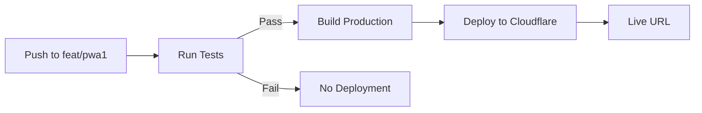

# Cloudflare Pages Deployment Setup

This document explains how to set up automatic Cloudflare Pages deployment via GitHub Actions.

## Overview

The CI workflow now includes automatic deployment to Cloudflare Pages when:

1. ✅ All Playwright tests pass
2. ✅ Push is to `feat/pwa1` branch (currently)
3. ✅ Event is a direct push (not PR)

## Required GitHub Secrets

Add these secrets to your GitHub repository:

**Settings → Secrets and variables → Actions → New repository secret**

### 1. `CLOUDFLARE_API_TOKEN`

Create an API token with Pages permissions:

1. Go to [Cloudflare Dashboard](https://dash.cloudflare.com/profile/api-tokens)
2. Click **"Create Token"**
3. Use template: **"Edit Cloudflare Workers"** (includes Pages)
4. Or create custom token with permissions:
   - Account → Cloudflare Pages → Edit
5. Copy the token and add to GitHub secrets

### 2. `CLOUDFLARE_ACCOUNT_ID`

Find your account ID:

1. Go to [Cloudflare Dashboard](https://dash.cloudflare.com/)
2. Select any site (or go to Workers & Pages)
3. Look at the URL or right sidebar for **Account ID**
4. Format: `1234567890abcdef1234567890abcdef`
5. Add to GitHub secrets

### 3. `VITE_SUPABASE_URL`

Your **production** Supabase project URL:

```
https://your-project-ref.supabase.co
```

**Note:** This is different from the local Supabase URL used in tests!

### 4. `VITE_SUPABASE_ANON_KEY`

Your **production** Supabase anon (public) key:

1. Go to [Supabase Dashboard](https://app.supabase.com/)
2. Select your project
3. Settings → API
4. Copy the **anon/public** key (starts with `eyJ...`)
5. Add to GitHub secrets

## Deployment Flow



### Branch Strategy

**Current (Development):**

- `feat/pwa1` → Deploys to Cloudflare on test success
- Allows manual testing on production build

**Future (After PWA Complete):**

- `main` → Deploys to production
- `feat/*` → No deployment (or preview deployments)

## Testing Deployment Locally

Before pushing, test the production build locally:

```bash
# Build for production
npm run build

# Preview the production build
npm run preview

# Or deploy manually to Cloudflare
npm run deploy
```

## Deployment URLs

After successful deployment, check the Actions workflow output for:

- **Preview URL**: Branch-specific URL (e.g., `feat-pwa1.tunetrees-pwa.pages.dev`)
- **Production URL**: Main project URL (e.g., `tunetrees-pwa.pages.dev`)

## Troubleshooting

### "CLOUDFLARE_API_TOKEN not found"

- Verify secret is named exactly `CLOUDFLARE_API_TOKEN`
- Check secret is in repository settings (not organization)
- Token must have Pages edit permissions

### "Account ID is required"

- Add `CLOUDFLARE_ACCOUNT_ID` secret
- Verify it's the 32-character hex string

### "Supabase connection failed"

- Verify `VITE_SUPABASE_URL` points to production project
- Verify `VITE_SUPABASE_ANON_KEY` is the correct anon key
- Check Supabase project is active

### "Build failed"

- Check build logs in Actions tab
- Test build locally first: `npm run build`
- Verify all dependencies are in `package.json` (not just `devDependencies`)

## Updating for Production

When PWA is ready for production, update the workflow:

```yaml
# Change from:
if: github.ref == 'refs/heads/feat/pwa1' && github.event_name == 'push'

# To:
if: github.ref == 'refs/heads/main' && github.event_name == 'push'
```

This will deploy only from `main` branch instead of `feat/pwa1`.

## Custom Domain (Optional)

After deployment, you can add a custom domain:

1. Go to Cloudflare Pages → tunetrees-pwa
2. Custom domains → Add a domain
3. Follow DNS configuration instructions
4. Update workflow `environment.url` to use custom domain

## Monitoring

View deployment history:

- **GitHub Actions**: Repository → Actions tab
- **Cloudflare Dashboard**: Workers & Pages → tunetrees-pwa → Deployments

## Resources

- [Cloudflare Pages Docs](https://developers.cloudflare.com/pages/)
- [Wrangler CLI Docs](https://developers.cloudflare.com/workers/wrangler/)
- [GitHub Actions for Pages](https://github.com/cloudflare/wrangler-action)
