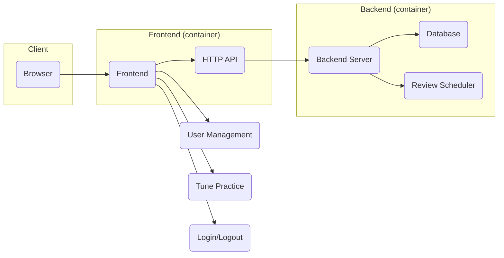
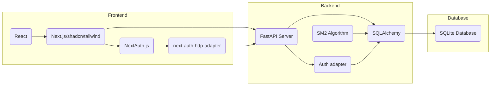
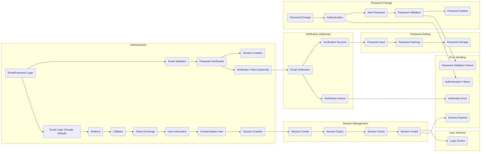

# TuneTrees: Tune Repertoire Practice Assistant

TuneTrees is designed to help folk musicians efficiently memorize and retain a large repertoire of tunes. By combining proven memory techniques like spaced repetition, mnemonics, and spatial navigation, the app assists in training musical memory. In the future, TuneTrees may explore the use of advanced technologies like neural networks and reinforcement learning to further enhance the memorization process.

See the [Tune Trees Project Whitepaper](docs/core-proposal.md#tune-trees-project-whitepaper)
to get some insight into the vision of the project.

**Table of Contents**

<!-- TOC -->

- [1. Design and Intent](#1-design-and-intent)
  - [1.1. User-centric Functional Overview](#11-user-centric-functional-overview)
  - [1.2. System Structure](#12-system-structure)
  - [1.3. Technology Usage](#13-technology-usage)
    - [1.3.1. Frontend:](#131-frontend)
    - [1.3.2. Backend:](#132-backend)
  - [1.4. Database Files](#14-database-files)
  - [1.5. Schema:](#15-schema)
  - [1.6. Alternatives or Potential Technology Evolution](#16-alternatives-or-potential-technology-evolution)
- [2. Development Processes](#2-development-processes)
  - [2.1. Generation of ORM code](#21-generation-of-orm-code)
    - [2.1.1. VSCode Processes (🚧 This Section a Work in Progress 🚧)](#211-vscode-processes--this-section-a-work-in-progress-)
    - [2.1.2. Run and Debug in VSCode (🚧 This Section a Work in Progress 🚧)](#212-run-and-debug-in-vscode--this-section-a-work-in-progress-)
- [3. Build and Deploy (🚧 This Section a Work in Progress 🚧)](#3-build-and-deploy--this-section-a-work-in-progress-)
  - [3.1. Basics](#31-basics)
  - [3.2. Build](#32-build)
  - [3.3. Deploy](#33-deploy)
    - [3.3.1. Deploy to Local Docker](#331-deploy-to-local-docker)
      - [3.3.1.1. **_3.3.1.1. Make local certificates_**](#3311-_3311-make-local-certificates_)
      - [3.3.1.2. **_3.3.1.2. Use Docker Compose to deploy using webserver_local_**](#3312-_3312-use-docker-compose-to-deploy-using-webserver_local_)
    - [3.3.2. Deploy to Digital Ocean Droplet](#332-deploy-to-digital-ocean-droplet)
- [4. Testing](#4-testing)
  - [4.1. Continuous Integration (CI)](#41-continuous-integration-ci)
  - [4.2. Test Data Management](#42-test-data-management)
  - [4.3. React/Next Frontend Testing](#43-reactnext-frontend-testing)
    - [4.3.1. End-to-End (E2E)](#431-end-to-end-e2e)
  - [4.4. Python Backend Testing](#44-python-backend-testing)
    - [4.4.1. Integration Testing](#441-integration-testing)
- [5. Authentication and User Management (🚧 This Section a Work in Progress 🚧)](#5-authentication-and-user-management--this-section-a-work-in-progress-)
  - [5.1. Mail verification mechanism](#51-mail-verification-mechanism)
- [6. Credits](#6-credits)
<!-- /TOC -->

## 1. Design and Intent

TuneTrees is a web application with a backend server that manages user data and schedules reviews. The backend securely stores all data in a database, while the frontend handles user interactions like login, account management, and practicing tunes. The frontend communicates with the backend using an HTTP API to access and update user data. Both the frontend and backend are packaged as containers and deployed together using Docker Compose on a DigitalOcean server.

### 1.1. User-centric Functional Overview

The following sketch illustrates a high-level and abstract _user view_ functional (or feature) overview. In this rough diagram, boxes are the main intent, and the arrows just imply major relations, with the direction implying general data flow. The blue boxes illustrate intent and are not yet implemented.


### 1.2. System Structure

This diagram provides a high-level overview of the TuneTree architecture.



### 1.3. Technology Usage

This diagram maps out the basic technology used. Specific implementation details may evolve.



#### 1.3.1. Frontend:

Handles user interactions, including login, account management, and tune practice.

- HTTP API: Communicates with the backend to access and update user data.
- User Management: Handles user registration, login, and account settings.
- Tune Practice: Provides tools for practicing tunes and tracking progress.
- Login/Logout: Implements authentication and authorization.

#### 1.3.2. Backend:

Handles user data management, review scheduling, and API requests.

- Database: Stores user data, including tunes, practice history, and review schedules.
- Review Scheduler: Determines when tunes should be reviewed based on the user's progress.

### 1.4. Database Files

The TuneTrees project includes several SQLite database files that serve different purposes in development, testing, and migration workflows:

#### Checked-in Database Files

**`tunetrees_test_clean.sqlite3`** - **Base Test Database**

- Contains clean test data with known state for reproducible testing
- Used as the source of truth for desired schema during development
- Copied to `tunetrees_test.sqlite3` (ignored) for each test run
- **Always tracked in git** - serves as the target schema for migrations

**`production_baseline.sqlite3`** - **Clean Schema Baseline**

- Contains database schema without production data
- Used by Alembic for clean schema comparisons during migration generation
- Represents the baseline schema that production databases start from
- **Tracked in git** - provides stable reference for migration system

**`true_production_baseline.sqlite3`** - **Production Data Snapshot**

- Snapshot of actual production database at a specific point in time
- Contains real user data and represents deployed production state
- Used for testing migrations against real data to ensure data preservation
- **Tracked in git** - provides production data reference for migration testing

#### Working Database Files (Ignored)

The following database files are generated during development and are ignored by git:

- `tunetrees.sqlite3` - Main development database (working copy)
- `tunetrees_test.sqlite3` - Transient test database (copied from clean version)
- `tunetrees_production.sqlite3` - Downloaded production database for migration
- `*_temp_*.sqlite3` - Temporary files created during migration processes

#### Database File Workflow

1. **Schema Changes**: Made directly in `tunetrees_test_clean.sqlite3` using database tools
2. **Migration Generation**: Alembic compares `production_baseline.sqlite3` vs `tunetrees_test_clean.sqlite3`
3. **Migration Testing**: Uses `true_production_baseline.sqlite3` to verify data preservation
4. **Production Deployment**: Downloads live production database and applies migrations

For detailed information about database migrations, see [Database Migration with Alembic](docs/database-migration-alembic.md).

### 1.5. Schema:

The database is organized as follows: Each user can have multiple playlists, and each playlist is associated with a specific musical instrument. These playlists contain tunes, which are stored separately and shared across all users. TuneTrees doesn't aim to be a complete tune repository, so it only stores basic tune information. For more detailed details, users can refer to external resources.

For information about database migrations using Alembic, see [Database Migration with Alembic](docs/database-migration-alembic.md).

The complete entity relationship diagram is illustrated by the following diagram:

```mermaid
erDiagram
    GENRE {
        TEXT id PK
        TEXT name
        TEXT region
        TEXT description
    }
    TUNE_TYPE {
        TEXT id PK
        TEXT name
        TEXT rhythm
        TEXT description
    }
    GENRE_TUNE_TYPE {
        TEXT genre_id FK
        TEXT tune_type_id FK
    }
    USER {
        INTEGER id PK
        TEXT hash
        TEXT name
        TEXT email
        TEXT email_verified
        TEXT image
        BOOLEAN deleted
        TEXT sr_alg_type
    }
    ACCOUNT {
        TEXT user_id FK
        TEXT provider_account_id PK
        TEXT provider
        TEXT type
        TEXT access_token
        TEXT id_token
        TEXT refresh_token
        TEXT scope
        INTEGER expires_at
        TEXT session_state
        TEXT token_type
    }
    INSTRUMENT {
        INTEGER id PK
        INTEGER private_to_user FK
        TEXT instrument
        TEXT description
        TEXT genre_default
        BOOLEAN deleted
    }
    PLAYLIST {
        INTEGER playlist_id PK
        INTEGER user_ref FK
        INTEGER instrument_ref
        BOOLEAN deleted
        TEXT sr_alg_type
    }
    PLAYLIST_TUNE {
        INTEGER playlist_ref PK, FK
        INTEGER tune_ref PK, FK
        TEXT current
        TEXT learned
        BOOLEAN deleted
    }
    PREFS_SPACED_REPETITION {
        TEXT alg_type PK
        INTEGER user_id PK, FK
        TEXT fsrs_weights
        REAL request_retention
        INTEGER maximum_interval
    }
    SESSION {
        TEXT session_token PK
        TEXT expires
        TEXT user_id FK
    }
    TAB_GROUP_MAIN_STATE {
        INTEGER id PK
        INTEGER user_id FK
        TEXT which_tab
        INTEGER playlist_id
        TEXT tab_spec
    }
    TABLE_STATE {
        INTEGER user_id PK, FK
        TEXT screen_size PK
        TEXT purpose PK
        INTEGER playlist_id PK, FK
        TEXT settings
        INTEGER current_tune
    }
    TUNE {
        INTEGER id PK
        TEXT type
        TEXT structure
        TEXT title
        TEXT mode
        TEXT incipit
        TEXT genre FK
        BOOLEAN deleted
        INTEGER private_for FK
    }
    NOTE {
        INTEGER id PK
        INTEGER user_ref FK
        INTEGER tune_ref FK
        INTEGER playlist_ref FK
        TEXT created_date
        TEXT note_text
        INTEGER public
        INTEGER favorite
        BOOLEAN deleted
    }
    PRACTICE_RECORD {
        INTEGER id PK
        INTEGER playlist_ref FK
        INTEGER tune_ref FK
        TEXT practiced
        INTEGER quality
        REAL easiness
        INTEGER interval
        INTEGER repetitions
        TEXT review_date
        TEXT backup_practiced
        REAL stability
        INTEGER elapsed_days
        INTEGER lapses
        INTEGER state
        REAL difficulty
        INTEGER step
    }
    REFERENCE {
        INTEGER id PK
        TEXT url
        TEXT ref_type
        INTEGER tune_ref FK
        INTEGER public
        INTEGER favorite
        INTEGER user_ref FK
        TEXT comment
        TEXT title
        BOOLEAN deleted
    }
    TABLE_TRANSIENT_DATA {
        INTEGER user_id PK, FK
        INTEGER tune_id PK, FK
        INTEGER playlist_id PK, FK
        TEXT purpose
        TEXT note_private
        TEXT note_public
        TEXT recall_eval
    }
    TAG {
        INTEGER tag_id PK
        INTEGER user_ref FK
        INTEGER tune_ref FK
        TEXT tag_text
    }
    TUNE_OVERRIDE {
        INTEGER id PK
        INTEGER tune_ref FK
        TEXT title
        TEXT type
        TEXT structure
        TEXT genre FK
        TEXT mode
        TEXT incipit
        BOOLEAN deleted
        INTEGER user_ref FK
    }
    VERIFICATION_TOKEN {
        TEXT identifier PK
        TEXT token
        TEXT expires
    }

    %% Relationships
    GENRE_TUNE_TYPE }|--|| GENRE : "genre_id"
    GENRE_TUNE_TYPE }|--|| TUNE_TYPE : "tune_type_id"
    INSTRUMENT }|--|| USER : "private_to_user"
    PLAYLIST }|--|| USER : "user_ref"
    PLAYLIST_TUNE }|--|| PLAYLIST : "playlist_ref"
    PLAYLIST_TUNE }|--|| TUNE : "tune_ref"
    PREFS_SPACED_REPETITION }|--|| USER : "user_id"
    SESSION }|--|| USER : "user_id"
    TAB_GROUP_MAIN_STATE }|--|| USER : "user_id"
    TABLE_STATE }|--|| USER : "user_id"
    TABLE_STATE }|--|| PLAYLIST : "playlist_id"
    TUNE }|--|| GENRE : "genre"
    TUNE }|--|| USER : "private_for"
    NOTE }|--|| USER : "user_ref"
    NOTE }|--|| TUNE : "tune_ref"
    NOTE }|--|| PLAYLIST : "playlist_ref"
    PRACTICE_RECORD }|--|| PLAYLIST : "playlist_ref"
    PRACTICE_RECORD }|--|| TUNE : "tune_ref"
    REFERENCE }|--|| TUNE : "tune_ref"
    REFERENCE }|--|| USER : "user_ref"
    TABLE_TRANSIENT_DATA }|--|| USER : "user_id"
    TABLE_TRANSIENT_DATA }|--|| TUNE : "tune_id"
    TABLE_TRANSIENT_DATA }|--|| PLAYLIST : "playlist_id"
    TAG }|--|| USER : "user_ref"
    TAG }|--|| TUNE : "tune_ref"
    TUNE_OVERRIDE }|--|| TUNE : "tune_ref"
    TUNE_OVERRIDE }|--|| GENRE : "genre"
    TUNE_OVERRIDE }|--|| USER : "user_ref"
    ACCOUNT }|--|| USER : "user_id"
```



#### 1.4.1. Notable Table/Field Descriptions

Since SQLite can't directly have descriptions for the fields, this is arguably the best place to track these.

##### practice_record

This associates the current state of practice, unique to tune/playlist/user.

| Type    | Name             | Description                                                                                             |
| ------- | ---------------- | ------------------------------------------------------------------------------------------------------- |
| INTEGER | id               | Primary key, autoincrement                                                                              |
| INTEGER | playlist_ref     | References the playlist (`playlist.playlist_id`)                                                        |
| INTEGER | tune_ref         | References the tune (`tune.id`)                                                                         |
| TEXT    | practiced        | Date/time or string indicating when the practice occurred                                               |
| INTEGER | quality          | Quality rating of the practice session                                                                  |
| REAL    | easiness         | Easiness factor for spaced repetition, when using SM2                                                   |
| INTEGER | interval         | Interval (days) until next review                                                                       |
| INTEGER | repetitions      | Number of times this tune has been reviewed                                                             |
| TEXT    | review_date      | Scheduled date for next review (maybe should be called Due)                                             |
| TEXT    | backup_practiced | Backup of practice date/time or notes (deprecated, not needed given `practice_history` table)           |
| REAL    | stability        | Stability metric for spaced repetition, when using FSRS                                                 |
| INTEGER | elapsed_days     | Days elapsed since last review                                                                          |
| INTEGER | lapses           | Number of times the tune was forgotten                                                                  |
| INTEGER | state            | Enum representing the learning state (one of Learning = 1, Review = 2, Relearning = 3, or null/0 = NEW) |
| REAL    | difficulty       | Difficulty metric for the tune, when using FSRS                                                         |
| INTEGER | step             | Current learning or relearning step or None if the tune is in the Review state                          |

### 1.6. Alternatives or Potential Technology Evolution

1. Down the line, I can switch to MySQL or PostgreSQL if needed.
2. For the front end, I may experiment with a Kotlin frontend at some point.

## 2. Development Processes

Lorem ipsum dolor sit amet, consectetur adipiscing elit. Sed do eiusmod tempor incididunt ut labore et dolore magna aliqua. Ut enim ad minim veniam, quis nostrud exercitation ullamco laboris nisi ut aliquip ex ea commodo consequat. Duis aute irure dolor in reprehenderit in voluptate velit esse cillum dolore eu fugiat nulla pariatur. Excepteur sint occaecat cupidatat non proident, sunt in culpa qui officia deserunt mollit anim id est laborum.

### 2.1. Generation of ORM code

The SQLAlchemy ORM code is contained in the `tunetrees/models` package in the `tunetrees.py`
module. It should always be generated with the following procedure:

For database schema changes and migrations, refer to [Database Migration with Alembic](docs/database-migration-alembic.md).

First, make sure you have [sqlacodegen-v2](https://pypi.org/project/sqlacodegen-v2/) installed:

```bash
pip install "sqlacodegen-v2 ~= 0.1.4"
```

Then, generate the `tunetrees.py` python file which will contain the TuneTrees ORM code.

```bash
sqlacodegen_v2 sqlite:///tunetrees.sqlite3 > tunetrees/models/tunetrees.py
```

Then remove the extra `from sqlalchemy.orm.base import Mapped` line from the generated code.

Finally, make sure the new code is properly formatted for the project.

> [!NOTE]
> For the moment, both `black` and `ruff` are being invoked, which is just the author
> trying to hedge his bets.

```bash
black tunetrees/models/tunetrees.py &&  ruff check --fix --select I tunetrees/models/tunetrees.py && ruff check --fix tunetrees
```

#### 2.1.1. VSCode Processes (🚧 This Section a Work in Progress 🚧)

To install and set up Visual Studio Code (VSCode) for this project, follow these steps:

1. Download and install VSCode from the official website: [https://code.visualstudio.com/](https://code.visualstudio.com/)

2. Open VSCode and install the following extensions:

   - Python: This extension provides support for Python development. You can install it by searching for "Python" in the Extensions view and clicking on the "Install" button.
   - Docker: This extension allows you to work with Docker containers directly from VSCode. Search for "Docker" in the Extensions view and install it.
   - Remote - Containers: This extension enables you to develop inside a Docker container using VSCode. Install it by searching for "Remote - Containers" in the Extensions view.

3. Clone the TuneTrees project repository to your local machine:

   ```bash
   git clone https://github.com/your-username/tunetrees.git
   ```

4. Open the project folder in VSCode:

   - Click on "File" in the menu bar.
   - Select "Open Folder" and navigate to the location where you cloned the TuneTrees repository.
   - Click "Open" to open the project in VSCode.

5. Set up the development environment:

   - Open the integrated terminal in VSCode by clicking on "View" in the menu bar and selecting "Terminal" from the dropdown menu.
   - Run the following command to create a virtual environment for the project:
     ```bash
     python3 -m venv venv
     ```
   - Activate the virtual environment:
     - On macOS/Linux:
       ```bash
       source venv/bin/activate
       ```
     - On Windows:
       ```bash
       venv\Scripts\activate
       ```

6. Install the project dependencies:

   - Run the following command to install the required Python packages:
     ```bash
     pip install -r requirements.txt
     ```

7. Start the development server:
   - Run the following command to start the backend server:
     ```bash
     uvicorn tunetrees.main:app --reload
     ```
   - Open a web browser and navigate to [http://localhost:8000](http://localhost:8000) to access the TuneTrees application.

Now you have VSCode installed and set up for the TuneTrees project. You can start coding and contributing to the project using the powerful features of VSCode.

#### 2.1.2. Run and Debug in VSCode (🚧 This Section a Work in Progress 🚧)

To run and debug your project using `.vscode/launch.json`, follow these steps:

1. Open your project in Visual Studio Code (VSCode).

2. In the VSCode sidebar, click on the "Run and Debug" icon (or press `Ctrl+Shift+D`).

3. Click on the "Create a launch.json file" link or select "Add Configuration" from the dropdown menu.

4. Choose the appropriate configuration for your project. For example, if you're working with a Python project, select "Python" as the configuration type.

5. VSCode will generate a `launch.json` file in the `.vscode` directory of your project.

6. Open the `launch.json` file and configure the necessary settings for running and debugging your project. This may include specifying the entry point file, command-line arguments, environment variables, and more.

7. Save the `launch.json` file.

8. To run your project, click on the "Run" button in the VSCode toolbar (or press `F5`). VSCode will execute your project according to the configuration specified in `launch.json`.

9. To debug your project, set breakpoints in your code by clicking on the left margin of the code editor or pressing `F9`. Then click on the "Debug" button in the VSCode toolbar (or press `F5`). VSCode will start your project in debug mode and pause execution at the breakpoints you set. You can inspect variables, step through code, and analyze the program's behavior.

10. Use the debugging controls in the VSCode toolbar to navigate through your code and control the debugging session. These controls include stepping into functions, stepping over lines, stepping out of functions, and stopping the debugging session.

By following these steps and configuring the `launch.json` file, you can easily run and debug your project in Visual Studio Code.

## 3. Build and Deploy (🚧 This Section a Work in Progress 🚧)

Lorem ipsum dolor sit amet, consectetur adipiscing elit. Sed do eiusmod tempor incididunt ut labore et dolore magna aliqua. Ut enim ad minim veniam, quis nostrud exercitation ullamco laboris nisi ut aliquip ex ea commodo consequat. Duis aute irure dolor in reprehenderit in voluptate velit esse cillum dolore eu fugiat nulla pariatur. Excepteur sint occaecat cupidatat non proident, sunt in culpa qui officia deserunt mollit anim id est laborum.

### 3.1. Basics

    - Docker.
    - Multi-Platform Cross Compilation
    - Docker Compose
    - buildx bake

### 3.2. Build

    - docker buildx bake
    - docker buildx bake frontend
    - docker buildx bake server

### 3.3. Deploy

This section provides step-by-step instructions for deploying TuneTrees using Docker containers. The deployment process covers both local Docker container management on a laptop and deployment on a DigitalOcean droplet where the app is hosted. To ensure HTTPS protection, a proxy server container is used, which requires access to PEM certificates.

Please note that when we refer to "deploying," we mean running the application in Docker containers rather than in a development environment. While it is possible to deploy for production in a non-containerized environment, this project currently focuses on containerized deployments.

If you are not already familiar with Docker and Docker Compose, we recommend familiarizing yourself with the basics of these technologies before proceeding with the deployment process.

#### 3.3.1. Deploy to Local Docker

For local deployment to Docker containers, these instructions have been tested with [Docker Desktop](https://www.docker.com/products/docker-desktop) on a MacBook Pro with an M3 chip and 48 gigibytes of memory.

> [!NOTE]
> The author has chosen not to use [Rancher Desktop](https://rancherdesktop.io/) at the moment because he believes it may have limitations when it comes to cross-compiling to platform-specific containers. However, it is quite possible that there is a way to configure Rancher Desktop for cross-compilation. Other desktop container options such as [Podman](https://podman.io/) may also be feasible.

##### 3.3.1.1. **_3.3.1.1. Make local certificates_**

We recommend using `mkcert` to generate self-signed certificates into a local
`dhparam` directory. To install `mkcert` follow these steps:

**For macOS:**

Install `mkcert` by running the following command in your terminal:

```SHELL
brew install mkcert
```

**For Linux:**

Install `mkcert` by running the following commands in your terminal:

```SHELL
sudo apt-get update
sudo apt-get install libnss3-tools
wget -O mkcert https://github.com/FiloSottile/mkcert/releases/download/v1.4.3/mkcert-v1.4.3-linux-amd64
chmod +x mkcert
sudo mv mkcert /usr/local/bin/
```

**For Windows:**

Install `mkcert` by following the instructions on the official website: [https://github.com/FiloSottile/mkcert#installation](https://github.com/FiloSottile/mkcert#installation)

**Install localhost certificates**

Once `mkcert` is installed, the certificates can be created as follows:

1. Create the `dhparam` directory and `cd` into it:

```SHELL
mkdir -p dhparam
cd dhparam
```

2. Generate the self-signed certificates by running the following command:

```SHELL
mkcert localhost
```

This will generate the `localhost.pem` and `localhost-key.pem` files in the `dhparam` directory.

##### 3.3.1.2. **_3.3.1.2. Use Docker Compose to deploy using webserver_local_**

To deploy the application locally using Docker Compose with a local https ngnx proxy, follow these steps:

1. Make sure you have Docker and Docker Compose installed on your machine.

2. Open a terminal or command prompt and navigate to the root directory of the project.

3. Create a `.env.local` file in the `frontend` directory based on the [frontend/template.env.local](https://github.com/sboagy/tunetrees/tree/main/frontend/template.env.local) template. Replace
   the IDs and secrets, specifid by the angle-bracketed values, with the correct secrets. You can supply
   your own secrets, or, if working as part of the project, you can obtain these secrets from the
   1Password vault assigned to the project, or get them directly from this project's administrator.

Obviously ensure that no secrets are ever checked into the github repository.

Before the next step, you should declare `TUNETREES_DB` and `TUNETREES_DEPLOY_BASE_DIR` in
your terminal environment (not sure if there's a reasonable way to make this more automatic):

```shell
export TUNETREES_DB="/home/sboag/tunetrees/tunetrees.sqlite3"
export TUNETREES_DEPLOY_BASE_DIR="/home/sboag/tunetrees"
```

4. Build the Docker images by running the following command:

   ```bash
   docker compose build
   ```

5. Start the Docker containers in detached mode by running the following command:

   ```bash
   docker compose up server frontend webserver_local -d
   ```

   This command will start the `server`, `frontend` and `webserver_local` services defined in the `compose.yaml` file.

6. Wait for the containers to start up. You can check the logs by running the following command:

   ```bash
   docker-compose logs -f
   ```

   This will display the logs from both the `server` and `webserver_local` containers.

7. Once the containers are up and running, you can access the TuneTrees application by opening a web browser and navigating to [http://localhost:8000](http://localhost:8000).

   Note: The `webserver_local` service acts as a reverse proxy and forwards requests to the `server` service running on port 8000.

8. To stop the containers, run the following command:

   ```bash
   docker-compose down
   ```

   This will stop and remove the containers, but preserve the data in the SQLite database.

By following these steps, you will be able to deploy the TuneTrees application locally using Docker Compose with the `webserver_local` service.

#### 3.3.2. Deploy to Digital Ocean Droplet

- dhparam.
- local.
- remote DigitalOcean droplet.

## 4. Testing

Testing is thin right now, primarily consisting of Playwright End-to-End testing.  
(No apologies for this thinness, as I prefer to let the design settle down before
spending excessive time with detailed testing.)

> [!NOTE]
> Ed: this Testing section a work in progress.

### 4.1. Continuous Integration (CI)

The CI tests only run Playwright at this time, the configuration for which can be
found in `.github/workflows/playwright.yml`.

### 4.2. Test Data Management

`tunetrees_test_clean.sqlite3` (checked in) is the base test database, and is copied into
`tunetrees_test.sqlite3` (transient, git ignored) for every test.

Stability of using this test database relies on setting the environment variable
`TT_REVIEW_SITDOWN_DATE` on the frontend, which must be specified in Coordinated Universal Time (UTC).  
This value should be set to `2024-12-31 16:47:57.671465+00:00`.

### 4.3. React/Next Frontend Testing

Unit Testing, Integration Testing, Visual Regression Testing, and Accessibility Testing
is not implemented at this time.

#### 4.3.1. End-to-End (E2E)

Playwright is used for End-to-End testing, the main configuration for which is found
in `playwright.config.ts`, in the `frontend` directory. Also in the `frontend` directory
are the `tests` as well as `test-scripts` which hold shared utility scripts for the tests.
Of particular note is `test-scripts/tunetrees.po.ts` which contains the main Playwright
Page Object object model for TuneTrees, abstracting many of the components for use by the
tests.

Stability of Playwright testing relies on setting the environment variable for the frontend to
`TT_REVIEW_SITDOWN_DATE`, which must be specified in Coordinated Universal Time (UTC).  
This value should be set to `2024-12-31 16:47:57.671465+00:00`.

##### 4.3.1.2. Test Cookies

\[ This section should be considered as not stable. And, certainly the refresh of the storage state needs to
be automated. See https://github.com/sboagy/tunetrees/issues/189 . \]

In order to not have every test log in, the TuneTrees playwright tests save login information into
`test-scripts/storageStateSboagyLogin.json`. If you run the tests, and you don't get a logged in state,
i.e. it just sits there, it's likely because `storageStateSboagyLogin.json` is stale, and needs to be rebuilt.

In order for the `storageStateSboagyLogin.json` to be rebuild, one should set the environment variable `SAVE_COOKIES` to
`true`, or uncomment the `process.env.SAVE_COOKIES = "true"` in `frontend/playwright.config.ts`, and then run the "test-login-1" playwright test.

On the server, this information is stored in a secret and needs to be base64 encoded before setting the secret:

```
base64 -i test-scripts/storageStateSboagyLogin.json -o test-scripts/storageStateSboagyLogin.b64
```

Once you've got the `storageStateSboagyLogin.b64` file, copy and paste that into the STORAGE_STATE_TEST1 [environment secret found in the TuneTrees git repository](https://github.com/sboagy/tunetrees/settings/environments).

### 4.4. Python Backend Testing

Unit Testing is not really implemented at this time. Nor is
API Testing, Performance Testing, or Security Testing implemented.

For the moment I'm mainly relying on the frontend End-to-End testing to
test the backend.

#### 4.4.1. Integration Testing

There are a few pytest tests, but these aren't run by CI at this time.

## 5. Authentication and User Management (🚧 This Section a Work in Progress 🚧)

Lorem ipsum dolor sit amet, consectetur adipiscing elit. Sed do eiusmod tempor incididunt ut labore et dolore magna aliqua. Ut enim ad minim veniam, quis nostrud exercitation ullamco laboris nisi ut aliquip ex ea commodo consequat. Duis aute irure dolor in reprehenderit in voluptate velit esse cillum dolore eu fugiat nulla pariatur. Excepteur sint occaecat cupidatat non proident, sunt in culpa qui officia deserunt mollit anim id est laborum.



### 5.1. Mail verification mechanism

Lorem ipsum dolor sit amet, consectetur adipiscing elit. Sed do eiusmod tempor incididunt ut labore et dolore magna aliqua. Ut enim ad minim veniam, quis nostrud exercitation ullamco laboris nisi ut aliquip ex ea commodo consequat. Duis aute irure dolor in reprehenderit in voluptate velit esse cillum dolore eu fugiat nulla pariatur. Excepteur sint occaecat cupidatat non proident, sunt in culpa qui officia deserunt mollit anim id est laborum.

## 6. Credits

TuneTrees is a collaborative project developed by a team of dedicated musicians and software engineers. The following individuals have made contributions to the project:

- Scott Boag: Project Owner
- Caitlin Rich: Developer
- Joanne Boag: Consultation

If you would like to contribute to TuneTrees, please visit [GitHub repository](https://github.com/your-username/tunetrees) for more information.
