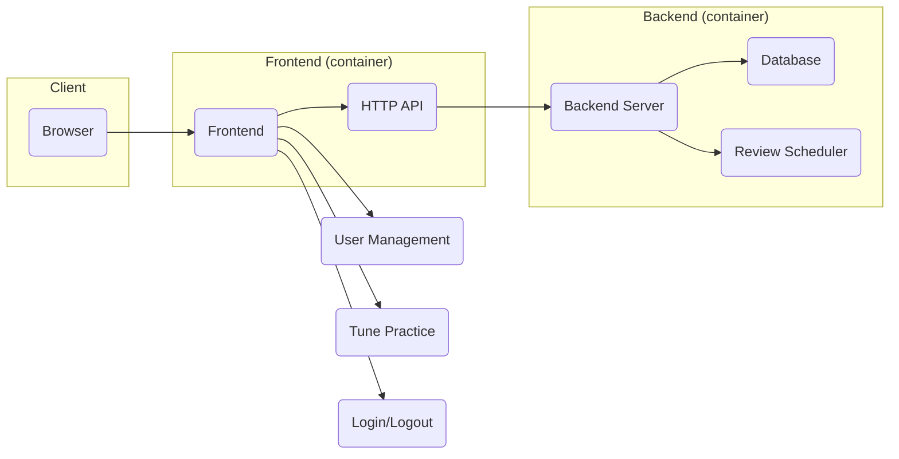
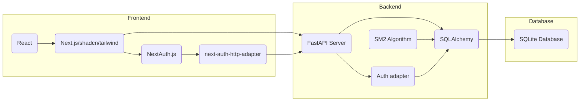
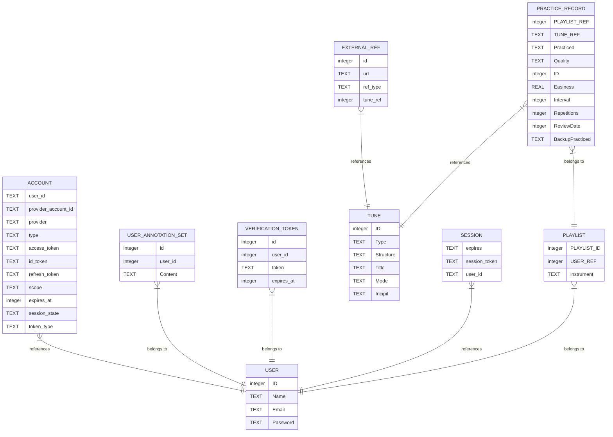

# TuneTrees: Tune Repertoire Practice Assistant

TuneTrees is designed to help folk musicians efficiently memorize and retain a large repertoire of tunes. By combining proven memory techniques like spaced repetition, mnemonics, and spatial navigation, the app assists in training musical memory. In the future, TuneTrees may explore the use of advanced technologies like neural networks and reinforcement learning to further enhance the memorization process.

See the [Tune Trees Project Whitepaper](docs/core-proposal.md#tune-trees-project-whitepaper)
to get some insight into the vision of the project.

## Design and Intent

TuneTrees is a web application with a backend server that manages user data and schedules reviews. The backend securely stores all data in a database, while the frontend handles user interactions like login, account management, and practicing tunes. The frontend communicates with the backend using an HTTP API to access and update user data. Both the frontend and backend are packaged as containers and deployed together using Docker Compose on a DigitalOcean server.

### System Structure

This diagram provides a high-level overview of the TuneTree architecture.



### Technology Usage

This diagram maps out the basic technology used. Specific implementation details may evolve.



#### Frontend:

Handles user interactions, including login, account management, and tune practice.
- HTTP API: Communicates with the backend to access and update user data.
- User Management: Handles user registration, login, and account settings.
- Tune Practice: Provides tools for practicing tunes and tracking progress.
- Login/Logout: Implements authentication and authorization.

#### Backend:

Handles user data management, review scheduling, and API requests.
- Database: Stores user data, including tunes, practice history, and review schedules.
- Review Scheduler: Determines when tunes should be reviewed based on the user's progress.

### Schema:

The database is organized as follows: Each user can have multiple playlists, and each playlist is associated with a specific musical instrument. These playlists contain tunes, which are stored separately and shared across all users. TuneTrees doesn't aim to be a complete tune repository, so it only stores basic tune information. For more detailed details, users can refer to external resources.

The complete entity relationship diagram is illustrated by the following diagram:



### Alternatives or Potential Technology Evolution

1. Down the line, I can switch to MySQL or PostgreSQL if needed.
2. For the front end, I may experiment with a Kotlin frontend at some point.

## Development Processes

### Generation of ORM code

The SQLAlchemy ORM code is contained in the `tunetrees/models` package in the `tunetrees.py` 
module.  It should always be generated with the following procedure:

```bash
sqlacodegen_v2 sqlite:///tunetrees.sqlite3 > tunetrees/models/tunetrees.py
```

Then remove the extra `from sqlalchemy.orm.base import Mapped` line from the generated code.

Finally, make sure the new code is properly formatted for the project.

[!NOTE]
For the moment, both `black` and `ruff` are invoked, which is just me trying to hedge my bets.

```bash
black tunetrees/models/tunetrees.py &&  ruff check --fix --select I tunetrees/models/tunetrees.py && ruff check --fix tunetrees 
```

## Credits

TuneTrees is a collaborative project developed by a team of dedicated musicians and software engineers. The following individuals have made contributions to the project:

- Scott Boag: Project Owner
- Caitlin Rich: Developer
- Joanne Boag: Consultation

If you would like to contribute to TuneTrees, please visit [GitHub repository](https://github.com/your-username/tunetrees) for more information.
