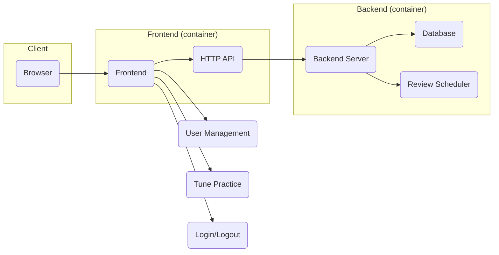
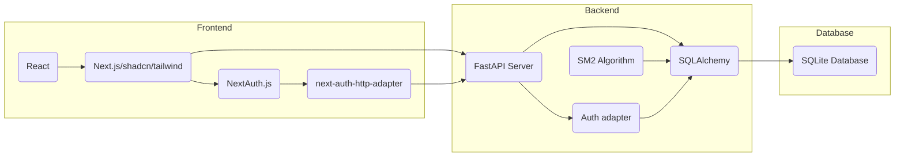
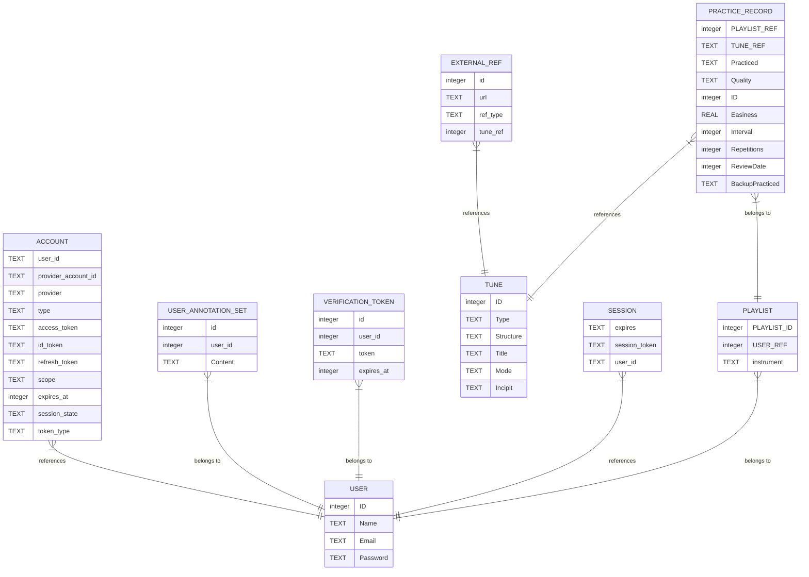

# TuneTrees: Tune Repertoire Practice Assistant

TuneTrees is designed to help folk musicians efficiently memorize and retain a large repertoire of tunes. By combining proven memory techniques like spaced repetition, mnemonics, and spatial navigation, the app assists in training musical memory. In the future, TuneTrees may explore the use of advanced technologies like neural networks and reinforcement learning to further enhance the memorization process.

See the [Tune Trees Project Whitepaper](docs/core-proposal.md#tune-trees-project-whitepaper)
to get some insight into the vision of the project.

**Table of Contents**

<!-- TOC -->
- [1. Design and Intent](#1-design-and-intent)
    - [1.1. System Structure](#11-system-structure)
    - [1.2. Technology Usage](#12-technology-usage)
        - [1.2.1. Frontend:](#121-frontend)
        - [1.2.2. Backend:](#122-backend)
    - [1.3. Schema:](#13-schema)
    - [1.4. Alternatives or Potential Technology Evolution](#14-alternatives-or-potential-technology-evolution)
- [2. Development Processes](#2-development-processes)
    - [2.1. Generation of ORM code](#21-generation-of-orm-code)
        - [2.1.1. VSCode Processes  (🚧 This Section a Work in Progress 🚧)](#211-vscode-processes---this-section-a-work-in-progress-)
        - [2.1.2. Run and Debug in VSCode  (🚧 This Section a Work in Progress 🚧)](#212-run-and-debug-in-vscode---this-section-a-work-in-progress-)
- [3. Build and Deploy (🚧 This Section a Work in Progress 🚧)](#3-build-and-deploy--this-section-a-work-in-progress-)
    - [3.1. Basics](#31-basics)
    - [3.2. Build](#32-build)
    - [3.3. Deploy](#33-deploy)
        - [3.3.1. Local](#331-local)
            - [3.3.1.1. Make local certificates](#3311-make-local-certificates)
        - [3.3.2. Digital Ocean Droplet](#332-digital-ocean-droplet)
- [4. Authentication and User Management (🚧 This Section a Work in Progress 🚧)](#4-authentication-and-user-management--this-section-a-work-in-progress-)
    - [4.1. Mail verification mechanism](#41-mail-verification-mechanism)
- [5. Credits](#5-credits)
<!-- /TOC -->


## 1. Design and Intent

TuneTrees is a web application with a backend server that manages user data and schedules reviews. The backend securely stores all data in a database, while the frontend handles user interactions like login, account management, and practicing tunes. The frontend communicates with the backend using an HTTP API to access and update user data. Both the frontend and backend are packaged as containers and deployed together using Docker Compose on a DigitalOcean server.

### 1.1. System Structure

This diagram provides a high-level overview of the TuneTree architecture.



### 1.2. Technology Usage

This diagram maps out the basic technology used. Specific implementation details may evolve.



#### 1.2.1. Frontend:

Handles user interactions, including login, account management, and tune practice.
- HTTP API: Communicates with the backend to access and update user data.
- User Management: Handles user registration, login, and account settings.
- Tune Practice: Provides tools for practicing tunes and tracking progress.
- Login/Logout: Implements authentication and authorization.

#### 1.2.2. Backend:

Handles user data management, review scheduling, and API requests.
- Database: Stores user data, including tunes, practice history, and review schedules.
- Review Scheduler: Determines when tunes should be reviewed based on the user's progress.

### 1.3. Schema:

The database is organized as follows: Each user can have multiple playlists, and each playlist is associated with a specific musical instrument. These playlists contain tunes, which are stored separately and shared across all users. TuneTrees doesn't aim to be a complete tune repository, so it only stores basic tune information. For more detailed details, users can refer to external resources.

The complete entity relationship diagram is illustrated by the following diagram:



### 1.4. Alternatives or Potential Technology Evolution

1. Down the line, I can switch to MySQL or PostgreSQL if needed.
2. For the front end, I may experiment with a Kotlin frontend at some point.

## 2. Development Processes

Lorem ipsum dolor sit amet, consectetur adipiscing elit. Sed do eiusmod tempor incididunt ut labore et dolore magna aliqua. Ut enim ad minim veniam, quis nostrud exercitation ullamco laboris nisi ut aliquip ex ea commodo consequat. Duis aute irure dolor in reprehenderit in voluptate velit esse cillum dolore eu fugiat nulla pariatur. Excepteur sint occaecat cupidatat non proident, sunt in culpa qui officia deserunt mollit anim id est laborum.

### 2.1. Generation of ORM code

The SQLAlchemy ORM code is contained in the `tunetrees/models` package in the `tunetrees.py` 
module.  It should always be generated with the following procedure:

```bash
sqlacodegen_v2 sqlite:///tunetrees.sqlite3 > tunetrees/models/tunetrees.py
```

Then remove the extra `from sqlalchemy.orm.base import Mapped` line from the generated code.

Finally, make sure the new code is properly formatted for the project.

> [!NOTE]
> For the moment, both `black` and `ruff` are being invoked, which is just the author 
> trying to hedge his bets.

```bash
black tunetrees/models/tunetrees.py &&  ruff check --fix --select I tunetrees/models/tunetrees.py && ruff check --fix tunetrees 
```

#### 2.1.1. VSCode Processes  (🚧 This Section a Work in Progress 🚧)

To install and set up Visual Studio Code (VSCode) for this project, follow these steps:

1. Download and install VSCode from the official website: [https://code.visualstudio.com/](https://code.visualstudio.com/)

2. Open VSCode and install the following extensions:
    - Python: This extension provides support for Python development. You can install it by searching for "Python" in the Extensions view and clicking on the "Install" button.
    - Docker: This extension allows you to work with Docker containers directly from VSCode. Search for "Docker" in the Extensions view and install it.
    - Remote - Containers: This extension enables you to develop inside a Docker container using VSCode. Install it by searching for "Remote - Containers" in the Extensions view.

3. Clone the TuneTrees project repository to your local machine:
    ```bash
    git clone https://github.com/your-username/tunetrees.git
    ```

4. Open the project folder in VSCode:
    - Click on "File" in the menu bar.
    - Select "Open Folder" and navigate to the location where you cloned the TuneTrees repository.
    - Click "Open" to open the project in VSCode.

5. Set up the development environment:
    - Open the integrated terminal in VSCode by clicking on "View" in the menu bar and selecting "Terminal" from the dropdown menu.
    - Run the following command to create a virtual environment for the project:
      ```bash
      python3 -m venv venv
      ```
    - Activate the virtual environment:
      - On macOS/Linux:
         ```bash
         source venv/bin/activate
         ```
      - On Windows:
         ```bash
         venv\Scripts\activate
         ```

6. Install the project dependencies:
    - Run the following command to install the required Python packages:
      ```bash
      pip install -r requirements.txt
      ```

7. Start the development server:
    - Run the following command to start the backend server:
      ```bash
      uvicorn tunetrees.main:app --reload
      ```
    - Open a web browser and navigate to [http://localhost:8000](http://localhost:8000) to access the TuneTrees application.

Now you have VSCode installed and set up for the TuneTrees project. You can start coding and contributing to the project using the powerful features of VSCode.


#### 2.1.2. Run and Debug in VSCode  (🚧 This Section a Work in Progress 🚧)

To run and debug your project using `.vscode/launch.json`, follow these steps:

1. Open your project in Visual Studio Code (VSCode).

2. In the VSCode sidebar, click on the "Run and Debug" icon (or press `Ctrl+Shift+D`).

3. Click on the "Create a launch.json file" link or select "Add Configuration" from the dropdown menu.

4. Choose the appropriate configuration for your project. For example, if you're working with a Python project, select "Python" as the configuration type.

5. VSCode will generate a `launch.json` file in the `.vscode` directory of your project.

6. Open the `launch.json` file and configure the necessary settings for running and debugging your project. This may include specifying the entry point file, command-line arguments, environment variables, and more.

7. Save the `launch.json` file.

8. To run your project, click on the "Run" button in the VSCode toolbar (or press `F5`). VSCode will execute your project according to the configuration specified in `launch.json`.

9. To debug your project, set breakpoints in your code by clicking on the left margin of the code editor or pressing `F9`. Then click on the "Debug" button in the VSCode toolbar (or press `F5`). VSCode will start your project in debug mode and pause execution at the breakpoints you set. You can inspect variables, step through code, and analyze the program's behavior.

10. Use the debugging controls in the VSCode toolbar to navigate through your code and control the debugging session. These controls include stepping into functions, stepping over lines, stepping out of functions, and stopping the debugging session.

By following these steps and configuring the `launch.json` file, you can easily run and debug your project in Visual Studio Code.


## 3. Build and Deploy (🚧 This Section a Work in Progress 🚧)

Lorem ipsum dolor sit amet, consectetur adipiscing elit. Sed do eiusmod tempor incididunt ut labore et dolore magna aliqua. Ut enim ad minim veniam, quis nostrud exercitation ullamco laboris nisi ut aliquip ex ea commodo consequat. Duis aute irure dolor in reprehenderit in voluptate velit esse cillum dolore eu fugiat nulla pariatur. Excepteur sint occaecat cupidatat non proident, sunt in culpa qui officia deserunt mollit anim id est laborum.

### 3.1. Basics

    - Docker.
    - Multi-Platform Cross Compilation
    - Docker Compose
    - buildx bake

### 3.2. Build

    - docker buildx bake
    - docker buildx bake frontend
    - docker buildx bake server

### 3.3. Deploy

Lorem ipsum dolor sit amet, consectetur adipiscing elit. Sed do eiusmod tempor incididunt ut labore et dolore magna aliqua. Ut enim ad minim veniam, quis nostrud exercitation ullamco laboris nisi ut aliquip ex ea commodo consequat. Duis aute irure dolor in reprehenderit in voluptate velit esse cillum dolore eu fugiat nulla pariatur. Excepteur sint occaecat cupidatat non proident, sunt in culpa qui officia deserunt mollit anim id est laborum.

#### 3.3.1. Local

For local deployment, these instructions have been tested with Docker Desktop on 
a MacBook Pro with an M3 chip and 48 gigibytes of memory.

##### 3.3.1.1. Make local certificates

We recommend using `mkcert` to generate self-signed certificates into a local 
`dhparam` directory.  To install `mkcert` follow these steps:

**For macOS:**

Install `mkcert` by running the following command in your terminal:

```SHELL
brew install mkcert
```

**For Linux:**

Install `mkcert` by running the following commands in your terminal:

```SHELL
sudo apt-get update
sudo apt-get install libnss3-tools
wget -O mkcert https://github.com/FiloSottile/mkcert/releases/download/v1.4.3/mkcert-v1.4.3-linux-amd64
chmod +x mkcert
sudo mv mkcert /usr/local/bin/
```

**For Windows:**

Install `mkcert` by following the instructions on the official website: [https://github.com/FiloSottile/mkcert#installation](https://github.com/FiloSottile/mkcert#installation)

**Install localhost certificates**

Once `mkcert` is installed, the certificates can be created as follows:

1. Create the `dhparam` directory and `cd` into it:

```SHELL
mkdir -p dhparam
cd dhparam
```

2. Generate the self-signed certificates by running the following command:

```SHELL
mkcert localhost
```

This will generate the `localhost.pem` and `localhost-key.pem` files in the `dhparam` directory.


#### 3.3.2. Digital Ocean Droplet

- dhparam.
- local.
- remote DigitalOcean droplet.

## 4. Authentication and User Management (🚧 This Section a Work in Progress 🚧)

Lorem ipsum dolor sit amet, consectetur adipiscing elit. Sed do eiusmod tempor incididunt ut labore et dolore magna aliqua. Ut enim ad minim veniam, quis nostrud exercitation ullamco laboris nisi ut aliquip ex ea commodo consequat. Duis aute irure dolor in reprehenderit in voluptate velit esse cillum dolore eu fugiat nulla pariatur. Excepteur sint occaecat cupidatat non proident, sunt in culpa qui officia deserunt mollit anim id est laborum.

### 4.1. Mail verification mechanism

Lorem ipsum dolor sit amet, consectetur adipiscing elit. Sed do eiusmod tempor incididunt ut labore et dolore magna aliqua. Ut enim ad minim veniam, quis nostrud exercitation ullamco laboris nisi ut aliquip ex ea commodo consequat. Duis aute irure dolor in reprehenderit in voluptate velit esse cillum dolore eu fugiat nulla pariatur. Excepteur sint occaecat cupidatat non proident, sunt in culpa qui officia deserunt mollit anim id est laborum.

## 5. Credits

TuneTrees is a collaborative project developed by a team of dedicated musicians and software engineers. The following individuals have made contributions to the project:

- Scott Boag: Project Owner
- Caitlin Rich: Developer
- Joanne Boag: Consultation

If you would like to contribute to TuneTrees, please visit [GitHub repository](https://github.com/your-username/tunetrees) for more information.
