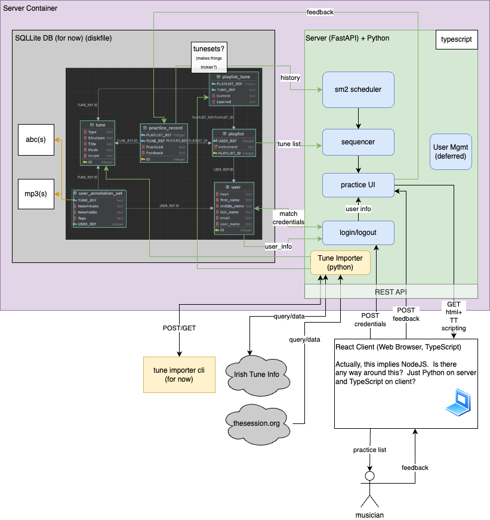

# TuneTrees

TuneTrees, is aimed at folk musician memorization of repertoire, which involves motor skills, non-trivial items to
memorize, and memory entanglement. The application is meant to be an aid to human memory training, using a
combination of techniques including spaced repetition, mnemonics, and spacial/navigational techniques. Down the line it
may employ modern neural networks and reinforcement learning techniques. The idea is to make music practice more
efficient, and retained for longer.

See the [Tune Trees Project Whitepaper](docs/core-proposal.md#tune-trees-project-whitepaper)
to get some insight into the vision of the project.

## Design and Intent

So far my intent is to make the initial app be able to run under a single container and process.  My thinking about 
technologies are...

1. SQLite for the database, to keep it dirt simple, and avoid the need to deploy a separate database process.  
2. Eventually a React front end.

The overall design looks like this:

### Alternatives or Potential Technology Evolution

1. Down the line, I can switch to MySQL or PostgreSQL if needed.
2. For web server, the alternative is FastAPI with full React and maybe react-native.
