# DrizzleSync Proposal/Brainstorm

## Core Idea

Brainstorming.  What would you think of a opinionated PWA sync library that would assume postgres (maybe supabase, but would be nice to make it generic?), SQLite WASM, and Drizzle.  And maybe Wrangler, not sure.  The source of truth would be local postgres DB.  Tools would query local postgres and generate schemas for SQLite WASM and Drizzle, as well as some meta infrastructure to drive sync, and maybe generate Postgres migration files.  So there would always be only one place to make schema changes.  And then the library would be composed of trigger system, client-side sync engine, client-sync service, and server-side sync processor. 

In other words, essentially what I've been trying to build for my app, but with the multi-schema nightmare fixed via code generation, and the system separated off into a reusable library.

1. Could this be constructed reasonably to be robust and generic enough for useful reuse?
2. Would it be interesting as an npm library and open source component?

## Idea Development

This is a essentially describing the "Holy Grail" of Local-First development: **The Developer Experience (DX) of a monolithic app, but the architecture of a distributed system.**

The current landscape forces developers to manually stitch together disparate tools (Supabase, Drizzle, SQLite, Workers) and maintain duplicate schemas. A library that automates this "glue" would be highly valuable.

Here is an analysis of the viability and market potential for such a library, which we could call **"DrizzleSync"** (or *Oasis*, *Mirage*, etc.).

### 1\. Can it be robust and generic?

**Yes, but you must be strictly opinionated.**
Generic sync libraries (like Replicache or ElectricSQL) are often heavy because they try to support *every* backend or *every* frontend pattern. By locking your scope to **Postgres + Drizzle + SQLite WASM**, you dramatically simplify the problem space.

#### The "Golden Path" Architecture

To make this robust, the library needs to function as a CLI tool + Runtime helper.

**A. The Source of Truth (Schema Introspection)**
Instead of writing TypeScript schemas manually, your library relies on the **Postgres Database Schema** as the master.

  * *Input:* Connection string to local Postgres Docker container.
  * *Action:* `npx oasis codegen`
  * *Output:*
    1.  `schema.postgres.ts`: Drizzle Postgres definitions.
    2.  `schema.sqlite.ts`: Drizzle SQLite definitions (automatically mapping `timestamp` $\to$ `integer`, `boolean` $\to$ `integer`, etc.).
    3.  `sync-meta.ts`: A generated map of tables and columns for the runtime.

**B. The "Invisible" Infrastructure**
The library shouldn't just be code; it should be *infrastructure-as-code*.

  * **Triggers:** The library provides a migration that installs a standard `change_log` table and generic triggers in Postgres.
  * **Client Outbox:** It generates the SQL to create the `sync_outbox` table in SQLite triggers automatically.

**C. The Sync Engine (The "Black Box")**
You provide two pre-compiled packages:

1.  `@oasis/client`: A hook (e.g., `useOasisSync()`) that connects Drizzle-SQLite to the Worker.
2.  `@oasis/worker`: A request handler (e.g., `handleSyncRequest(req, drizzleDB)`) that you drop into a Cloudflare Worker.

### 2\. Is it interesting as an Open Source project?

**Absolutely.** The timing is perfect.

  * **The Trend:** "Local-First" is the hottest topic in web dev right now (see: LoFi, ElectricSQL, PowerSync), but most solutions are SaaS (PowerSync) or complex infrastructure (ElectricSQL requires running a separate sync service/container).
  * **The Gap:** There is no lightweight, "Serverless" sync solution. Everything currently requires a dedicated container running 24/7 to manage the replication stream. Your Cloudflare Worker approach is **Scale-to-Zero**, which is a massive differentiator for hobbyists and indie hackers.

#### Why developers would use this:

1.  **"One Schema Rule":** They hate maintaining `client/schema.ts` and `server/schema.ts`.
2.  **Zero Infra Cost:** They can host the sync layer on Cloudflare Free Tier instead of paying $25/mo for a sync container.
3.  **Drizzle Native:** Drizzle is exploding in popularity; a sync engine built *specifically* for it would gain immediate traction.

### Potential Pitfalls (The "Hard Parts")

If you build this, here is where you will get stuck:

1.  **Partial Sync / Authorization:**

      * *Problem:* Generic sync is easy if everyone sees everything. It's hard if User A should only see Row X.
      * *Solution:* Your library needs a way to inject "Filters" into the pull query (e.g., `where: (table, user) => eq(table.userId, user.id)`).

2.  **Schema Evolution:**

      * *Problem:* What happens when the server schema changes (new column) but the user has an old PWA cached?
      * *Solution:* The sync handshake must include a "Schema Version." If mismatch, the client must pause sync and reload (or run a client-side migration).

3.  **Type Mapping:**

      * *Problem:* Postgres `jsonb` vs. SQLite `text`. Postgres `uuid` vs. SQLite `text`.
      * *Solution:* Your code generator needs a robust type-mapper (which you've essentially already solved in your current refactor).

### Verdict

This is **highly viable**.

**Recommendation:**
Don't build the generic library *yet*.

1.  Finish your current app using the architecture we discussed.
2.  While building it, isolate the "Sync" code into a `packages/sync-core` folder in your monorepo.
3.  Once your app works, **extract** that folder. The "Code Generator" is the product.

You are effectively rebuilding a lightweight, serverless version of **ElectricSQL** or **PowerSync**, but tailored for the Drizzle ecosystem. That is a very compelling pitch.

I have generated a diagram to visualize how this library would structure the development workflow versus the runtime data flow. This differentiates the "Build Time" code generation from the "Run Time" synchronization.

### Visualizing "DrizzleSync"

The diagram below illustrates the "One Source of Truth" concept. Note how the **CLI** does the heavy lifting at build time, so the runtime remains simple.

```mermaid
flowchart TD
    subgraph BuildTime [🛠️ Build Time: Code Generation]
        Postgres[(Local Postgres DB)]
        CLI[npx drizzle-sync generate]
        
        Postgres -->|Introspect| CLI
        CLI -->|Generate| ClientSchema["client/schema.sqlite.ts"]
        CLI -->|Generate| ServerSchema["worker/schema.postgres.ts"]
        CLI -->|Generate| SyncMeta["shared/sync-meta.ts"]
        CLI -->|Generate| Migrations["drizzle/migrations/triggers.sql"]
    end

    subgraph Runtime [⚡ Run Time: Sync Flow]
        PWA[PWA Client]
        Worker[Cloudflare Worker]
        ProdDB[(Production Postgres)]
        
        ClientSchema -.->|Used By| PWA
        ServerSchema -.->|Used By| Worker
        
        PWA -->|Batch JSON| Worker
        Worker -->|Hyperdrive| ProdDB
    end

    style CLI fill:#f9f,stroke:#333,stroke-width:2px
    style BuildTime fill:#f9f9f9,stroke:#999,stroke-dasharray: 5 5
```

