# Architecture Proposal: Hybrid Local-First Sync with Cloudflare Workers

## 1. Executive Summary

**Objective:** Migrate the current "Browser-Side Sync" architecture to a "Serverless Hybrid" architecture using Cloudflare Workers and Hyperdrive.

**Current State:**
The application uses a **Browser-Only** approach.

1. **Writes:** Application writes to SQLite WASM.
2. **Outbox:** SQLite Triggers (`AFTER INSERT/UPDATE/DELETE`) automatically populate a local `sync_outbox` table.
3. **Sync:** A browser-side process polls `sync_outbox`, transforms data (camelCase -> snake_case), and executes REST calls to Supabase via `supabase-js`.

**Proposed State:**
The application retains the Local-First/Outbox pattern but moves the **synchronization execution** to a Cloudflare Worker.

1. **Writes:** (Unchanged) Application writes to SQLite WASM.
2. **Outbox:** (Unchanged) SQLite Triggers populate `sync_outbox`.
3. **Sync:** The browser sends a **single batch JSON payload** of the `sync_outbox` to a Cloudflare Worker. The Worker utilizes **Hyperdrive** to perform a transactional merge with PostgreSQL.

```mermaid
flowchart TD
    subgraph PWA ["📱 PWA (Browser)"]
        UI[User Interface]
        subgraph LocalData ["Local Data Layer"]
            SQLite[("SQLite WASM")]
            SupabaseJS[Supabase JS Client]
        end
        SyncLogic["Sync Logic (TypeScript)"]
    end

    subgraph Cloudflare ["☁️ Cloudflare (Edge)"]
        Worker[Cloudflare Worker]
        Hyperdrive[Hyperdrive Connection Pool]
    end

    subgraph Backend ["🗄️ Supabase (Backend)"]
        Postgres[("PostgreSQL DB")]
        Auth[Supabase Auth]
        Storage[Supabase Storage]
    end

    %% -- UI Reads/Writes to Local DB --
    UI -->|Read/Write Instant| SQLite
    UI -.->|Upload Images| Storage

    %% -- Sync Loop --
    SyncLogic -- 1. Push Dirty Rows JSON --> Worker
    Worker -- 2. Atomic Transaction --> Hyperdrive
    Hyperdrive -- 3. Execute SQL --> Postgres

    %% -- Auth & Direct Access --
    SupabaseJS -- Login / Tokens --> Auth
    SupabaseJS -- Realtime Subscriptions --> Postgres

    %% -- Data Flow Return --
    Postgres -- 4. Return Updated Rows --> Hyperdrive
    Hyperdrive --> Worker
    Worker -- 5. Sync Response JSON --> SyncLogic
    SyncLogic -- 6. Update Local DB --> SQLite

    %% Styling
    style UI fill:#e1f5fe,stroke:#01579b,stroke-width:2px
    style SQLite fill:#fff9c4,stroke:#fbc02d,stroke-width:2px
    style Worker fill:#ffe0b2,stroke:#f57c00,stroke-width:2px
    style Postgres fill:#c8e6c9,stroke:#388e3c,stroke-width:2px
```

## 2. Why Migrate? (The Business Case)

| Feature | Current (Browser-Only) | Proposed (Cloudflare Worker) |
| :--- | :--- | :--- |
| **Data Integrity** | **Low.** If the user closes the tab mid-sync, partial data is written. No multi-table transactions. | **High.** Atomic Transactions. The entire batch syncs, or nothing syncs. |
| **Performance** | **Variable.** Requires 1 HTTP request per modified row (chattiness). | **High.** 1 HTTP request per sync cycle. Hyperdrive pools DB connections (0-5ms latency). |
| **Security** | **Standard.** Relies on RLS. Timestamp validation happens on the client (untrusted). | **Enhanced.** Timestamp validation and Conflict Resolution happen on the trusted server. |
| **Cost** | Free (Supabase Tier). | **Free/Negligible.** Cloudflare Workers Free Tier (100k req/day) + Free Hyperdrive. |

## 3. Detailed Architecture Changes

### A. The Client (PWA / Browser)

**1. What Stays:**
* **Drizzle/SQLite Schema:** Your isomorphic schema definitions remain.
* **Triggers:** The `AFTER INSERT` triggers that populate `sync_outbox` are perfect. Keep them.
* **The `sync_outbox` Table:** This remains the source of truth for "what needs to go to the server."

**2. What Changes:**
* **Remove:** The loop that iterates `sync_outbox` and calls `supabase.from(table).upsert()`.
* **Add:** A `syncWithWorker()` function.
    * **Step 1:** `SELECT * FROM sync_outbox`.
    * **Step 2:** `POST /api/sync` with `{ changes: outboxRows, lastSyncAt: timestamp }`.
    * **Step 3:** Await response.
    * **Step 4:** On success, `DELETE FROM sync_outbox` WHERE id IN (acceptedIds).
    * **Step 5:** Apply incoming changes from server response to local SQLite.

### B. The Server (Cloudflare Worker)

**1. The Stack:**
* **Runtime:** Cloudflare Worker (TypeScript).
* **Database Access:** Drizzle ORM + `postgres` driver + **Cloudflare Hyperdrive** (for connection pooling).
* **Auth:** `supabase-js` (just to verify the JWT token from the request header).

**2. The Logic (`POST /api/sync`):**
The Worker performs a "Sandwich" Transaction:

* **Layer 1: Authentication**
    * Extract JWT from `Authorization` header.
    * Verify user Identity.
* **Layer 2: Conflict Resolution (The Push)**
    * Start Transaction.
    * Iterate through Client's `changes`.
    * **Query:** Fetch current server version of the row.
    * **Compare:** Is `Client.updatedAt` > `Server.updated_at`?
    * **Write:** If yes, execute `INSERT/UPDATE` via Drizzle. If no, ignore (Server Wins).
* **Layer 3: The Pull**
    * Query all tables for rows where `updated_at` > `Client.lastSyncAt` AND `user_id` == `currentUser`.
* **Layer 4: Response**
    * Commit Transaction.
    * Return JSON: `{ success: true, pulledChanges: [...], newServerTimestamp: ... }`

## 4. Implementation Roadmap

### Phase 1: The Worker Setup
1. Initialize a Cloudflare Worker project.
2. Install `drizzle-orm`, `postgres`, and `@supabase/supabase-js`.
3. Configure **Hyperdrive** in the Cloudflare Dashboard pointing to your Supabase instance.
4. Copy your Drizzle Schema (`schema.ts`) to the Worker project.

### Phase 2: The Endpoint Logic
1. Implement the `POST` handler.
2. Write the "Batch Upsert" logic. *Note: Since you have a `sync_outbox` with table names, you can map these dynamically to Drizzle tables.*

### Phase 3: Client Refactor
1. Modify your existing `SyncService`.
2. Replace the `supabase.upsert` loop with the single `fetch('https://my-worker.../sync')` call.
3. Update the `DELETE FROM sync_outbox` logic to only delete rows confirmed by the Worker.

## 5. Handling The "Meta" Logic

You mentioned a meta table tracking `primaryKey`, `snake_case` mapping, etc.

* **Option A (Shared Code):** If this meta logic is in a TypeScript file, share it between Client and Worker. The Worker needs it to know that when the client says `{ table: 'userSettings' }`, it means `user_settings` in Postgres.
* **Option B (Payload Transformation):** Have the Client transform the `sync_outbox` data into the "Server Expected Format" (snake_case) *before* sending the JSON to the worker. This keeps the Worker "dumb" and fast. **(Recommended)**

## 6. Conclusion for Review

This proposal leverages your recent refactor (Triggers/Outbox) to create a robust, professional-grade sync engine. It eliminates the fragility of browser-side networking while incurring zero additional cost.

**Next Step:** specific implementation of `syncWithWorker()` function and the Worker's `fetch` handler.