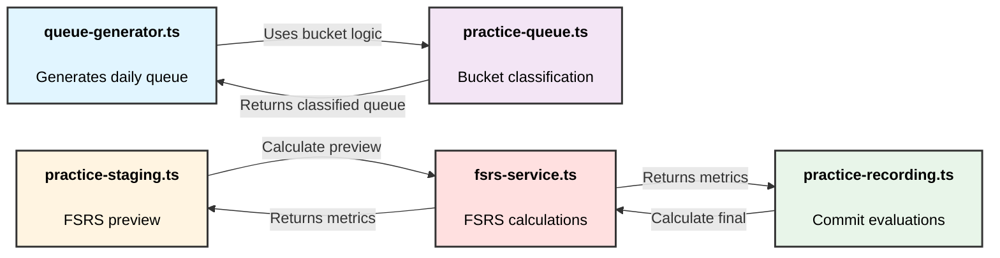

# TuneTrees Scheduling Architecture

**Created:** 2025-11-20  
**Purpose:** Simplified data flow between core scheduling components  
**Focus:** Scheduling logic only (storage mechanisms omitted for clarity)

## Core Components Data Flow

## Component Purposes

### 1. queue-generator.ts
Creates frozen daily practice queue snapshot

**When:** On page load (if queue doesn't exist for today)

---

### 2. practice-queue.ts
Classifies tunes into buckets based on due dates

**Buckets:**
- Q1: Due Today
- Q2: Lapsed 0-7 days
- Q3: New (never scheduled)
- Q4: Old Lapsed (>7 days)

---

### 3. practice-staging.ts
Calculates FSRS preview when user selects evaluation

**When:** User selects dropdown (Again/Hard/Good/Easy)

---

### 4. practice-recording.ts
Commits evaluations and creates practice records

**When:** User clicks Submit button

---

### 5. fsrs-service.ts
Wraps ts-fsrs library for FSRS calculations

**Calculates:**
- Next due date
- Stability (memory strength)
- Difficulty
- Interval (days until next review)

## Data Flow Sequence

### Morning: Queue Generation
1. `queue-generator.ts` → calls → `practice-queue.ts`
2. `practice-queue.ts` → classifies tunes into Q1/Q2/Q3/Q4
3. Returns classified queue

### During Practice: Preview
1. User selects "Good" for a tune
2. `practice-staging.ts` → calls → `fsrs-service.ts`
3. `fsrs-service.ts` → calculates preview metrics
4. Returns stability, due date, interval
5. UI shows preview

### End of Practice: Commit
1. User clicks "Submit"
2. `practice-recording.ts` → calls → `fsrs-service.ts`
3. `fsrs-service.ts` → calculates final metrics
4. Practice records created with next due dates

## Key Constraint

**Minimum Next-Day Enforcement**
- File: `src/lib/utils/practice-date.ts`
- Function: `ensureMinimumNextDay()`
- Adds 25 hours (24h + 1h buffer) if FSRS schedules same day
- Prevents "today" loop bug

## References

- **FSRS Algorithm:** https://github.com/open-spaced-repetition/fsrs4anki/wiki/The-Algorithm
- **ts-fsrs Library:** https://github.com/open-spaced-repetition/ts-fsrs
- **Detailed Sequence:** `docs/practice_flow.md`
- **Test Plan:** `_notes/scheduling-comprehensive-test-plan.md`
