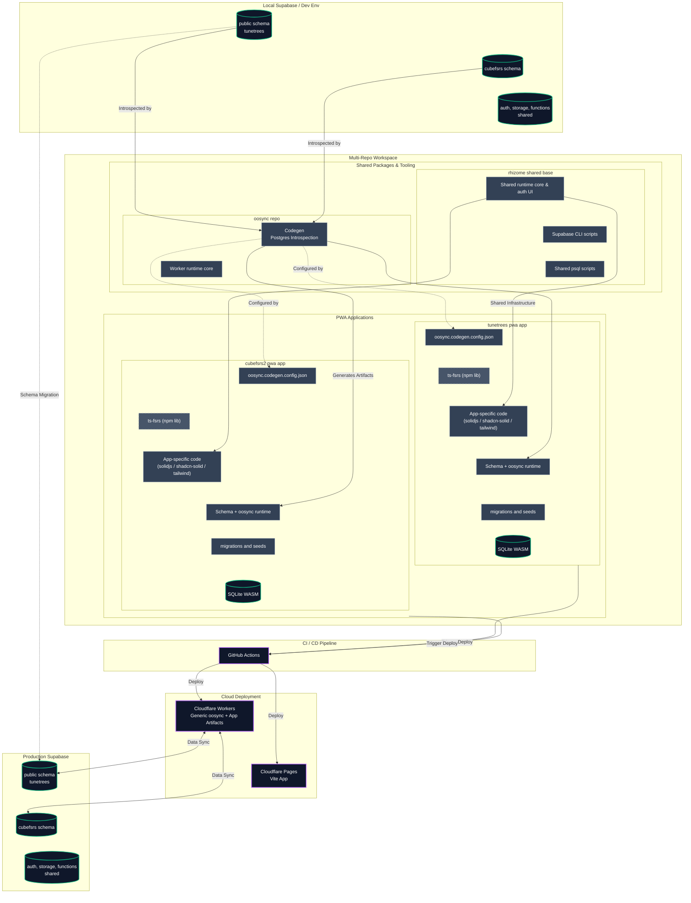

# TuneTrees Multi-Repo Architecture

Mermaid diagram derived from `design/shared_pwa_architecture-multi-repo.drawio.svg`.

```mermaid
flowchart TD
    %% Styling
    classDef repo fill:#1e293b,stroke:#3b82f6,stroke-width:2px,color:#fff
    classDef module fill:#334155,stroke:#94a3b8,stroke-width:1px,color:#fff
    classDef db fill:#0f172a,stroke:#10b981,stroke-width:2px,color:#fff
    classDef cloud fill:#0f172a,stroke:#a855f7,stroke-width:2px,color:#fff
    classDef lib fill:#475569,stroke:#94a3b8,stroke-width:1px,stroke-dasharray: 5 5,color:#fff

    subgraph DevEnv [Local Supabase / Dev Env]
        direction LR
        L_TT[(public schema<br/>tunetrees)]:::db
        L_Cube[(cubefsrs schema)]:::db
        L_Shared[(auth, storage, functions<br/>shared)]:::db
    end

    subgraph Workspace [Multi-Repo Workspace]
        direction TB
        
        subgraph Packages [Shared Packages & Tooling]
            direction LR
            
            subgraph Rhizome [rhizome shared base]
                direction TB
                R_Core[Shared runtime core & auth UI]:::module
                R_CLI[Supabase CLI scripts]:::module
                R_Psql[Shared psql scripts]:::module
                
                %% Force vertical stacking inside the repo
                R_Core ~~~ R_CLI ~~~ R_Psql
            end

            subgraph Oosync [oosync repo]
                direction TB
                O_CodeGen[Codegen<br/>Postgres Introspection]:::module
                O_Worker[Worker runtime core]:::module
                
                %% Force vertical stacking inside the repo
                O_CodeGen ~~~ O_Worker
            end
        end

        subgraph Apps [PWA Applications]
            direction LR
            
            subgraph TuneTrees [tunetrees pwa app]
                direction TB
                T_Conf[oosync.codegen.config.json]:::module
                T_FSRS["ts-fsrs (npm lib)"]:::lib
                T_App["App-specific code<br/>(solidjs / shadcn-solid / tailwind)"]:::module
                T_Schema[Schema + oosync runtime]:::module
                T_Mig[migrations and seeds]:::module
                T_DB[(SQLite WASM)]:::db
                
                %% Force vertical stacking inside the repo
                T_Conf ~~~ T_FSRS ~~~ T_App ~~~ T_Schema ~~~ T_Mig ~~~ T_DB
            end

            subgraph CubeFSRS [cubefsrs2 pwa app]
                direction TB
                C_Conf[oosync.codegen.config.json]:::module
                C_FSRS["ts-fsrs (npm lib)"]:::lib
                C_App["App-specific code<br/>(solidjs / shadcn-solid / tailwind)"]:::module
                C_Schema[Schema + oosync runtime]:::module
                C_Mig[migrations and seeds]:::module
                C_DB[(SQLite WASM)]:::db
                
                %% Force vertical stacking inside the repo
                C_Conf ~~~ C_FSRS ~~~ C_App ~~~ C_Schema ~~~ C_Mig ~~~ C_DB
            end
        end

    end

    subgraph CI [CI / CD Pipeline]
        GHActions[GitHub Actions]:::cloud
    end

    subgraph Cloud [Cloud Deployment]
        direction LR
        CFW[Cloudflare Workers<br/>Generic oosync + App Artifacts]:::cloud
        CFP[Cloudflare Pages<br/>Vite App]:::cloud
    end

    subgraph ProdEnv [Production Supabase]
        direction LR
        P_TT[(public schema<br/>tunetrees)]:::db
        P_Cube[(cubefsrs schema)]:::db
        P_Shared[(auth, storage, functions<br/>shared)]:::db
    end

    %% ==========================================
    %% EDGES (ALL POINTING TOP-TO-BOTTOM)
    %% ==========================================
    
    L_TT -->|Introspected by| O_CodeGen
    L_Cube -->|Introspected by| O_CodeGen

    R_Core -->|Shared Infrastructure| T_App
    R_Core --> C_App

    O_CodeGen -->|Generates Artifacts| C_Schema
    O_CodeGen --> T_Schema

    %% Reversed edge direction to stop Dagre from destroying the layout
    O_CodeGen -.->|Configured by| C_Conf
    O_CodeGen -.->|Configured by| T_Conf

    TuneTrees -->|Trigger Deploy| GHActions
    CubeFSRS -->|Trigger Deploy| GHActions

    GHActions -->|Deploy| CFW
    GHActions -->|Deploy| CFP

    CFW <-->|Data Sync| P_TT
    CFW <-->|Data Sync| P_Cube
    L_TT -.->|Schema Migration| P_TT

    %% ==========================================
    %% INVISIBLE LAYOUT SPINE
    %% ==========================================
    
    %% 1. Force items left-to-right inside horizontal wrappers
    L_TT ~~~ L_Cube ~~~ L_Shared
    R_Core ~~~ O_CodeGen
    T_Conf ~~~ C_Conf
    CFW ~~~ CFP
    P_TT ~~~ P_Cube ~~~ P_Shared

    %% 2. Force Macro Vertical Stack
    L_Shared ~~~ R_Core
    R_Psql ~~~ T_Conf
    O_Worker ~~~ C_Conf
    T_DB ~~~ GHActions
    C_DB ~~~ GHActions
    GHActions ~~~ CFW
    CFP ~~~ P_Shared
```
