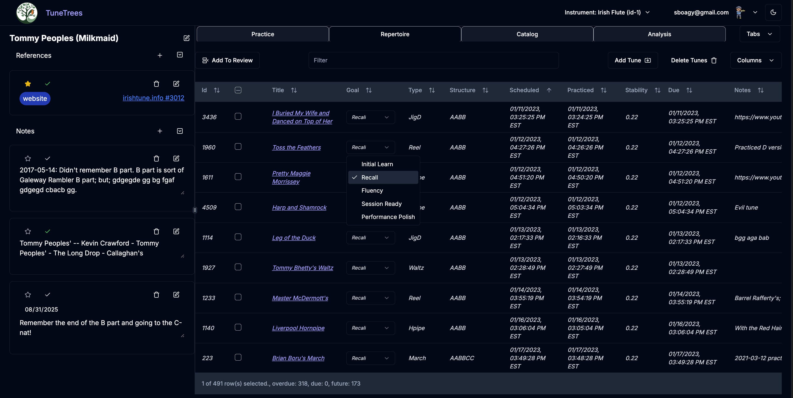

# TunesGrids for TuneTrees for SolidJS PWA Specification

Each of "Practice", "Repertoire", and "Catalog" tabs will each have a tune "grid".

Respectively:

1. The practice grid (TunesGridScheduled) will contain what is the daily practice "queue".
2. The Repertoire grid (TunesGridRepertoire) will contain all the tunes that are in the current playlist.
3. The Catalog grid (TunesGridCatalog) contain all the tunes in the TuneTrees catalog (possibly augmented by a user catalog), normally constrained via a genre filter. And each of these grids will have a controller tool bar, as you've started to implement.

The "grid" code must fullfill the following requirements:

1. Frozen headers, so the headers do not scroll when the table scrolls.
2. Frozen footer, so the footer does not scroll when the table scrolls.
3. Sortable columns.
4. Moveable columns.
5. Hideable columns.
6. Resizable columns.
7. Searchable
8. Virtual row windows, though its debatable if I really need this.
9. Custom edit controls in cells.
10. Multiple select.

Given the legacy implementation described below, the hope here is to implement a strategy that leans toward porting the core logic, and rewriting the UI structure for SolidJS and the latest "@tanstack/solid-table".

That is the classic dilemma when moving frameworks! Given that you are moving from **React/Next.js** to **SolidJS** and already have a complex, functional table implementation using **TanStack Table**, I strongly recommend a strategy that leans toward **porting the core logic** and **rewriting the UI structure**.

Here is a breakdown of why, and a suggested approach:

## 🔄 Port the Logic, Rewrite the Structure

You should aim to **port your complex TanStack configuration and utility functions**, but **rewrite your UI components from scratch** to fully leverage SolidJS's fine-grained reactivity.

### 1. The Argument for Porting Core Logic

Your most complex intellectual property and problem-solving is already baked into your TanStack configuration.

- **TanStack Logic is Portable:** The definitions for columns, the state management for sorting/filtering/visibility, and the API calls to TanStack's methods (e.g., `getSortedRowModel()`, `toggleColumnVisibility()`) are **framework-agnostic**. You can directly port this logic from your React hooks/callbacks into Solid's utility functions and signals/stores.
- **Virtualization Logic:** The underlying concepts you used with `@tanstack/react-virtual` transfer directly to `@tanstack/solid-virtual`. You've solved the hardest part (the coordinate system and scroll management); you just need to re-wire it with Solid's primitives.
- **Feature Completeness:** By porting, you ensure all 10 of your complex requirements are met, as you know the implementation path works.

### 2. The Argument for Rewriting UI Components

SolidJS is fundamentally different from React (no Virtual DOM, based on fine-grained reactivity and signals). Simply wrapping your old JSX will not yield the expected performance benefits.

- **SolidJS Performance:** To get the legendary SolidJS performance, you must use its primitives (`createSignal`, `createEffect`, `<For>`, `<Show>`) to ensure only the necessary DOM nodes update. Your React JSX structure will need to be refactored to use Solid's control flow components.
- **Fine-Grained Updates:** Your custom cell editing components, which are crucial for the user experience (like the dropdowns in the screenshot), should be rewritten in pure Solid to ensure only the value being edited re-runs, not the entire row or cell component.

---

## 🧭 Suggested Strategy

1.  **Extract the Configuration:** Create pure TypeScript files that define your column structures, initial state, and custom utility functions. These files should be nearly identical to the legacy code.
2.  **Build the Shell:** Create the basic SolidJS structure for your table, including the main `createSolidTable` instance and the scrollable container.
3.  **Implement the Hard Parts First:** Port the most complex and coupled features:
    - **Virtualization/Sticky Headers:** This requires careful CSS and integration with the virtualizer. Get this working first.
    - **Custom Cell Renderers:** Rewrite one or two of the custom cell components (like the "Goal" or "Type" editors) using Solid signals to test custom editing and updates.
4.  **Integrate Features:** Systematically connect the rest of the logic (sorting, filtering, column hiding/resizing) using the existing logic ported from Step 1.

**Conclusion:** **Port the complex logic, but rewrite the surrounding JSX into idiomatic Solid components.** This balances risk, reuses prior work on the hardest problems, and guarantees the SolidJS performance gains.

And then the data access must of course be rewritten for the Drizzle ORM.

## Legacy Implementation to Emulate or Port



The image aboid is a screenshot of legacy app where the repertoire table is shown. I implemented this via "@tanstack/react-table": "^8.21.3" and "@tanstack/react-virtual": "^3.13.9". It's an awesome bit of work, and has been working well. But it's VERY complex.

In the legacy code (rooting from the legacy directory), these grids are written with "@tanstack/react-table"

the main components to construct these grids are as follows:

```
frontend/app/(main)/pages/practice/components/TuneColumns.css
frontend/app/(main)/pages/practice/components/TuneColumns.tsx
frontend/app/(main)/pages/practice/components/TunesGrid.tsx
frontend/app/(main)/pages/practice/components/TunesGridCatalog.tsx
frontend/app/(main)/pages/practice/components/TunesGridRepertoire.tsx
frontend/app/(main)/pages/practice/components/TunesGridScheduled.tsx
frontend/app/(main)/pages/practice/components/TunesTable.tsx
frontend/app/(main)/pages/practice/components/use-save-table-state.ts
```

TunesGrid.tsx is the superclass for each of TunesGridScheduled, TunesGridRepertoire, and TunesGridCatalog. The table creation itself is done in TunesTable.tsx in the TunesTableComponent function around lines 496-530.

### Architecture Flow

1. **Columns Definition**: The columns are defined in TuneColumns.tsx via the `get_columns()` function
2. **Table Creation**: The table instance is created in TunesTable.tsx using `useReactTable()`
3. **Hook Interface**: The `useTunesTable()` hook (lines 957+) wraps the `TunesTableComponent` and returns both the table component and table instance
4. **Grid Components**: The hook is consumed by the different grid components:
   - TunesGridScheduled.tsx (line 708)
   - TunesGridRepertoire.tsx (line 181)
   - TunesGridCatalog.tsx (line 130)

### Key Files

- **TunesTable.tsx**: Main table creation and state management
- **TuneColumns.tsx**: Column definitions and configuration
- **TunesGrid.tsx**: Renders the actual table UI using the Tanstack table instance
- **`TunesGrid*.tsx`**: Specific grid implementations that consume the table

The table supports advanced features like column sizing, sorting, filtering, row selection, virtualization, and persistent state management across different table purposes (practice, repertoire, catalog).

createSolidTable()

## Database Views Used by Tune Grids

The TuneTrees application uses **two main database views** to power the different tune grids:

### 1. `practice_list_staged` View

**Used by:**

- **TunesGridRepertoire** (Repertoire tab)
- **TunesGridScheduled** (Practice tab - for some operations)

**API Endpoint:** `/repertoire_tunes_overview/{user_id}/{playlist_ref}`

**Purpose:** This view provides comprehensive tune information including staging/transient data for repertoire management.

**Key Features:**

- Includes staging data from `table_transient_data` (td) with COALESCE fallback to practice records (pr)
- Supports transient fields like `recall_eval`, `note_private`, `note_public`
- Has `has_staged` computed field to indicate if tune has pending changes
- Includes goal management and playlist-specific data

### 2. `practice_list_joined` View

**Used by:**

- **TunesGridScheduled** (Practice tab - legacy/fallback)
- Individual tune lookups

**API Endpoint:** `/playlist-tune-overview/{user_id}/{playlist_ref}/{tune_id}`

**Purpose:** Simpler view focused on practice records without staging capabilities.

### 3. Raw `tune` Table

**Used by:**

- **TunesGridCatalog** (Catalog tab)

**API Endpoint:** `/tunes`

**Purpose:** Shows all available tunes (public + user's private) for adding to repertoire.

### Key Differences Between Views

| View                   | Staging Support | Use Case                                | Transient Data  |
| ---------------------- | --------------- | --------------------------------------- | --------------- |
| `practice_list_staged` | ✅ Yes          | Repertoire management, practice staging | ✅ Full support |
| `practice_list_joined` | ❌ No           | Historical practice data                | ❌ None         |
| `tune` (raw table)     | ❌ No           | Catalog browsing                        | ❌ None         |

### Modern Practice Queue System

The **TunesGridScheduled** (Practice tab) has evolved to primarily use the **Daily Practice Queue** system:

- **Primary:** `daily_practice_queue` table entries via `/practice-queue/` endpoints
- **Fallback:** `practice_list_staged` view for enrichment and metadata
- **API:** `getPracticeQueueEntriesAction()` → `/practice-queue/{user_id}/{playlist_id}/entries`

This newer system provides snapshot-based scheduling with bucket classification (Due Today, Recently Lapsed, Backfill) rather than real-time view queries.

The database views are defined in:

- view_practice_list_staged.sql
- view_practice_list_joined.sql
