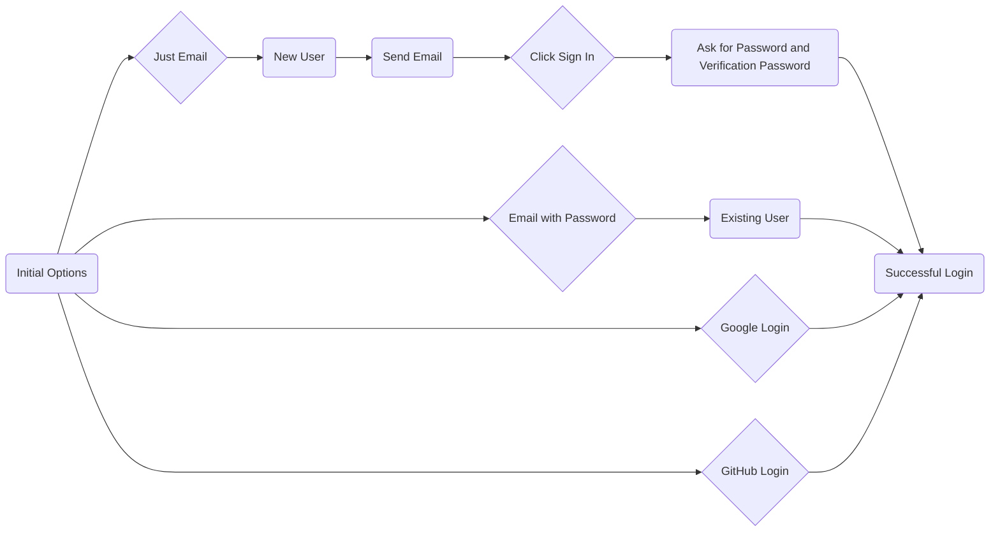

# Login Flow for Tune Trees

🚧 Work in Progress 🚧

## Description

The initial options should include email with password (for existing user with password already assigned), just email for new user, and google and github social logins.  If email for new user, it should post a mail to the user with a "Sign In" button, and when the user clicks it, it should invoke the app again, which should ask for a password and verification password.

## Diagram

