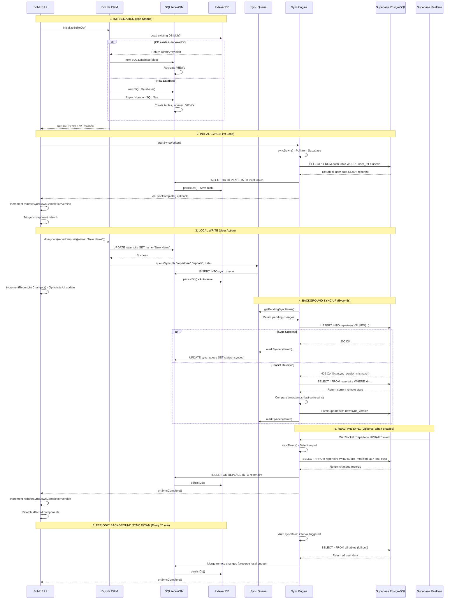
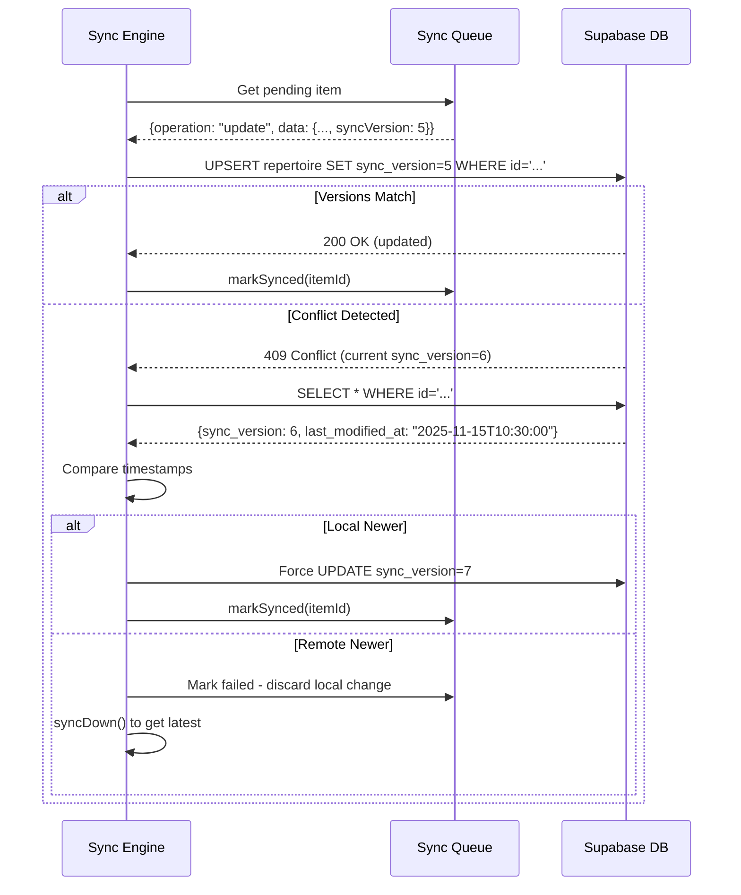

# TuneTrees Database & Replication Architecture

**Last Updated:** November 15, 2025  
**Related Documents:**
- [Drizzle SQLite WASM Guide](./DRIZZLE_SQLITE_WASM_GUIDE.md)
- [Database Schema Instructions](../.github/instructions/database.instructions.md)

## Table of Contents
1. [Architecture Overview](#architecture-overview)
2. [Data Flow Sequence](#data-flow-sequence)
3. [Component Details](#component-details)
4. [Sync Queue Mechanism](#sync-queue-mechanism)
5. [Conflict Resolution](#conflict-resolution)
6. [Key Files Reference](#key-files-reference)

---

## Architecture Overview

TuneTrees implements an **offline-first architecture** using a multi-layer data synchronization system. All user operations happen immediately against a local SQLite database running in the browser, with changes queued for background synchronization to Supabase PostgreSQL.

### High-Level Architecture

```
┌────────────────────────────────────────────────────────────────┐
│                         Browser Process                        │
├────────────────────────────────────────────────────────────────┤
│                                                                │
│  ┌─────────────────┐                                           │
│  │  SolidJS UI     │                                           │
│  │  Components     │◄──── Reactive Queries ─────┐              │
│  └────────┬────────┘                            │              │
│           │                                     │              │
│           │ Signals & Resources                 │              │
│           ▼                                     │              │
│  ┌─────────────────────────────────────────────┐│              │
│  │         Drizzle ORM (TypeScript)            ││              │
│  │    drizzle-orm/sql-js (SQLite Adapter)      ││              │
│  └────────┬────────────────────────────────────┘│              │
│           │                                     │              │
│           │ TypeScript API (type-safe queries)  │              │
│           ▼                                     │              │
│  ┌──────────────────────────────────────────────┴──────────┐   │
│  │           SQLite WASM (sql.js)                          │   │
│  │      In-Memory Relational Database (Heap)               │   │
│  │  • 20+ tables with referential integrity                │   │
│  │  • Complex VIEWs for practice scheduling                │   │
│  │  • Full SQL query engine                                │   │
│  └────────┬────────────────────────────────────────────────┘   │
│           │                                                    │
│           │ Serialize/Deserialize (Uint8Array)                 │
│           ▼                                                    │
│  ┌──────────────────────────────────────────────────────────┐  │
│  │              IndexedDB (Browser Storage)                 │  │
│  │  • Persists serialized SQLite blob                       │  │
│  │  • Database: "tunetrees-storage"                         │  │
│  │  • Key: "tunetrees-db" (binary blob)                     │  │
│  │  • Survives page refreshes & browser restarts            │  │
│  └──────────────────────────────────────────────────────────┘  │
│                                                                │
│           │                                                    │
│           │ Background Sync (Bidirectional)                    │
│           ▼                                                    │
│  ┌──────────────────────────────────────────────────────────┐  │
│  │           Sync Queue & Engine                            │  │
│  │  • Queues local changes for upload                       │  │
│  │  • Polls Supabase for remote changes                     │  │
│  │  • Conflict detection & resolution                       │  │
│  └────────┬─────────────────────────────────────────────────┘  │
│           │                                                    │
└───────────┼────────────────────────────────────────────────────┘
            │
            │ HTTPS (REST & Realtime WebSocket)
            ▼
┌─────────────────────────────────────────────────────────────────┐
│                    Supabase Cloud Platform                      │
├─────────────────────────────────────────────────────────────────┤
│  ┌──────────────────────────────────────────────────────────┐   │
│  │         PostgreSQL Database (Authoritative)              │   │
│  │  • 20+ tables mirroring local schema                     │   │
│  │  • Row-level security (RLS) for multi-tenancy            │   │
│  │  • Optimistic locking via sync_version column            │   │
│  └──────────────────────────────────────────────────────────┘   │
│                                                                 │
│  ┌───────────────────────────────────────────────────────────┐  │
│  │         Supabase Realtime (Optional)                      │  │
│  │  • WebSocket-based live sync                              │  │
│  │  • Broadcasts INSERT/UPDATE/DELETE events                 │  │
│  │  • Triggers immediate syncDown on remote changes          │  │
│  └───────────────────────────────────────────────────────────┘  │
└─────────────────────────────────────────────────────────────────┘
```

---

## Data Flow Sequence

### Sequence Diagram: Complete Data Flow



---

## Component Details

### 1. IndexedDB Layer
**Purpose:** Browser-native persistent storage for the serialized SQLite database.

**Key Operations:**
- **Store:** `saveToIndexedDB(key, Uint8Array)`
- **Retrieve:** `loadFromIndexedDB(key) → Uint8Array | null`
- **Delete:** `deleteFromIndexedDB(key)`

**Storage Schema:**
```typescript
// Database: "tunetrees-storage"
// Object Store: "databases"
{
  "tunetrees-db": Uint8Array,           // Serialized SQLite blob
  "tunetrees-db-version": Uint8Array    // Version number (4)
}
```

**File Location:** [`src/lib/db/client-sqlite.ts`](../src/lib/db/client-sqlite.ts)  
**Functions:**
- `saveToIndexedDB(key: string, data: Uint8Array)`
- `loadFromIndexedDB(key: string): Promise<Uint8Array | null>`
- `persistDb(): Promise<void>` - Main persistence function

**Persistence Trigger:**
```typescript
// Auto-persist setup (called on DB init)
setupAutoPersist(); // Saves every 5 seconds if dirty flag set
```

---

### 2. SQLite WASM Layer
**Purpose:** Full relational database engine running in browser memory (JavaScript heap).

**Key Characteristics:**
- **Engine:** sql.js (SQLite 3.41.0 compiled to WebAssembly)
- **Storage:** In-memory (fast reads/writes)
- **Schema:** 20+ tables with foreign keys, indexes, and complex VIEWs
- **Size:** Typically 5-10 MB serialized for active user data

**Critical VIEWs:**
- `practice_list_staged` - Combines repertoire_tune + daily_practice_queue + transient_data
- `view_repertoire_joined` - Joins repertoire + instrument + genre
- `view_daily_practice_queue_readable` - Human-readable queue with tune metadata

**File Location:** [`src/lib/db/client-sqlite.ts`](../src/lib/db/client-sqlite.ts)  
**Functions:**
- `initializeDb(): Promise<DrizzleORM>` - Main initialization
- `persistDb(): Promise<void>` - Serialize to IndexedDB
- `recreateViews(db): Promise<void>` - Recreate all VIEWs

**Initialization Flow:**
```typescript
// 1. Load WASM module
const SQL = await initSqlJs({ locateFile: (file) => `/sql-wasm/${file}` });

// 2. Check for existing DB in IndexedDB
const existingBlob = await loadFromIndexedDB(DB_KEY);

// 3a. Load existing DB
if (existingBlob) {
  sqliteDb = new SQL.Database(existingBlob);
  await recreateViews(drizzleDb); // VIEWs not persisted in blob
}

// 3b. Create new DB with migrations
else {
  sqliteDb = new SQL.Database();
  await applyMigrations(sqliteDb); // Run .sql files in order
  await initializeViews(drizzleDb);
}

// 4. Wrap in Drizzle ORM
drizzleDb = drizzle(sqliteDb, { schema: { ...schema, ...relations } });
```

---

### 3. Drizzle ORM Layer
**Purpose:** Type-safe TypeScript API for database operations with schema validation.

**Key Features:**
- **Type Safety:** Full TypeScript inference for queries
- **Schema Definition:** Declarative table/column definitions
- **Relation Mapping:** Joins and foreign key relationships
- **Migration Support:** Generate SQL from schema changes

**Schema Location:** [`drizzle/schema-sqlite.ts`](../drizzle/schema-sqlite.ts)  
**Example Table Definition:**
```typescript
export const repertoire = sqliteTable("repertoire", {
  repertoireId: text("repertoire_id").primaryKey(),
  userRef: text("user_ref").notNull().references(() => userProfile.supabaseUserId),
  name: text("name"),
  instrumentRef: text("instrument_ref").references(() => instrument.id),
  genreDefault: text("genre_default"),
  syncVersion: integer("sync_version").notNull().default(0),
  lastModifiedAt: text("last_modified_at").notNull(),
  deviceId: text("device_id"),
  deleted: integer("deleted").notNull().default(0),
});
```

**Query Examples:**
```typescript
// Type-safe SELECT
const repertoires = await db
  .select()
  .from(repertoire)
  .where(eq(repertoire.userRef, userId))
  .orderBy(repertoire.lastModifiedAt);

// Type-safe UPDATE
await db
  .update(repertoire)
  .set({ name: "New Name", lastModifiedAt: new Date().toISOString() })
  .where(eq(repertoire.repertoireId, repertoireId));

// Complex JOIN query
const result = await db
  .select({
    repertoireId: repertoire.repertoireId,
    name: repertoire.name,
    instrumentName: instrument.instrument,
    tuneCount: sql<number>`(SELECT COUNT(*) FROM repertoire_tune WHERE repertoire_ref = ${repertoire.repertoireId})`,
  })
  .from(repertoire)
  .leftJoin(instrument, eq(repertoire.instrumentRef, instrument.id))
  .where(eq(repertoire.userRef, userId));
```

---

### 4. Sync Queue Mechanism
**Purpose:** Queues local changes for asynchronous upload to Supabase.

**File Location:** [`src/lib/sync/queue.ts`](../src/lib/sync/queue.ts)

**Queue Schema:**
```typescript
// sync_queue table (stored in local SQLite)
interface SyncQueueItem {
  id: string;                    // UUID
  tableName: SyncableTable;      // e.g., "repertoire", "tune"
  operation: SyncOperation;      // "insert" | "update" | "delete"
  data: string;                  // JSON.stringify(recordData)
  status: SyncStatus;            // "pending" | "syncing" | "synced" | "failed"
  createdAt: string;             // ISO timestamp
  syncedAt: string | null;       // ISO timestamp when synced
  attempts: number;              // Retry count
  lastError: string | null;      // Error message on failure
}
```

**Key Functions:**
```typescript
// Queue a local change for sync
async function queueSync(
  db: SqliteDatabase,
  tableName: SyncableTable,
  operation: SyncOperation,
  data: Record<string, unknown>
): Promise<SyncQueueItem>

// Get pending items to sync
async function getPendingSyncItems(
  db: SqliteDatabase,
  limit?: number
): Promise<SyncQueueItem[]>

// Mark item as successfully synced
async function markSynced(
  db: SqliteDatabase,
  itemId: string
): Promise<void>

// Update sync status (for retry logic)
async function updateSyncStatus(
  db: SqliteDatabase,
  itemId: string,
  status: SyncStatus,
  error?: string
): Promise<void>
```

**Usage Pattern:**
```typescript
// After local write
await db.update(repertoire).set({ name: "New Name" }).where(...);

// Queue for sync
await queueSync(db, "repertoire", "update", {
  repertoireId: "123",
  name: "New Name",
  lastModifiedAt: new Date().toISOString(),
  syncVersion: currentVersion + 1,
});

// Persist queue to IndexedDB
await persistDb();

// Trigger optimistic UI update (no wait for sync)
incrementRepertoireChanged();
```

---

### 5. Sync Engine
**Purpose:** Executes bidirectional synchronization between local SQLite and Supabase PostgreSQL.

**File Location:** [`src/lib/sync/engine.ts`](../src/lib/sync/engine.ts)

**Core Operations:**

#### syncUp() - Push Local Changes
```typescript
/**
 * Upload pending local changes to Supabase
 * Processes sync_queue items and uploads via REST API
 */
async syncUp(): Promise<SyncResult>
```

**Flow:**
1. Get pending items from sync_queue (`status = "pending"`)
2. Batch items by table (max 100 per batch)
3. For each item:
   - Mark as `status = "syncing"`
   - Transform camelCase → snake_case for Supabase
   - Check if composite key table (requires special UPSERT logic)
   - Execute UPSERT via Supabase REST API
4. Handle responses:
   - Success: Mark as `status = "synced"`, set `syncedAt`
   - Conflict: Trigger conflict resolution (see below)
   - Failure: Increment `attempts`, set `lastError`

**Composite Key Handling:**
```typescript
// Tables with composite primary keys or unique constraints
const COMPOSITE_KEY_TABLES: Record<string, string[]> = {
  table_transient_data: ["user_id", "tune_id", "repertoire_id"],
  repertoire_tune: ["repertoire_ref", "tune_ref"],
  daily_practice_queue: ["user_ref", "repertoire_ref", "window_start_utc", "tune_ref"],
  // ...
};

// UPSERT with .onConflict() for composite keys
await supabase
  .from(tableName)
  .upsert(data, {
    onConflict: compositeKeys.join(","),
    ignoreDuplicates: false,
  });
```

#### syncDown() - Pull Remote Changes
```typescript
/**
 * Download all remote data from Supabase and merge into local SQLite
 * Full sync of all user-accessible records
 */
async syncDown(): Promise<SyncResult>
```

**Flow:**
1. For each table in sync order:
   - Query Supabase: `SELECT * FROM table WHERE user_ref = userId`
   - Transform snake_case → camelCase for SQLite
   - Execute `INSERT OR REPLACE` in local SQLite
2. After all tables synced:
   - Call `persistDb()` to save to IndexedDB
   - Trigger `onSyncComplete()` callback
   - UI increments `remoteSyncDownCompletionVersion` signal
   - Components with `createResource` dependencies refetch

**Table Sync Order:**
```typescript
// Reference tables first (no dependencies)
const syncOrder: SyncableTable[] = [
  "genre",
  "tune_type",
  "genre_tune_type",
  "user_profile",
  "instrument",
  // User preferences
  "prefs_scheduling_options",
  "prefs_spaced_repetition",
  "table_state",
  "tab_group_main_state",
  // Core data (depends on references)
  "tune",
  "repertoire",
  "repertoire_tune",
  "note",
  "reference",
  "tag",
  "practice_record",
  "daily_practice_queue",
  "table_transient_data",
  "tune_override",
];
```

---

### 6. Sync Service
**Purpose:** Manages background sync scheduling and Realtime subscriptions.

**File Location:** [`src/lib/sync/service.ts`](../src/lib/sync/service.ts)

**Key Responsibilities:**
- **Auto SyncUp:** Every 5 seconds (only if pending queue items)
- **Auto SyncDown:** Every 20 minutes (full pull)
- **Initial Sync:** Runs `syncDown()` on service start
- **Realtime:** Subscribes to WebSocket events (optional)

**Initialization:**
```typescript
// In AuthContext.tsx
const syncWorker = startSyncWorker(db, {
  supabase,
  userId: userUuid,
  realtimeEnabled: import.meta.env.VITE_REALTIME_ENABLED === "true",
  syncIntervalMs: 5000,
  onSyncComplete: () => {
    setRemoteSyncDownCompletionVersion(prev => prev + 1);
    setInitialSyncComplete(true);
  },
});
```

**Sync Intervals:**
```typescript
// SyncUp: Upload local changes
this.syncIntervalId = window.setInterval(async () => {
  const stats = await getSyncQueueStats(this.db);
  if (stats.pending > 0) {
    await this.syncUp();
  }
}, this.config.syncIntervalMs); // 5000ms

// SyncDown: Pull remote changes
this.syncDownIntervalId = window.setInterval(async () => {
  await this.syncDown();
}, 20 * 60 * 1000); // 20 minutes
```

**Realtime Integration:**
```typescript
// RealtimeManager watches for remote changes
private initializeRealtime(): void {
  this.realtimeManager = new RealtimeManager(
    this.config.supabase,
    this.db,
    {
      enabled: true,
      tables: ["repertoire", "tune", "practice_record", ...],
      onTableChange: async (tableName) => {
        // Remote change detected - trigger selective syncDown
        await this.syncDown();
      },
    }
  );
}
```

---

## Conflict Resolution

### Optimistic Locking Strategy
TuneTrees uses the `sync_version` column for optimistic locking to detect concurrent modifications.

**How it Works:**
1. Every syncable table has a `sync_version INTEGER` column
2. On local update:
   ```typescript
   await db.update(repertoire)
     .set({
       name: "New Name",
       syncVersion: currentVersion + 1, // Increment
       lastModifiedAt: new Date().toISOString(),
     });
   ```
3. On syncUp, send `sync_version` to Supabase
4. Supabase compares received `sync_version` with stored version
5. If mismatch → 409 Conflict

### Conflict Resolution Logic
**File:** [`src/lib/sync/engine.ts`](../src/lib/sync/engine.ts) - `resolveConflict()`

**Strategy: Last-Write-Wins (with timestamp tiebreaker)**
```typescript
async resolveConflict(
  tableName: string,
  localData: any,
  remoteData: any
): Promise<"local" | "remote">
{
  const localTime = new Date(localData.lastModifiedAt || 0);
  const remoteTime = new Date(remoteData.last_modified_at || 0);
  
  if (localTime > remoteTime) {
    // Local change is newer - force update to Supabase
    return "local";
  } else {
    // Remote change is newer - discard local change
    return "remote";
  }
}
```

**Conflict Flow:**


---

## View-Specific Sync Signals

To enable **optimistic UI updates** without waiting for remote sync, TuneTrees uses view-specific signals that increment immediately after local writes.

**Signal Architecture:**
```typescript
// AuthContext.tsx - Signal definitions
const [remoteSyncDownCompletionVersion, setRemoteSyncDownCompletionVersion] = createSignal(0);
const [practiceListStagedChanged, setPracticeListStagedChanged] = createSignal(0);
const [catalogListChanged, setCatalogListChanged] = createSignal(0);
const [repertoireListChanged, setRepertoireListChanged] = createSignal(0);
```

**Usage Pattern:**
```typescript
// 1. User action handler
async function handleUpdateRepertoire(repertoireId: string, newName: string) {
  // Write to local DB
  await db.update(repertoire).set({ name: newName }).where(...);
  
  // Queue for sync
  await queueSync(db, "repertoire", "update", {...});
  
  // Persist
  await persistDb();
  
  // Trigger optimistic UI update (immediate)
  incrementRepertoireListChanged();
  
  // Background: syncUp() will run on next 5s interval
}

// 2. Component resource (refetches when signal changes)
const [repertoires] = createResource(
  () => {
    const db = localDb();
    const version = repertoireListChanged(); // Reactive dependency
    return db && userId ? { db, userId, version } : null;
  },
  async (params) => {
    return await getUserRepertoires(params.db, params.userId);
  }
);
```

**Signal Mapping:**
- `remoteSyncDownCompletionVersion`: Incremented when background `syncDown()` completes
- `practiceListStagedChanged`: Practice queue operations (evaluations, queue add/reset)
- `catalogListChanged`: Tune catalog changes (tune add/edit/delete)
- `repertoireListChanged`: Repertoire/repertoire changes (repertoire add/edit, tune assignments)

---

## Key Files Reference

### Core Database Layer
| File | Purpose | Key Exports |
|------|---------|------------|
| [`src/lib/db/client-sqlite.ts`](../src/lib/db/client-sqlite.ts) | SQLite WASM initialization & persistence | `initializeSqliteDb()`, `persistDb()`, `setupAutoPersist()` |
| [`drizzle/schema-sqlite.ts`](../drizzle/schema-sqlite.ts) | Drizzle schema definitions (20+ tables) | All table definitions (`repertoire`, `tune`, etc.) |
| [`src/lib/db/init-views.ts`](../src/lib/db/init-views.ts) | SQLite VIEW creation logic | `initializeViews()`, `recreateViews()` |
| [`src/lib/db/migration-version.ts`](../src/lib/db/migration-version.ts) | Schema version tracking & migration logic | `needsMigration()`, `getCurrentSchemaVersion()` |

### Sync Layer
| File | Purpose | Key Exports |
|------|---------|------------|
| [`src/lib/sync/queue.ts`](../src/lib/sync/queue.ts) | Sync queue operations (CRUD) | `queueSync()`, `getPendingSyncItems()`, `markSynced()` |
| [`src/lib/sync/engine.ts`](../src/lib/sync/engine.ts) | Bidirectional sync logic (upload/download) | `SyncEngine` class, `syncUp()`, `syncDown()` |
| [`src/lib/sync/service.ts`](../src/lib/sync/service.ts) | Background sync orchestration | `SyncService` class, `startSyncWorker()` |
| [`src/lib/sync/realtime.ts`](../src/lib/sync/realtime.ts) | Supabase Realtime WebSocket subscriptions | `RealtimeManager` class |

### Auth & Context
| File | Purpose | Key Exports |
|------|---------|------------|
| [`src/lib/auth/AuthContext.tsx`](../src/lib/auth/AuthContext.tsx) | Auth state & sync signal management | `useAuth()`, sync version signals, `forceSyncDown()` |
| [`src/lib/context/CurrentRepertoireContext.tsx`](../src/lib/context/CurrentRepertoireContext.tsx) | Current repertoire state management | `useCurrentRepertoire()` |

### Query Layer (Business Logic)
| File | Purpose | Key Exports |
|------|---------|------------|
| [`src/lib/db/queries/repertoires.ts`](../src/lib/db/queries/repertoires.ts) | Repertoire queries | `getUserRepertoires()`, `getRepertoireById()` |
| [`src/lib/db/queries/practice.ts`](../src/lib/db/queries/practice.ts) | Practice queue queries | `getPracticeList()`, `ensureDailyQueue()` |
| [`src/lib/db/queries/tunes.ts`](../src/lib/db/queries/tunes.ts) | Tune catalog queries | `getTunesForUser()`, `getRepertoireTunes()` |

### Service Layer (Write Operations)
| File | Purpose | Key Exports |
|------|---------|------------|
| [`src/lib/services/practice-recording.ts`](../src/lib/services/practice-recording.ts) | Practice evaluation commits | `commitStagedEvaluations()`, `stagePracticeEvaluation()` |
| [`src/lib/services/practice-queue.ts`](../src/lib/services/practice-queue.ts) | Queue management | `ensureDailyQueue()`, `addTunesToQueue()` |

---

## Performance Characteristics

### Read Performance
- **SQLite Queries:** Sub-millisecond for simple queries, 10-50ms for complex JOINs
- **IndexedDB Reads:** 5-20ms (asynchronous, doesn't block UI)
- **Drizzle Overhead:** Minimal (~1-2ms for type validation)

### Write Performance
- **Local Writes:** 1-5ms (SQLite in-memory)
- **Queue Insert:** 1-2ms (simple INSERT)
- **Persist to IndexedDB:** 50-200ms (serialization + storage)
- **SyncUp to Supabase:** 100-500ms (network latency)

### Sync Performance
- **Initial SyncDown:** 5-15 seconds (3000+ records)
- **Incremental SyncUp:** 100-300ms per batch (10-20 records)
- **Background SyncDown:** 2-5 seconds (checking for changes)

### Storage Size
- **SQLite Schema (empty):** ~500 KB
- **Typical User Data:** 3-8 MB (500 tunes, 1000 practice records)
- **IndexedDB Overhead:** ~10% (metadata)

---

## Error Handling & Recovery

### Network Failures
```typescript
// SyncEngine retries failed uploads
if (attempt < config.maxRetries) {
  await updateSyncStatus(db, itemId, "pending"); // Retry later
} else {
  await updateSyncStatus(db, itemId, "failed", error.message);
  toast.error("Sync failed - will retry when online");
}
```

### Database Corruption
```typescript
// Detected by version mismatch or failed blob load
if (corrupted) {
  await clearLocalDatabaseForMigration();
  await initializeDb(); // Recreate from scratch
  await syncDown(); // Re-download all data
}
```

### Quota Exceeded (IndexedDB)
```typescript
// Monitor storage quota
if (navigator.storage && navigator.storage.estimate) {
  const { usage, quota } = await navigator.storage.estimate();
  if (usage / quota > 0.9) {
    toast.warning("Storage almost full - consider clearing old data");
  }
}
```

---

## Testing & Development

### Local Development
```bash
# Disable sync for testing local changes
VITE_DISABLE_SYNC=true npm run dev

# Enable Realtime for live sync testing
VITE_REALTIME_ENABLED=true npm run dev

# Enable verbose sync logging
VITE_SYNC_DEBUG=true npm run dev
```

### Database Inspection
```javascript
// Browser DevTools Console
window.__ttTestApi.inspectDatabase();
window.__ttTestApi.getSyncQueue();
window.__ttTestApi.forceSyncDown();
window.__ttTestApi.forceSyncUp();
```

### Reset Local Database
```javascript
// Clear and re-sync from Supabase
localStorage.setItem("TT_FORCE_RESET", "true");
location.reload();
```

---

## Future Enhancements

### Planned Improvements
1. **Incremental SyncDown:** Only fetch records modified since last sync
   - Track `last_sync_timestamp` per table
   - Query: `WHERE last_modified_at > last_sync_timestamp`
   
2. **Compression:** Compress IndexedDB blobs to reduce storage
   - Use LZ4 or similar fast compression
   - Trade CPU for storage space (especially on mobile)

3. **Selective Table Sync:** Allow users to choose which data to sync offline
   - "Sync all repertoires" vs "Sync current repertoire only"
   - Reduce storage for power users with 1000+ tunes

4. **Conflict UI:** Show user conflicts for manual resolution
   - Currently: Last-write-wins (automatic)
   - Future: Show diff and let user choose

5. **Background Sync API:** Use browser Background Sync for reliable upload
   - Retry failed syncs even when tab closed
   - Requires Service Worker integration

---

## Related Documentation
- [Drizzle SQLite WASM Guide](./DRIZZLE_SQLITE_WASM_GUIDE.md) - Schema definitions and query patterns
- [Database Instructions](../.github/instructions/database.instructions.md) - Schema invariants and safety rules
- [Testing Instructions](../.github/instructions/testing.instructions.md) - E2E test patterns for sync behavior

---

**Last Updated:** November 15, 2025  
**Maintainer:** GitHub Copilot (per @sboagy)
