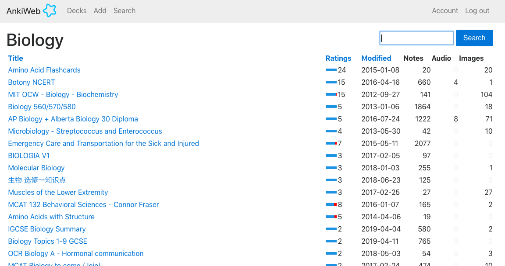

# Tune Trees Project Whitepaper
 
## Executive Summary

This is a proposal for an experimental application called TuneTrees, 
aimed at folk musician memorization of repertoire, which involves motor skills, non-trivial items to memorize, and
memory entanglement.  The application will be an aid to human memory training, using a combination of techniques 
including spaced repetition, mnemonics, and spacial/navigational techniques.  Down the line it may employ 
modern neural networks and reinforcement learning techniques.  The idea is to make music practice more efficient, 
and retained for longer.

## Overview

The author's interest in spaced repetition has it's roots in his quest as an adult to learn 
[Irish Traditional Music](https://en.wikipedia.org/wiki/Irish_traditional_music) (ITrad hereafter), 
with his instrument being the [Irish Flute](https://en.wikipedia.org/wiki/Irish_flute).  

An ITrad musician shows up to a 
[seisiún](https://en.wikipedia.org/wiki/Irish_traditional_music_session) without sheet music, and must draw from 
memory from a large repertoire of tunes, his play list, which is drawn from a huge 
[corpus of tunes](https://www.irishtune.info/rhythm/distribution-session.htm) (note the link still likely only records 
about half or less of known tunes).  And so the musician needs to be able to at least retrieve how tunes start given 
a tune name, but also needs to be able to hear a tune and be able remember the name and playing details.  Much of 
this happens naturally, but tunes can easily "age out", so that it becomes harder to recall them.  For the author, 
having learned this as an adult, the challenge is substantial, compared to a musician who learned as a child or in 
their teens.

From the science perspective, TuneTrees has some interesting unique aspects that are a bit different from simple 
flashcard memorization.  In terms of unique aspects, one thing is that ITrad tunes 
have simple structures that have components that are similar to each other.  A musician may be playing one tune, and 
then discover they are playing another tune that shares that component.  This is 
[memory interference](https://www.tutor2u.net/psychology/reference/proactive-and-retroactive-interference), or, this 
could also be termed "memory entanglement" (or "tune entanglement" in this case).

The term “Tune Trees” is descriptive of trees of tunes that are arranged in trie configuration, which is to say, by 
their first note prefixes.  So that tunes that begin similarly occur in the same space. Tunes can be practiced this way 
together, both to reinforce each other, and to stress their differences so they do not get tangled.

Another interesting aspect for SR review of music repertoire that extends the pure mental aspects of mental
memorization, is the aspect of motor control
and exercising the human motor system. Which is to say, technical aspects of playing, which
involve [muscle memory](https://en.wikipedia.org/wiki/Muscle_memory),
must be regularly reviewed. Finding a maximal interval strategy could then be applied to industrial skills, and
perhaps rehabilitative teaching of tasks that have been lost due to trauma or disease.

The idea behind TuneTrees is also interesting because the memory units are not simple and atomic, they are complex, 
while also somewhat abstract.  It is very likely (in the author's experience) that existing SR algorithms and memory 
mnemonics are not currently tuned for this kind of memorization.  Finding optimal strategies for this realm could 
lead to better strategies for e-learning of complex structures.

The basic aspects of this future project would be to extend the core framework to specify a playlist of tunes, which 
would reference an external database (probably from [irishtune.info](https://www.irishtune.info/search.php)
website).  Note that the irishtune.info website already contains something called the 
[Practice Machine](https://www.irishtune.info/faq/practice.html#whatismachine), which uses a rough idea of 
SR, but does not use any AI techniques, or the idea of solving the tune entanglement issue.

The project could be further extended by having the app "listen" to the review tune being played, providing feedback, 
and then calculating the spacing interval based on how well the tune was played.  This would, in essence, begin to 
turn the app into a music teacher of sorts. 

### General Memorization App

Ultimately, a more general memorization app could be created, similar to Anki and other flashcard software, but 
providing an ecosystem of AI plug-ins, with a DRL learning base.  This would be more useful for e-learning 
than the current crop of flashcard software.
 
To get an idea of areas in Anatomy, Biology, Chemistry, Geography, History, Law, Math, Music, Pathology, and Physics 
where this could be applied, it is useful to browse the [AnkiWeb shared catalog](https://ankiweb.net/shared/decks/) \[
this will require an AnkiWeb login\].

## Partnerships?

* Potentially: MIT McGovern Institute for Brain Research,\
Possibly, [Robert Ajemian](http://web.mit.edu/ajemian/www/webpage.html), Ph.D in Cognitive and Neural Systems,\
Note article: [Memory Contest Comes To MIT, Where Brain Scientists Explain Why Training Works](https://www.wbur.org/commonhealth/2018/07/13/mental-athletes-memory-champions-mit)

### Related References

* [Probabilistic Models of Student Learning and Forgetting](https://scholar.colorado.edu/cgi/viewcontent.cgi?referer=https://scholar.google.com/&httpsredir=1&article=1004&context=csci_gradetds)

* [20 rules of learning](http://super-memory.com/articles/20rules.htm)

* [Augmenting Long-term Memory](http://augmentingcognition.com/ltm.html)