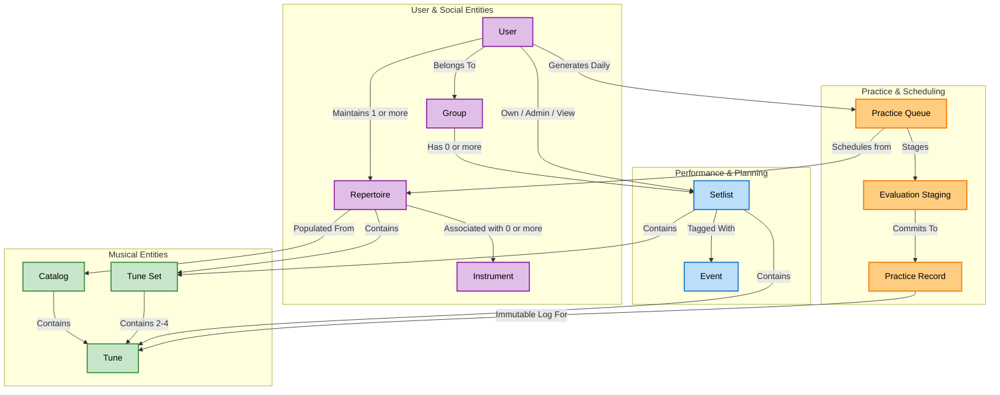

# TuneTrees: Core Ontology & Nomenclature

**Purpose:** This document defines the core domain terminology and data architecture for TuneTrees. It serves as the single source of truth for UI labels, database schema design, and codebase variable naming.

## 1. Musical Entities
These are the fundamental building blocks of the music managed within the app.

* **Tune:** The base musical unit (e.g., a single jig, reel, or polka).
* **Tune Set ("Set"):** A curated sequence of **Tunes**, typically played continuously without stopping (usually 2-4 tunes).
* **Catalog:** The global, master database of all available **Tunes**.

## 2. User & Social Entities
How people and organizations are structured.

* **User:** An individual musician.
    * Can belong to multiple **Groups**.
    * Creates and maintains **one or more Repertoires**.
* **Group:** A collective of **Users** (e.g., a band, a session crew, or a class).
    * Has **zero or more Setlists**.
* **Instrument:** A specific musical instrument (e.g., Fiddle, Tenor Banjo, Irish Flute).
* **Repertoire:** A User's curated collection of music.
    * Populated by adding items from the **Catalog**.
    * Can be associated with **zero or more Instruments**.
    * Can contain individual **Tunes** as well as grouped **Tune Sets**.

## 3. Performance & Planning Entities
How music is organized for real-world, live playing.

* **Setlist:** An ordered list of individual **Tunes** and/or **Tune Sets** intended for a performance or session.
    * *User Relationship:* A User can **Own, Admin, or View** a Setlist.
    * *Group Relationship:* A Group can have **zero or more** Setlists associated with it. 
* **Event:** A specific, calendar-bound occurrence (e.g., "Saturday Pub Gig", "St. Patrick's Day Session").
    * Contains exact date and time data.
    * *Relationship:* A **Setlist** can be tagged with one or multiple **Events** (allowing the same sequence of music to be reused across different dates).

## 4. Practice & Scheduling Entities
How a User interacts with their Repertoire to achieve mastery over time.

* **Scheduling (The Algorithm):** The mathematical process, driven by the FSRS (Free Spaced Repetition Scheduler) algorithm, that calculates the optimal interval for reviewing a tune. 
* **Practice Queue (or "Practice List"):** A frozen, daily snapshot of tunes generated for a User to practice on a specific day, organized hierarchically into Buckets.
* **Evaluation Staging:** The transient UI state where a User previews the algorithmic outcome of a rating before permanently submitting it.
* **Practice Record:** An immutable, historical database entry logging a User's evaluation of a specific tune at an exact timestamp. 

## 5. Key Architectural Rules
* **Separation of List and Time:** A **Setlist** exists independently of an **Event**. The music and the calendar occurrence are strictly decoupled.
* **Solo vs. Group Parity:** A User does not need to create a dummy "Group of One" to create a Setlist. 
* **Immutability of Practice:** A **Practice Record** is a historical fact; it is never updated or deleted.

