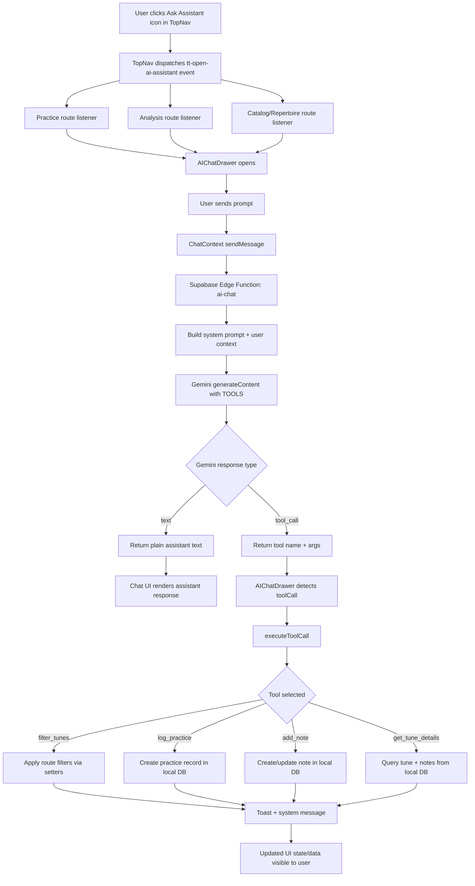
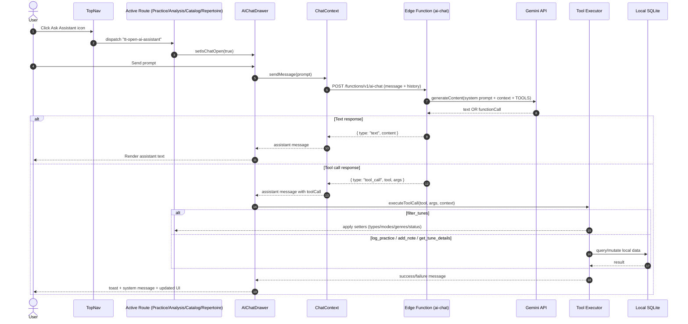

# AI Assistant Flow

- Tool definitions exposed to the model are in index.ts (`TOOLS` with `filter_tunes`, `log_practice`, `add_note`, `get_tune_details`).
- The model is told to use those tools and receives them in the Gemini request in index.ts.
- Tool calls returned by the model are parsed and sent back as `type: "tool_call"` in index.ts.
- Actual tool behavior (“what happens in app”) is implemented in tool-executor.ts and handlers below: tool-executor.ts, tool-executor.ts, tool-executor.ts, tool-executor.ts.
- The chat drawer that executes returned tool calls is in AIChatDrawer.tsx.
- Shared tool-call types are in types.ts.

## Key implementation files

- TopNav event dispatch: `src/components/layout/TopNav.tsx`
- Drawer + tool-call trigger: `src/components/ai/AIChatDrawer.tsx`
- Chat API call + response shaping: `src/lib/ai/context.tsx`
- Tool execution handlers: `src/lib/ai/tool-executor.ts`
- Tool schema + model invocation: `supabase/functions/ai-chat/index.ts`

## Sequence view

## Legend

- `U`: User
- `TN`: TopNav UI control that dispatches `tt-open-ai-assistant`
- `RT`: Active route component (Practice, Analysis, Catalog, Repertoire)
- `DR`: `AIChatDrawer` UI component
- `CX`: Chat context (`sendMessage`, message state)
- `EF`: Supabase Edge Function (`ai-chat`)
- `GM`: Gemini model API (returns text or function call)
- `EX`: Client-side tool executor (`executeToolCall`)
- `DB`: Local SQLite via Drizzle/sql.js
- `text` response: assistant message only (no local side effects)
- `tool_call` response: executes local app action (filters, practice log, notes, details)
