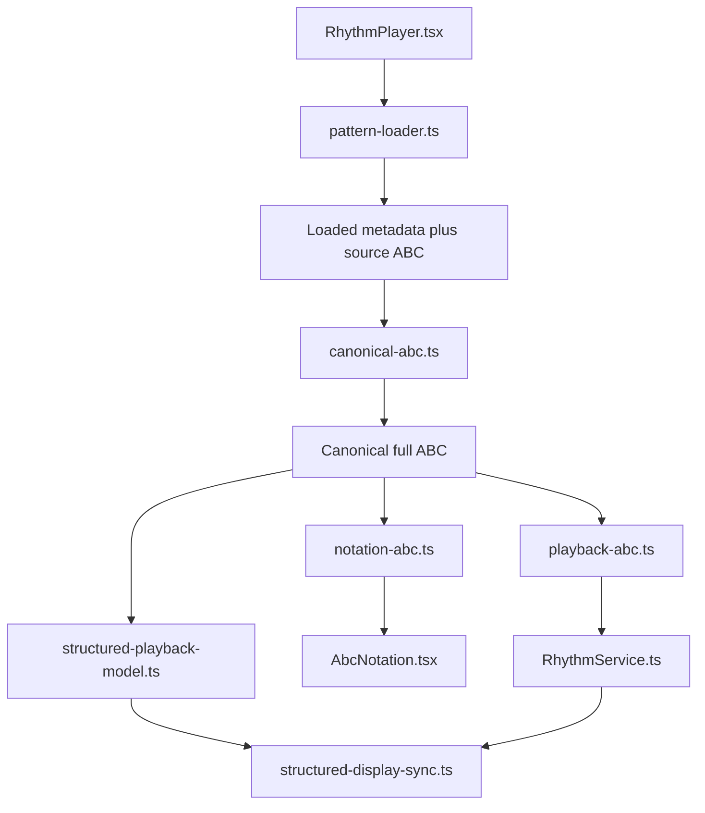

# Rhythm Player And Pattern Editor

## Purpose

This document is the durable architecture and development reference for the rhythm player and the editable rhythm pattern workflow.

It covers:

- how a selected pattern becomes canonical ABC, rendered notation, and playback state
- how the pattern picker and custom-pattern editor fit into that flow
- where playback timing, note highlighting, and section labeling live
- the invariants and debugging facts that have already caused real regressions

## Scope

The rhythm feature is split across four cooperating areas:

1. Player orchestration in `src/components/rhythm/`
2. ABC transformation and synchronization helpers in `src/lib/rhythm/`
3. Playback engine behavior in `src/lib/services/RhythmService.ts`
4. Editable custom-pattern persistence in `src/lib/db/queries/rhythm-patterns.ts`

## Architecture Summary

The rhythm player is built around one pipeline and one selection contract.

Pipeline:

1. Load the selected rhythm pattern source and metadata.
2. Assemble one canonical full ABC representation.
3. Derive notation ABC from the canonical ABC.
4. Derive playback ABC and logical start offsets from the canonical ABC.
5. Render notation with abcjs.
6. Drive playback with `RhythmService`.
7. Map runtime playback position back onto rendered section labels and noteheads.

Selection contract:

- `selectedPatternId` is the authoritative UI selection in `RhythmPlayer.tsx`.
- The picker is controlled from that state.
- Pattern loads may resolve to a different selected pattern candidate, but stale async responses must not overwrite the newer user selection.
- Creating, editing, and deleting custom patterns all flow back through the same selected-pattern path.

## File Map

| File | Role |
| --- | --- |
| `src/components/rhythm/RhythmPlayer.tsx` | Main orchestration component for loading, derivation, transport UI, section selection, highlight sync, and editor dialogs. |
| `src/components/rhythm/RhythmPatternPicker.tsx` | Controlled selector and action surface for choosing a pattern and opening custom-pattern create/edit flows. |
| `src/components/tunes/AbcNotation.tsx` | Shared abcjs rendering host used by the player and editor preview. |
| `src/lib/rhythm/pattern-loader.ts` | Pattern ingestion and selection boundary. Returns metadata, raw source ABC, chosen candidate id, and candidate list. |
| `src/lib/rhythm/canonical-abc.ts` | The only source-aware ABC transformation layer. Seed and full-track inputs both become canonical full ABC here. |
| `src/lib/rhythm/notation-abc.ts` | Source-agnostic notation preparation for abcjs display. |
| `src/lib/rhythm/playback-abc.ts` | Source-agnostic playback planning, including rotated playback ABC and logical start offsets. |
| `src/lib/rhythm/structured-playback-model.ts` | Pure runtime section and beat-position model. |
| `src/lib/rhythm/structured-display-sync.ts` | DOM and SVG synchronization from structured playback position back onto abcjs-rendered labels and noteheads. |
| `src/lib/services/RhythmService.ts` | Playback engine facade: sample-kit audio, premium loops, count-in, tempo persistence, timing callbacks, and current beat/measure/marker signals. |
| `src/lib/db/queries/rhythm-patterns.ts` | User-editable custom pattern CRUD and tune-type / genre resolution for saves. |
| `src/components/rhythm/RhythmPlayer.test.tsx` | Integration-heavy coverage for orchestration, picker state, custom pattern flows, and notation sync. |
| `src/lib/rhythm/rhythm-pipeline.test.ts` | Direct tests for canonical assembly and source-agnostic notation/playback derivation. |
| `src/lib/services/RhythmService.test.ts` | Service-level playback and timing tests. |
| `e2e/tests/rhythm-player-001-structured-playback.spec.ts` | Browser regression that the active note progresses through the visible structure instead of looping the first line. |

## Runtime Flow

### 1. Pattern load

`RhythmPlayer.tsx` asks `RhythmService.loadPattern(...)` for the selected pattern. The service delegates to `pattern-loader.ts`, which returns one `RhythmPatternMetadata` value containing the resolved ABC, selected pattern id, candidate list, pattern type, and kit metadata.

Inside `RhythmPlayer.tsx`, that result is kept in a local `loadedPattern` signal and merged with the service's own `metadata()` signal via `activePatternMetadata = loadedPattern() ?? metadata()`. The local copy lets the component ignore stale async loads and keep the current selection stable, while the service signal remains the long-lived runtime source once the load settles.

The loader is intentionally not allowed to assemble canonical ABC or make display/playback-specific changes.

### 2. Canonical ABC assembly

`assembleCanonicalRhythmAbc(...)` in `canonical-abc.ts` is the source-aware boundary.

Responsibilities:

- accept both `seed` and `full_track` source inputs
- normalize them into one canonical full ABC shape
- resolve structure parts and labeled sections
- expose section and event counting helpers used elsewhere

Key rule:

- downstream modules should work from canonical full ABC and should not branch on `patternType`

### 3. Notation derivation

`buildNotationRhythmAbc(...)` in `notation-abc.ts` prepares display ABC for abcjs.

Responsibilities:

- strip notation-hostile lines when needed
- wrap body lines for display
- keep the result display-safe and source-agnostic

`AbcNotation.tsx` should only receive the derived notation ABC, not source-pattern metadata.

### 4. Playback derivation

`buildPlaybackRhythmPlan(...)` in `playback-abc.ts` builds:

- `playbackAbc`
- `startPositionMs`
- `startBeatIndex`
- `startMeasure`
- start-section options for the UI

This is where section rotation and playback offsets belong.

Critical invariant:

- starting from a later section requires both the millisecond offset and the logical offsets. `startPositionMs` alone is insufficient, because the UI would still think playback is at beat 0 / measure 0 and the section badge and highlight would behave like `A1`.

### 5. Playback engine

`RhythmService.ts` owns playback execution and runtime signals.

Responsibilities:

- tempo persistence
- sample-kit playback via decoded audio buffers
- premium-loop playback when explicitly preferred
- count-in handling
- current beat, measure, pulse, and playback-marker signals
- restart, pause, resume, and replay behavior

Current behavior:

- the service defaults to ABC sample-kit playback even when metadata includes a premium loop
- premium loops are only used when the preference signal opts in
- the service still exposes `loadPattern(...)` as a wrapper, but actual pattern selection logic lives in `pattern-loader.ts`

### 6. Runtime cursor model

`structured-playback-model.ts` converts the current beat index into structured section state and also exports the compact-vs-expanded structure helper `resolveEffectivePlaybackParts(...)`, which `playback-abc.ts` uses while building playback plans.

It computes:

- active part index
- display section index
- remaining beat index within the active part
- repeat pass number like `A2` or `B2`

This module must stay pure. It should not inspect DOM or generate playback ABC.

### 7. Rendered notation synchronization

`structured-display-sync.ts` maps structured runtime state back onto abcjs-rendered SVG.

It owns two jobs:

1. rewriting rendered `P:` labels so the visible staff shows the correct repeat pass, such as `A2`
2. resolving the active notehead for highlight synchronization

This module contains the most fragile abcjs-facing logic in the stack.

## Pattern Editor Flow

The rhythm pattern editor is hosted inside `RhythmPlayer.tsx` and persisted through `src/lib/db/queries/rhythm-patterns.ts`.

### Controlled picker behavior

`RhythmPatternPicker.tsx` is responsible for the visible selection and actions:

- select pattern candidate
- open create dialog
- open edit dialog for the selected custom pattern

It is intentionally controlled. It should not infer selection from metadata or the DOM.

### Create custom pattern

Create flow:

1. User opens the create dialog from `RhythmPatternPicker.tsx`.
2. `RhythmPlayer.tsx` validates the draft ABC with abcjs parsing.
3. `createEditableRhythmPattern(...)` persists the new row.
4. `selectedPatternId` is updated to the new custom pattern id.
5. The player reloads through the normal loader path.

### Edit custom pattern

Edit flow:

1. User clicks Edit selected custom.
2. `getEditableRhythmPatternById(...)` loads the persisted row.
3. The dialog edits the same fields as create.
4. `updateEditableRhythmPattern(...)` writes the changes.
5. The player reloads and re-derives notation and playback through the same pipeline.

### Delete custom pattern

Delete flow:

1. `deleteEditableRhythmPattern(...)` removes the row.
2. The player clears or re-resolves `selectedPatternId`.
3. The picker and loaded pattern must converge on the same remaining candidate.

The important design point is that create, edit, and delete all return to the same selected-pattern state and loader path, rather than patching UI state independently.

## Hard-Won Invariants

These are the invariants that have already mattered in production-like debugging and should be preserved.

### One canonical ABC boundary

- notation and playback must derive from the same canonical full ABC
- downstream modules should not branch on `patternType`

### One selection state

- `selectedPatternId` is the authoritative user-facing selection
- stale async responses must not overwrite a newer selection

### Start-section playback needs logical offsets

- `startPositionMs` is not enough
- the UI and service also need `startBeatIndex` and `startMeasure`
- this is required for section badges, measure counters, and note highlighting to stay aligned after starting from `B`, `B2`, and similar later sections

### TuneTrees assumes compact repeated notation

- the TuneTrees rhythm player is built around the normal compact layout with visible repeated sections rather than a user-facing expanded layout mode
- structured playback can still traverse repeated passes like `A`, `A2`, `B`, and `B2` while the visible notation reuses the same compact repeated staff lines
- `structured-display-sync.ts` contains extra defensive mapping logic only because abcjs and some rendered-notation shapes do not always produce a simple one-to-one mapping between logical playback events and visible noteheads

### Rests do not create visible noteheads

Full rendered notation can contain logical ABC events that are rests. abcjs advances playback through those events, but the rendered SVG does not create a new notehead for them.

`structured-display-sync.ts` now handles this by building per-line event-to-notehead maps so that rest-heavy lines keep the highlight on the current visible notehead instead of wrapping backward within the same line.

### abcjs timing events can be silent

abcjs timing callbacks can advance beat state while omitting `midiPitches`.

`RhythmService.ts` must fall back to percussion pitches for those events, otherwise playback appears active but silent. This behavior is covered in `RhythmService.test.ts`.

## Testing Layers

### Unit and direct pipeline coverage

- `src/lib/rhythm/rhythm-pipeline.test.ts`
- `src/lib/services/RhythmService.test.ts`

Use these for canonical assembly, playback planning, tempo and count-in behavior, pitch fallback, premium loop behavior, and start-offset logic.

### Component and integration coverage

- `src/components/rhythm/RhythmPlayer.test.tsx`

Use this for:

- picker state behavior
- custom-pattern create and edit flows
- section badge logic
- structured notehead resolution
- regressions around compact repeated notation, abcjs/rendered-shape mapping quirks, and rest-heavy wrapped lines

### Browser regression coverage

- `e2e/tests/rhythm-player-001-structured-playback.spec.ts`

Use this when the bug only reproduces in real abcjs browser rendering or live playback timing.

## Debugging Guide

When the rhythm player is wrong, first identify which boundary owns the defect.

### If notation and playback disagree

Check:

1. `canonical-abc.ts`
2. `notation-abc.ts`
3. `playback-abc.ts`

Question:

- did notation and playback derive from the same canonical full ABC?

### If playback starts in the right audio position but the UI badge/highlight is wrong

Check:

1. `playback-abc.ts` for `startBeatIndex` and `startMeasure`
2. `RhythmPlayer.tsx` wiring into `RhythmService.play(...)`
3. `structured-playback-model.ts`

Question:

- did the player seed both millisecond and logical offsets, or only the millisecond offset?

### If the active note wraps or jumps on rendered notation

Check:

1. `structured-display-sync.ts`
2. the rendered abcjs line classes like `abcjs-l0`, `abcjs-l1`
3. whether abcjs rendering or wrapped notation has broken the expected compact repeated mapping between playback events and visible lines
4. whether the line includes rests that reduce visible noteheads relative to logical events

Question:

- is the bug in structured event-to-line mapping, or is the raw abcjs playback marker itself wrong?

### If playback is active but silent

Check:

1. `RhythmService.ts` timing callback event payloads
2. whether `midiPitches` are missing
3. the sample-kit fallback path for empty timing pitches

### If picker selection looks stale

Check:

1. `selectedPatternId` in `RhythmPlayer.tsx`
2. loader response `selectedPatternId`
3. whether an older load resolved after a newer user selection

## Current Remaining Cleanup

The large refactor is mostly complete, but some cleanup is still intentionally deferred.

Still open:

- further decomposition inside `pattern-loader.ts`
- further simplification of adjacent state and helper surface in `RhythmPlayer.tsx`
- eventual removal of the remaining delegated pattern-loader wrapper concerns from `RhythmService.ts`

Not currently goals:

- rewriting the audio engine
- redesigning the player UI
- replacing abcjs

## Practical Validation Commands

Focused checks that have been useful for this area:

- `npm run test:unit -- src/components/rhythm/RhythmPlayer.test.tsx`
- `npm run test:unit -- src/lib/services/RhythmService.test.ts`
- `npm run test:unit -- src/lib/rhythm/rhythm-pipeline.test.ts`
- `npm run lint`
- `npm run typecheck`

When a bug is only visible in real browser rendering, follow with the structured playback E2E coverage or reproduce it manually in the live player.