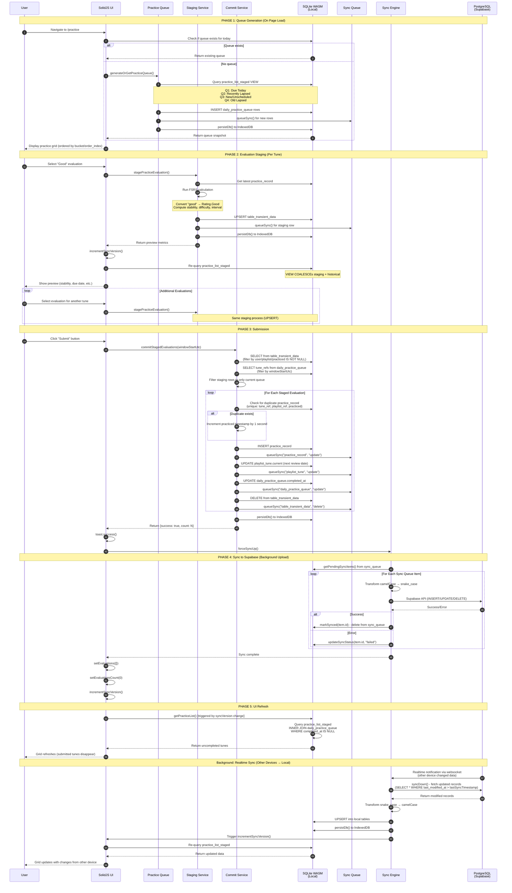

# Practice Flow: Code Map (SolidJS PWA)

This document maps the complete practice flow in the current SolidJS PWA implementation, from queue generation to submission and sync.

**Architecture:** Offline-first with local SQLite WASM + Supabase sync  
**Last Updated:** November 10, 2025

---

## Overview

The practice flow consists of five major phases:

1. **Queue Generation** - Create frozen daily practice snapshot
2. **Evaluation Staging** - FSRS preview calculations on dropdown selection
3. **Submission** - Commit evaluations to practice_record and mark queue completed
4. **Sync** - Bidirectional sync with Supabase PostgreSQL
5. **UI Refresh** - React to database changes via reactive signals

---

## Architecture Diagram



---

## Code Reference: Jump to Implementation

| Component | Description | File | Key Functions |
|-----------|-------------|------|---------------|
| **Practice Page** | Main practice UI with submit handler | `src/routes/practice/Index.tsx` | `PracticeIndex`, `handleSubmitEvaluations`, `handleRecallEvalChange` |
| **Grid Component** | Practice grid with evaluation dropdowns | `src/components/grids/TunesGridScheduled.tsx` | `TunesGridScheduled` component |
| **Flashcard View** | Flashcard interface with evaluation controls | `src/components/practice/FlashcardView.tsx` | `FlashcardView` component |
| **Queue Service** | Generate and manage daily practice queue | `src/lib/services/practice-queue.ts` | `generateOrGetPracticeQueue`, `ensureDailyQueue`, `addTunesToQueue` |
| **Staging Service** | FSRS preview calculations | `src/lib/services/practice-staging.ts` | `stagePracticeEvaluation`, `clearStagedEvaluation` |
| **Commit Service** | Batch commit evaluations | `src/lib/services/practice-recording.ts` | `commitStagedEvaluations` |
| **Sync Service** | Orchestrates sync operations | `src/lib/sync/service.ts` | `SyncService.syncUp`, `SyncService.syncDown` |
| **Sync Engine** | Handles data transformation and upload/download | `src/lib/sync/engine.ts` | `SyncEngine.syncUp`, `SyncEngine.syncDown`, `processQueueItem` |
| **Realtime Manager** | Supabase realtime subscriptions | `src/lib/sync/realtime.ts` | `RealtimeManager` class |
| **Auth Context** | Global auth state and sync signals | `src/lib/auth/AuthContext.tsx` | `AuthProvider`, `useAuth` hook |

---

## Phase 1: Queue Generation

### Entry Point: Page Load

**File:** `src/routes/practice/Index.tsx`  
**Component:** `PracticeIndex`

```typescript
const PracticeIndex: Component = () => {
  const {
    user,
    localDb,
    incrementPracticeListStagedChanged,
    practiceListStagedChanged,
    initialSyncComplete,
  } = useAuth();
  const { currentPlaylistId } = useCurrentPlaylist();

  // Resource to get user ID from user_profile table
  const [userId] = createResource(/* params */, async (params) => {
    const result = await db.get(sql`
      SELECT supabase_user_id FROM user_profile 
      WHERE supabase_user_id = ${params.userId}
    `);
    return result?.supabase_user_id || null;
  });

  // Shared evaluation state (parent manages, children consume)
  const [evaluations, setEvaluations] = createSignal<Record<string, string>>({});
  const [evaluationsCount, setEvaluationsCount] = createSignal(0);
```

**Key Architecture Changes:**
- **View-specific signals:** Replaced global `syncVersion` with `practiceListStagedChanged` for practice data
- **Parent-managed state:** Evaluation staging logic centralized in `Index.tsx`'s `handleRecallEvalChange`
- **Children as presentational:** Grid and Flashcard components only call parent callback, no local staging

### Queue Generation Service

**File:** `src/lib/services/practice-queue.ts`  
**Function:** `generateOrGetPracticeQueue`

```typescript
export async function generateOrGetPracticeQueue(
  db: AnyDatabase,
  userRef: string,
  playlistRef: string,
  reviewSitdownDate: Date = new Date(),
  localTzOffsetMinutes: number | null = null,
  mode: string = "per_day",
  forceRegen: boolean = false
): Promise<DailyPracticeQueueRow[]>
```

**Key Steps:**

1. **Compute Windows**
   ```typescript
   const windows = computeSchedulingWindows(
     reviewSitdownDate,
     prefs.acceptableDelinquencyWindow,
     localTzOffsetMinutes
   );
   ```
   - **Function:** `computeSchedulingWindows` in same file
   - **Returns:** `{ startTs, endTs, windowFloorTs }` (ISO format timestamps)

2. **Check Existing Queue**
   ```typescript
   const existing = await db.all(sql`
     SELECT * FROM daily_practice_queue
     WHERE user_ref = ${userRef} AND playlist_ref = ${playlistRef}
       AND (window_start_utc = ${isoFormat} OR window_start_utc = ${spaceFormat})
       AND active = 1
   `);
   if (existing.length > 0 && !forceRegen) {
     return existing;
   }
   ```
   - **Note:** Handles both ISO ('2025-11-08T00:00:00') and space ('2025-11-08 00:00:00') formats for backward compatibility

3. **Query Practice List Staged**
   - **Q1 (Bucket 1):** Due today
     ```sql
     SELECT * FROM practice_list_staged
     WHERE scheduled >= startTs AND scheduled < endTs
     ORDER BY COALESCE(scheduled, latest_due) ASC
     ```
   - **Q2 (Bucket 2):** Recently lapsed (within delinquency window)
     ```sql
     WHERE scheduled >= windowFloorTs AND scheduled < startTs
     ```
   - **Q3 (Bucket 3):** New/unscheduled tunes
     ```sql
     WHERE scheduled IS NULL AND (latest_due IS NULL OR latest_due < windowFloorTs)
     ```
   - **Q4 (Bucket 4):** Old lapsed (disabled by default)

4. **Build Queue Rows**
   ```typescript
   const q1Built = buildQueueRows(q1Rows, windows, prefs, userRef, playlistRef, mode, localTzOffsetMinutes, 1);
   ```
   - **Function:** `buildQueueRows` in same file
   - **Creates:** `DailyPracticeQueueRow` objects with:
     - `bucket` (1-4)
     - `orderIndex` (0-based sequential)
     - `windowStartUtc`, `windowEndUtc` (ISO format with 'T')
     - `snapshotCoalescedTs` (captured scheduling timestamp)
     - `completedAt: null` (initially)

5. **Persist to Database**
   ```typescript
   await db.insert(dailyPracticeQueue).values(allBuiltRows).run();
   ```
   - **Table:** `daily_practice_queue`
   - **Schema:** `drizzle/schema-sqlite.ts`
   - **Constraint:** UNIQUE (user_ref, playlist_ref, window_start_utc, tune_ref)

### Window Format Utility

**File:** `src/lib/utils/practice-date.ts`  
**Function:** `formatAsWindowStart`

```typescript
export function formatAsWindowStart(date: Date): string {
  return `${date.getFullYear()}-${String(date.getMonth() + 1).padStart(
    2,
    "0"
  )}-${String(date.getDate()).padStart(2, "0")}T00:00:00`;
}
// Returns: "2025-11-08T00:00:00" (ISO format with T)
```

**Critical Note:** SQLite TEXT columns store dates as-is. We now use ISO format (with 'T') consistently because SQLite WASM prefers this format. Older data may still have space format ('2025-11-08 00:00:00'), so queries match both formats during transition.

---

## Phase 2: Evaluation Staging

### User Interaction: Selecting Evaluation

**File:** `src/routes/practice/Index.tsx`  
**Handler:** `handleRecallEvalChange` (centralized in parent)

```typescript
const handleRecallEvalChange = async (tuneId: string, evaluation: string) => {
  console.log(`Recall evaluation for tune ${tuneId}: ${evaluation}`);

  // 1) Optimistic shared-state update (drives both grid and flashcard)
  setEvaluations((prev) => ({ ...prev, [tuneId]: evaluation }));

  // 2) Stage/clear in local DB
  const db = localDb();
  const playlistId = currentPlaylistId();
  const userIdVal = await getUserId();

  if (!db || !playlistId || !userIdVal) return;

  try {
    if (evaluation === "") {
      // Clear staged data when "(Not Set)" selected
      await clearStagedEvaluation(db, userIdVal, tuneId, playlistId);
    } else {
      // Stage FSRS preview for actual evaluations
      await stagePracticeEvaluation(
        db,
        userIdVal,
        playlistId,
        tuneId,
        evaluation,
        "recall",
        "fsrs"
      );
    }

    // 3) Trigger practice list refresh using view-specific signal
    incrementPracticeListStagedChanged();
  } catch (error) {
    console.error(`Failed to stage evaluation:`, error);
  }
};
```

**Architecture Note:** Grid and Flashcard components receive `onRecallEvalChange` prop and call it directly. No staging logic in child components - all centralized in parent.

### Evaluation Dropdown Component

**File:** `src/components/grids/RecallEvalComboBox.tsx`  
**Lines:** 1-107

```typescript
interface RecallEvalComboBoxProps {
  value: string;
  onChange: (value: string) => void;
  testId: string;
}

export const RecallEvalComboBox: Component<RecallEvalComboBoxProps> = (props) => {
  const options = [
    { value: "", label: "(Not Set)", color: "text-gray-500" },
    { value: "again", label: "Again", color: "text-red-600" },
    { value: "hard", label: "Hard", color: "text-orange-600" },
    { value: "good", label: "Good", color: "text-green-600" },
    { value: "easy", label: "Easy", color: "text-blue-600" },
  ];
  
  return <DropdownMenu.Root>{/* Kobalte DropdownMenu */}</DropdownMenu.Root>;
};
```

### Staging Service

**File:** `src/lib/services/practice-staging.ts`  
**Function:** `stagePracticeEvaluation`

```typescript
export async function stagePracticeEvaluation(
  db: SqliteDatabase,
  userId: string,
  playlistId: string,
  tuneId: string,
  evaluation: string,
  goal: string = "recall",
  technique: string = ""
): Promise<FSRSPreviewMetrics>
```

**Key Steps:**

**Key Steps:**

1. **Get Latest Practice Record**
   ```typescript
   const latestCard = await getLatestPracticeRecord(db, tuneId, playlistId);
   ```
   - **Function:** `getLatestPracticeRecord` in same file
   - **Returns:** FSRS `Card` object or null if never practiced

2. **Run FSRS Calculation**
   const rating = mapEvaluationToRating(evaluation); // "good" → Rating.Good
   const card: Card = latestCard ?? createEmptyCard(now);
   const schedulingCards = f.repeat(card, now);
   const nextCard = schedulingCards[ratingKey].card;
   ```
   - **Library:** `ts-fsrs` (imported line 17)
   - **Ratings:** Again=1, Hard=2, Good=3, Easy=4

3. **Build Preview Metrics** (Lines 164-175)
   ```typescript
   const preview: FSRSPreviewMetrics = {
     quality: rating,
     difficulty: nextCard.difficulty,
     stability: nextCard.stability,
     interval: Math.round(nextCard.scheduled_days),
     step: nextCard.state,
     repetitions: nextCard.reps,
     practiced: now.toISOString(),
     due: nextCard.due.toISOString(),
     state: nextCard.state,
     goal,
     technique,
   };
   ```

4. **UPSERT to Transient Table**
   ```typescript
   await db.run(sql`
     INSERT INTO table_transient_data (
       user_id, tune_id, playlist_id, quality, difficulty, stability, 
       interval, step, repetitions, practiced, due, state, goal, 
       technique, recall_eval, sync_version, last_modified_at
     ) VALUES (${userId}, ${tuneId}, ${playlistId}, /* ... */)
     ON CONFLICT(user_id, tune_id, playlist_id) DO UPDATE SET
       quality = excluded.quality,
       difficulty = excluded.difficulty,
       /* ... all fields ... */
   `);
   ```
   - **Table:** `table_transient_data`
   - **Constraint:** UNIQUE on (user_id, tune_id, playlist_id)

5. **Queue for Sync**
   ```typescript
   await queueSync(db, "table_transient_data", "update", {
     userId, tuneId, playlistId, ...preview, recallEval: evaluation
   });
   ```
   - **Function:** `queueSync` in `src/lib/sync/queue.ts`
   - **Purpose:** Stage write for background upload to Supabase

6. **Persist to IndexedDB**
   ```typescript
   await persistDb();
### Clear Staged Evaluation

**File:** `src/lib/services/practice-staging.ts`  
**Function:** `clearStagedEvaluation`

```typescript
export async function clearStagedEvaluation(
  db: SqliteDatabase,
  userId: string,
  tuneId: string,
  playlistId: string
): Promise<void> {
  await db.run(sql`
    DELETE FROM table_transient_data
    WHERE user_id = ${userId} AND tune_id = ${tuneId} AND playlist_id = ${playlistId}
  `);
  
  await queueSync(db, "table_transient_data", "delete", { userId, tuneId, playlistId });
  await persistDb();
}
```

**When Called:** User selects "(Not Set)" in evaluation dropdown to clear previous staging.);
  
  await queueSync(db, "table_transient_data", "delete", { userId, tuneId, playlistId });
  await persistDb();
}
```

---

### User Action: Click Submit Button

**File:** `src/routes/practice/Index.tsx`  
**Handler:** `handleSubmitEvaluations`

**Handler:** `handleSubmitEvaluations()`

```typescript
const handleSubmitEvaluations = async () => {
  const db = localDb();
  const playlistId = currentPlaylistId();
  const userId = await getUserId();
  
  if (!db || !playlistId || !userId) {
    toast.error("Cannot submit: Missing required data");
    return;
  }

  const count = evaluationsCount();
  if (count === 0) {
    toast.warning("No evaluations to submit");
    return;
  }

  // Convert queue date to window_start_utc format
  const date = queueDate();
  const windowStartUtc = formatAsWindowStart(date); // "2025-11-08 00:00:00"

  // Call commit service
  const result = await commitStagedEvaluations(db, userId, playlistId, windowStartUtc);

  if (result.success) {
    toast.success(`Successfully submitted ${result.count} evaluation(s)`);
    
    // Clear local state
    setEvaluations({});
    setEvaluationsCount(0);
    
    // Trigger UI refresh using view-specific signal
    incrementPracticeListStagedChanged();
    
    console.log(`✅ Submit complete: ${result.count} evaluations committed`);
  } else {
    toast.error(`Failed to submit: ${result.error}`);
  }
};
```

**Note:** No longer calls `forceSyncUp()` after submit - background sync handles upload automatically. View-specific signal (`incrementPracticeListStagedChanged`) triggers grid refresh immediately.

### Commit Service
### Commit Service

**File:** `src/lib/services/practice-recording.ts`  
**Function:** `commitStagedEvaluations`
```typescript
export async function commitStagedEvaluations(
  db: SqliteDatabase,
  userId: string,
  playlistId: string,
  windowStartUtc?: string
): Promise<{ success: boolean; count: number; error?: string }>
```

**Key Steps:**
**Key Steps:**

1. **Determine Active Window**
   let activeWindowStart: string;
   if (windowStartUtc) {
     activeWindowStart = windowStartUtc;
   } else {
     const latestWindow = await db.get<{ window_start_utc: string }>(sql`
       SELECT window_start_utc FROM daily_practice_queue
       WHERE user_ref = ${userId} AND playlist_ref = ${playlistId}
       ORDER BY window_start_utc DESC LIMIT 1
     `);
     activeWindowStart = latestWindow.window_start_utc;
   }
   ```

2. **Fetch Staged Evaluations** (Lines 407-449)
   ```typescript
2. **Fetch Staged Evaluations**
     tune_id: number;
     quality: number;
     difficulty: number;
     stability: number;
     interval: number;
     step: number | null;
     repetitions: number;
     practiced: string;
     due: string;
     state: number;
     goal: string;
     technique: string;
     recall_eval: string;
     elapsed_days: number | null;
     lapses: number | null;
   }>(sql`
     SELECT tune_id, quality, difficulty, stability, interval, step, 
            repetitions, practiced, due, state, goal, technique, recall_eval
     FROM table_transient_data
     WHERE user_id = ${userId}
       AND playlist_id = ${playlistId}
       AND practiced IS NOT NULL
   `);
   ```

3. **Filter to Queue Tunes**
   ```typescript
   const queueTuneIds = await db.all<{ tune_ref: number }>(sql`
     SELECT DISTINCT tune_ref FROM daily_practice_queue
     WHERE user_ref = ${userId} AND playlist_ref = ${playlistId}
       AND window_start_utc = ${activeWindowStart}
   `);
   
   const queueTuneIdSet = new Set(queueTuneIds.map(row => row.tune_ref));
   const evaluationsToCommit = stagedEvaluations.filter(eval_ => 
     queueTuneIdSet.has(eval_.tune_id)
   );
   ```

4. **For Each Evaluation:**

   **a. Ensure Unique Timestamp**
   ```typescript
   let practicedTimestamp = staged.practiced;
   let attempts = 0;
   while (attempts < maxAttempts) {
     const existing = await db.all<{ id: number }>(sql`
       SELECT id FROM practice_record
       WHERE tune_ref = ${staged.tune_id}
         AND playlist_ref = ${playlistId}
         AND practiced = ${practicedTimestamp}
     `);
     
     if (existing.length === 0) break;
     
     // Increment by 1 second if duplicate
     const date = new Date(practicedTimestamp);
     date.setSeconds(date.getSeconds() + 1);
     practicedTimestamp = date.toISOString();
     attempts++;
   }
   ```

   **b. Insert Practice Record**
   ```typescript
   const recordId = generateId();
   await db.run(sql`
     INSERT INTO practice_record (
       id, playlist_ref, tune_ref, practiced, quality, easiness, interval, 
       repetitions, due, backup_practiced, stability, elapsed_days, lapses, 
       state, difficulty, step, goal, technique, last_modified_at
     ) VALUES (
       ${recordId}, ${playlistId}, ${staged.tune_id}, ${practicedTimestamp},
       ${staged.quality}, NULL, ${staged.interval}, ${staged.repetitions},
       ${staged.due}, NULL, ${staged.stability}, ${staged.elapsed_days ?? null},
       ${staged.lapses ?? 0}, ${staged.state}, ${staged.difficulty},
       ${staged.step}, ${staged.goal}, ${staged.technique}, ${now}
     )
   `);
   ```

   **c. Queue Sync for Practice Record**
   ```typescript
   await queueSync(db, "practice_record", "update", {
     id: recordId,
     playlistRef: playlistId,
     tuneRef: staged.tune_id,
     practiced: practicedTimestamp,
     quality: staged.quality,
     // ... all fields ...
   });
   ```

   **d. Update Playlist Tune**
   ```typescript
   await db.run(sql`
     UPDATE playlist_tune
     SET current = ${staged.due}, last_modified_at = ${now}
     WHERE playlist_ref = ${playlistId} AND tune_ref = ${staged.tune_id}
   `);
   
   await queueSync(db, "playlist_tune", "update", {
     playlistRef: playlistId,
     tuneRef: staged.tune_id,
   });
   ```

   **e. Update Queue Completed At**
   ```typescript
   const queueItem = await db.get<{ id: string; window_start_utc: string }>(sql`
     SELECT id, window_start_utc, window_end_utc
     FROM daily_practice_queue
     WHERE user_ref = ${userId}
       AND playlist_ref = ${playlistId}
       AND tune_ref = ${staged.tune_id}
       AND window_start_utc = ${activeWindowStart}
     LIMIT 1
   `);
   
   await db.run(sql`
     UPDATE daily_practice_queue
     SET completed_at = ${now}
     WHERE user_ref = ${userId}
       AND playlist_ref = ${playlistId}
       AND tune_ref = ${staged.tune_id}
       AND window_start_utc = ${activeWindowStart}
   `);
   
   // Verify the update
   const verifyQueue = await db.get<{ completed_at: string | null }>(sql`
     SELECT completed_at FROM daily_practice_queue
     WHERE user_ref = ${userId} AND playlist_ref = ${playlistId}
       AND tune_ref = ${staged.tune_id} AND window_start_utc = ${activeWindowStart}
     LIMIT 1
   `);
   console.log(`✓ Verified completed_at in DB:`, verifyQueue?.completed_at);
   
   await queueSync(db, "daily_practice_queue", "update", {
     id: queueItem.id,
     userRef: userId,
     playlistRef: playlistId,
     completedAt: now,
   });
   ```

   **f. Delete from Transient Table**
   ```typescript
   await db.run(sql`
     DELETE FROM table_transient_data
     WHERE user_id = ${userId} AND tune_id = ${staged.tune_id}
       AND playlist_id = ${playlistId}
   `);
   ```

5. **Persist and Return**
   ```typescript
   await persistDb();
   
   return {
     success: true,
     count: committedTuneIds.length,
   };
   ```

---

## Phase 4: Synchronization

### Sync Service Architecture

**File:** `src/lib/auth/AuthContext.tsx`  
**Functions:** `forceSyncUp`, `forceSyncDown`

```typescript
const forceSyncUp = async () => {
  const syncServiceInstance = syncService();
  if (!syncServiceInstance) return;

  console.log("🔄 [ForceSyncUp] Starting sync up to Supabase...");
  
  const result = await syncServiceInstance.syncUp();
  
  console.log("✅ [ForceSyncUp] Sync up completed:", {
    success: result.success,
    itemsSynced: result.itemsSynced,
    itemsFailed: result.itemsFailed,
  });
  
  // Increment remote sync down completion version to trigger UI updates
  setRemoteSyncDownCompletionVersion((prev) => prev + 1);
};
```

### Sync Service

**File:** `src/lib/sync/service.ts`  
**Class:** `SyncService`

**Key Methods:**
- `syncUp()` - Upload pending changes to Supabase
- `syncDown()` - Download remote changes (BLOCKS if pending local changes exist)
- `sync()` - Full bidirectional sync (up then down)
- `startAutoSync()` - Begin background sync intervals
- `stopAutoSync()` - Stop background sync

**Critical syncDown Behavior:**
```typescript
public async syncDown(): Promise<SyncResult> {
  this.isSyncing = true;

  try {
    // CRITICAL: Upload pending changes BEFORE downloading remote changes
    // This prevents race conditions where:
    // 1. User deletes a row locally
    // 2. DELETE is queued but not yet sent to Supabase
    // 3. syncDown runs and re-downloads the "deleted" row from Supabase
    // 4. Row reappears in local DB (zombie record)
    const stats = await this.syncEngine.getSyncQueueStats();
### Sync Engine

**File:** `src/lib/sync/engine.ts`  
**Class:** `SyncEngine`

**Function:** `syncUp`
        // CRITICAL: DO NOT proceed with syncDown if upload failed
        throw new Error(
          "Cannot syncDown while pending changes exist - upload failed. Local data preserved."
        );
      }
    }

    const result = await this.syncEngine.syncDown();
    this.config.onSyncComplete?.(result);
    return result;
  } finally {
    this.isSyncing = false;
  }
}
```

**Why Block syncDown?** For offline-first PWA, local changes are the source of truth. If sync upload fails (network issue), we must NOT pull down remote data that might conflict with unsaved local changes. User remains functional with local data until network recovers.   const result = await this.syncEngine.syncUp();
      this.config.onSyncComplete?.(result);
      return result;
    } finally {
      this.isSyncing = false;
    }
  }
}
```

### Sync Engine

**File:** `src/lib/sync/engine.ts`  
**Lines:** 192-284

**Main Function:** `syncUp()`

```typescript
async syncUp(): Promise<SyncResult> {
  const startTime = new Date().toISOString();
  const errors: string[] = [];
  let synced = 0;
  let failed = 0;

**Function:** `processQueueItem`
  const pendingItems = await getPendingSyncItems(this.localDb, this.config.batchSize);

  if (pendingItems.length === 0) {
    return { success: true, itemsSynced: 0, itemsFailed: 0, conflicts: 0, errors: [], timestamp: startTime };
  }

  // Process each item
  for (const item of pendingItems) {
    try {
      await this.processQueueItem(item);
      await markSynced(this.localDb, item.id!);
      synced++;
    } catch (error) {
      const errorMsg = error instanceof Error ? error.message : String(error);
      errors.push(`Item ${item.id} (${item.tableName} ${item.operation}): ${errorMsg}`);
      await updateSyncStatus(this.localDb, item.id!, "failed", errorMsg);
      failed++;
    }
  }

  return {
    success: failed === 0,
    itemsSynced: synced,
    itemsFailed: failed,
    conflicts: 0,
    errors,
    timestamp: startTime,
  };
}
```
### Field Transformation

**File:** `src/lib/sync/engine.ts`  
**Function:** `transformLocalToRemote`
private async processQueueItem(item: SyncQueueItem): Promise<void> {
  const remoteTable = this.supabase.from(item.tableName);
  const recordData = JSON.parse(item.recordData);
  
  // Transform camelCase (local) → snake_case (Supabase API)
  const transformed = this.transformLocalToRemote(recordData);

  if (item.operation === "insert" || item.operation === "update") {
    const { error } = await remoteTable.upsert(transformed);
    if (error) throw error;
  } else if (item.operation === "delete") {
    const compositeFields = getCompositeKeyFields(item.tableName);
    if (compositeFields) {
      // Handle composite keys
      const filters: any = {};
      for (const field of compositeFields) {
        filters[field] = transformed[field];
      }
      const { error } = await remoteTable.delete().match(filters);
      if (error) throw error;
    } else {
      const { error } = await remoteTable.delete().eq("id", transformed.id);
      if (error) throw error;
    }
  }
}
### Sync Queue Management

**File:** `src/lib/sync/queue.ts`

**Main Functions:**

1. **queueSync** - Add item to sync queue
private transformLocalToRemote(record: any): any {
  const transformed: any = {};
  
  for (const [key, value] of Object.entries(record)) {
    // camelCase → snake_case
    const snakeKey = key.replace(/([A-Z])/g, "_$1").toLowerCase();
    
    // Handle timestamp fields (text → timestamp)
    if (value && typeof value === "string" && /^\d{4}-\d{2}-\d{2}/.test(value)) {
      transformed[snakeKey] = value; // Already ISO 8601
    }
    // Handle boolean (0/1 → true/false)
    else if (typeof value === "number" && (value === 0 || value === 1)) {
      transformed[snakeKey] = value === 1;
    }
    else {
      transformed[snakeKey] = value;
    }
  }
  
  return transformed;
}
```
2. **getPendingSyncItems** - Get items to sync
### Sync Queue Management

**File:** `src/lib/sync/queue.ts`  
**Lines:** 1-300

**Main Functions:**

1. **queueSync()** - Add item to sync queue (Lines 76-157)
   ```typescript
   export async function queueSync(
     db: SqliteDatabase,
     tableName: SyncableTable,
     operation: "insert" | "update" | "delete",
     recordData: any
3. **markSynced** - Mark item as completed
     const queueId = generateId();
     const now = new Date().toISOString();
     
     await db.insert(syncQueue).values({
       id: queueId,
       tableName,
       operation,
       recordData: JSON.stringify(recordData),
       status: "pending",
       createdAt: now,
       lastModifiedAt: now,
     });
   }
   ```

2. **getPendingSyncItems()** - Get items to sync (Lines 174-187)
   ```typescript
   export async function getPendingSyncItems(
     db: SqliteDatabase,
     limit = 100
   ): Promise<SyncQueueItem[]> {
### Grid Data Query

**File:** `src/routes/practice/Index.tsx`  
**Resource:** `practiceListData` (shared between grid and flashcard)

```typescript
// Initialize daily practice queue (must run BEFORE fetching practice list)
const [queueInitialized] = createResource(
  () => {
    const db = localDb();
    const playlistId = currentPlaylistId();
    const date = queueDate();
    const syncComplete = initialSyncComplete();

    if (!syncComplete) return null;

    return db && userId() && playlistId
      ? { db, userId: userId()!, playlistId, date }
      : null;
  },
  async (params) => {
    if (!params) return false;

    const { ensureDailyQueue } = await import("../../lib/services/practice-queue");
    
    const created = await ensureDailyQueue(
      params.db,
      params.userId,
      params.playlistId,
      params.date
    );
    
    return true;
### Practice List Query

**File:** `src/lib/db/queries/practice.ts`  
**Function:** `getPracticeList`
    const db = localDb();
    const playlistId = currentPlaylistId();
    const version = practiceListStagedChanged(); // ← Triggers refetch on practice data change
    const initialized = queueInitialized();
    
    return db && userId() && playlistId && initialized
      ? { db, userId: userId()!, playlistId, version, queueReady: initialized }
      : null;
  },
  async (params) => {
    if (!params) return [];
    
    const { getPracticeList } = await import("../../lib/db/queries/practice");
    return await getPracticeList(
      params.db,
      params.userId,
      params.playlistId,
      7 // delinquencyWindowDays
    );
  }
);

// Filtered list (removes completed tunes unless "Show Submitted" is enabled)
const filteredPracticeList = createMemo(() => {
  const data = practiceListData() || [];
  const shouldShow = showSubmitted();
  
  return shouldShow ? data : data.filter((tune: any) => !tune.completed_at);
});
```

**Architecture Changes:**
- Grid no longer manages its own data query - parent (`Index.tsx`) fetches and filters
- Grid receives `practiceListData` prop with pre-filtered data
- Single source of truth for both grid and flashcard viewsst [dueTunesData] = createResource(
  () => {
**Key Steps:**

1. **Debug Queue Status**riggers refetch on change
    const initialized = queueInitialized();
    
    return db && props.userId && playlistId && initialized
      ? { db, userId: props.userId, playlistId, version, queueReady: initialized }
      : null;
  },
  async (params) => {
    if (!params) return [];
    
    const delinquencyWindowDays = 7;
    return await getPracticeList(
      params.db,
      params.userId,
      params.playlistId,
      delinquencyWindowDays
    );
2. **Get Max Window**
);
```

### Practice List Query

**File:** `src/lib/db/queries/practice.ts`  
**Lines:** 161-280

**Main Function:** `getPracticeList()`

```typescript
export async function getPracticeList(
3. **Query with GROUP BY**
  userId: string,
  playlistId: string,
  _delinquencyWindowDays: number = 7
): Promise<PracticeListStagedWithQueue[]>
```

**Key Steps:**

1. **Debug Queue Status** (Lines 184-223)
   ```typescript
   const queueRows = await db.all<{ count: number }>(sql`
     SELECT COUNT(*) as count FROM daily_practice_queue dpq
     WHERE dpq.user_ref = ${userId} AND dpq.playlist_ref = ${playlistId}
       AND dpq.active = 1
   `);
   
   const windowCheck = await db.all<{ window_start_utc: string; count: number }>(sql`
     SELECT window_start_utc, COUNT(*) as count
     FROM daily_practice_queue
     WHERE user_ref = ${userId} AND playlist_ref = ${playlistId}
       AND active = 1
     GROUP BY window_start_utc ORDER BY window_start_utc DESC
   `);
4. **Return Rows**

2. **Get Max Window** (Lines 225-234)
   ```typescript
   const maxWindow = await db.get<{ max_window: string }>(sql`
     SELECT MAX(window_start_utc) as max_window
     FROM daily_practice_queue
     WHERE user_ref = ${userId} AND playlist_ref = ${playlistId}
       AND active = 1
### Practice List Staged VIEW

**File:** `src/lib/db/init-views.ts`  
**View:** `practice_list_staged`

**Purpose:** Merges all data sources (tune, playlist_tune, practice_record, table_transient_data)
3. **Query with GROUP BY** (Lines 246-267)
   ```sql
   SELECT 
     pls.*,
     MIN(dpq.bucket) as bucket,
     MIN(dpq.order_index) as order_index,
     MIN(dpq.completed_at) as completed_at
   FROM practice_list_staged pls
   INNER JOIN daily_practice_queue dpq 
     ON dpq.tune_ref = pls.id
     AND dpq.user_ref = pls.user_ref
     AND dpq.playlist_ref = pls.playlist_id
   WHERE dpq.user_ref = ${userId}
     AND dpq.playlist_ref = ${playlistId}
     AND dpq.active = 1
     AND dpq.completed_at IS NULL
     AND (
       dpq.window_start_utc = ${isoFormat}
       OR dpq.window_start_utc = ${spaceFormat}
     )
   GROUP BY pls.id
   ORDER BY MIN(dpq.bucket) ASC, MIN(dpq.order_index) ASC
   ```

4. **Return Rows** (Lines 269-280)
   ```typescript
   rows.forEach((row, i) => {
     console.log(`[getPracticeList] Row ${i}: tune=${row.id}, completed_at=${row.completed_at}`);
   });
   
   return rows;
   ```

### Practice List Staged VIEW

**File:** `src/lib/db/init-views.ts`  
**Lines:** 141-238

**Critical View:** Merges all data sources

```sql
CREATE VIEW IF NOT EXISTS practice_list_staged AS
SELECT
  tune.id,
  COALESCE(tune_override.title, tune.title) AS title,
  COALESCE(tune_override.type, tune.type) AS type,
  COALESCE(tune_override.mode, tune.mode) AS mode,
  playlist_tune.learned,
  
  -- COALESCE staging (table_transient_data) with historical (practice_record)
  COALESCE(td.goal, COALESCE(pr.goal, 'recall')) AS goal,
  playlist_tune.scheduled,
  playlist.user_ref,
  playlist.playlist_id,
  
  -- Latest practice state (staging OVERRIDES historical)
  COALESCE(td.state, pr.state) AS latest_state,
  COALESCE(td.practiced, pr.practiced) AS latest_practiced,
  COALESCE(td.quality, pr.quality) AS latest_quality,
  COALESCE(td.difficulty, pr.difficulty) AS latest_difficulty,
  COALESCE(td.easiness, pr.easiness) AS latest_easiness,
  COALESCE(td.stability, pr.stability) AS latest_stability,
  COALESCE(td.interval, pr.interval) AS latest_interval,
  COALESCE(td.repetitions, pr.repetitions) AS latest_repetitions,
  COALESCE(td.step, pr.step) AS latest_step,
  COALESCE(td.due, pr.due) AS latest_due,
  COALESCE(td.goal, pr.goal) AS latest_goal,
  COALESCE(td.technique, pr.technique) AS latest_technique,
  
  -- Evaluation from staging (if exists)
  td.recall_eval,
  CASE WHEN td.tune_id IS NOT NULL THEN 1 ELSE 0 END AS has_staged
  
FROM tune
INNER JOIN playlist_tune ON playlist_tune.tune_ref = tune.id
INNER JOIN playlist ON playlist.playlist_id = playlist_tune.playlist_ref
LEFT JOIN tune_override ON tune_override.tune_ref = tune.id
  AND (tune_override.user_ref IS NULL OR tune_override.user_ref = playlist.user_ref)
  
-- Latest practice_record for this tune/playlist
LEFT JOIN (
  SELECT pr.*
  FROM practice_record pr
  INNER JOIN (
    SELECT tune_ref, playlist_ref, MAX(id) as max_id
    FROM practice_record
    GROUP BY tune_ref, playlist_ref
  ) latest ON pr.tune_ref = latest.tune_ref
    AND pr.playlist_ref = latest.playlist_ref
    AND pr.id = latest.max_id
) practice_record ON practice_record.tune_ref = tune.id
  AND practice_record.playlist_ref = playlist_tune.playlist_ref
  
-- Staged/transient data (preview from evaluation staging)
LEFT JOIN table_transient_data td ON td.tune_id = tune.id
  AND td.playlist_id = playlist_tune.playlist_ref
  AND td.user_id = playlist.user_ref
```

**Key Point:** This VIEW does ALL the COALESCE operations. The grid query just filters by queue.

---

## Database Tables

### Core Tables

1. **tune** - Tune metadata (title, type, mode, structure, etc.)
2. **playlist** - User playlists
3. **playlist_tune** - Tunes in playlist (scheduled, learned)
4. **practice_record** - Historical practice events (immutable)
5. **daily_practice_queue** - Frozen daily snapshot (bucket, order_index, completed_at)
6. **table_transient_data** - Staging area for uncommitted evaluations
7. **user_profile** - Maps Supabase UUID to local integer ID

### daily_practice_queue Schema

**Source of truth:** `supabase/migrations/` (search for `CREATE TABLE daily_practice_queue`)  
**Generated worker schema:** `worker/src/generated/schema-postgres.generated.ts` (search for `dailyPracticeQueue`)

**Fields:**
- `id` (UUID, primary key)
- `user_ref` (UUID, references user_profile)
- `playlist_ref` (UUID, references playlist)
- `tune_ref` (UUID, references tune)
- `bucket` (integer: 1=Due Today, 2=Lapsed, 3=Backfill, 4=Old Lapsed)
- `order_index` (integer: stable ordering within bucket)
- `window_start_utc` (timestamp: start of practice window)
- `window_end_utc` (timestamp: end of practice window)
- `snapshot_coalesced_ts` (timestamp: captured scheduled/due date)
- `scheduled_snapshot` (timestamp: captured scheduled date)
- `latest_due_snapshot` (timestamp: captured latest practice date)
- `completed_at` (timestamp: when user submitted evaluation - NULL if not completed)
- `active` (boolean: 1=current queue, 0=superseded)
- ... (additional FSRS snapshot fields)

**Constraints:**
- UNIQUE (user_ref, playlist_ref, window_start_utc, tune_ref)
- Indexes on user/playlist/window/bucket/active

### practice_record Schema

**Source of truth:** `supabase/migrations/` (search for `CREATE TABLE practice_record`)  
**Generated worker schema:** `worker/src/generated/schema-postgres.generated.ts` (search for `practiceRecord`)

**Fields:**
- `id` (UUID, primary key)
- `playlist_ref` (UUID)
- `tune_ref` (UUID)
- `practiced` (timestamp: when evaluation was submitted)
- `quality` (integer: 1-4 rating from FSRS)
- `easiness` (real: SM2 field, NULL for FSRS)
- `interval` (integer: days until next review)
- `repetitions` (integer: successful review count)
- `due` (timestamp: next review date - ALSO stored in playlist_tune.current)
- `stability` (real: FSRS stability metric)
- `difficulty` (real: FSRS difficulty metric)
- `state` (integer: 1=Learning, 2=Review, 3=Relearning)
- `step` (integer: current step in learning sequence)
- `goal` (text: "recall", "fluency", etc.)
- `technique` (text: practice technique)
- `elapsed_days` (integer: days since last review)
- `lapses` (integer: forget events count)

**Constraints:**
- UNIQUE (tune_ref, playlist_ref, practiced)

### table_transient_data Schema

**File:** `supabase/migrations/20241101000000_initial_schema.sql`  
**Lines:** 335-360

**Fields:**
- `user_id` (UUID)
- `tune_id` (UUID)
- `playlist_id` (UUID)
- `purpose` (text)
- `recall_eval` (text: "again", "hard", "good", "easy")
- `practiced` (timestamp)
- `quality` (integer)
- `easiness` (real)
- `difficulty` (real)
- `stability` (real)
- `interval` (integer)
- `step` (integer)
- `repetitions` (integer)
### Supabase Realtime

**File:** `src/lib/sync/realtime.ts`  
**Class:** `RealtimeManager`

**Purpose:** Listen for changes from other devices via Supabase Realtime websockets
**Constraints:**
- UNIQUE (user_id, tune_id, playlist_id)

---

## Background Sync

### Automatic Sync Service

**File:** `src/lib/sync/service.ts`  
**Lines:** 269-299

**Auto Sync Strategy:**

```typescript
public startAutoSync(): void {
  // Periodic syncUp (frequent - push local changes)
  this.syncIntervalId = window.setInterval(async () => {
    const stats = await this.syncEngine.getSyncQueueStats();
    if (stats.pending > 0) {
      console.log(`[SyncService] Auto syncUp (${stats.pending} pending items)`);
      await this.syncUp();
    }
  }, 5 * 60 * 1000); // 5 minutes

  // Periodic syncDown (infrequent - pull remote changes)
  private async handleChange(tableName: string, payload: any): Promise<void> {
    // CRITICAL: Use SyncService.syncDown() instead of SyncEngine.syncDown()
    // SyncService ensures pending local changes are uploaded BEFORE downloading
    // This prevents race conditions where:
    // 1. User deletes a row locally
    // 2. Realtime triggers syncDown before DELETE is uploaded
    // 3. Deleted row gets re-downloaded (zombie record)
    await this.syncService.syncDown(); // Uses SyncService for queue protection
    this.config.onUpdate?.(tableName, payload);
## Key Invariants

1. **Immutability:**
   - `practice_record` rows are NEVER updated or deleted
   - `daily_practice_queue` rows remain stable throughout the day

2. **Uniqueness:**
   - `practice_record`: (tune_ref, playlist_ref, practiced) must be unique
   - `table_transient_data`: (user_id, tune_id, playlist_id) must be unique
   - `daily_practice_queue`: (user_ref, playlist_ref, window_start_utc, tune_ref) must be unique

3. **Timestamp Formats:**
   - SQLite stores as TEXT (ISO 8601: `'2025-11-08T12:00:00'` with 'T')
   - Supabase expects timestamp (also accepts ISO 8601)
   - Window keys now use ISO format consistently: `'2025-11-08T00:00:00'`
   - Queries handle both formats during transition: `window_start_utc = ${iso} OR window_start_utc = ${space}`

4. **Sync Order:**
   - **CRITICAL:** ALWAYS syncUp before syncDown to prevent zombie records
   - SyncService.syncDown() **blocks** if pending local changes exist until upload succeeds
   - Persist to IndexedDB immediately after local changes
   - Queue all database changes for sync (never direct Supabase writes)

5. **Conflict Resolution:**
   - Last-write-wins (based on `last_modified_at` timestamp)
   - Duplicate practice_record timestamps handled by incrementing seconds

6. **UI Reactivity:**
   - **View-specific signals** prevent unnecessary re-queries:
     - `practiceListStagedChanged` - Practice data changes
     - `catalogListChanged` - Catalog data changes
     - `repertoireListChanged` - Repertoire data changes
     - `remoteSyncDownCompletionVersion` - Remote sync completion
   - Components subscribe to relevant signal only
   - Completed items disappear when `completed_at IS NULL` filter applies

7. **Parent-Child Architecture:**
   - Parent (`Index.tsx`) manages all state and staging logic
   - Children (Grid, Flashcard) are presentational - only call parent callbacks
   - Single source of truth for evaluations and practice list data
          }
        )
        .subscribe();

      this.channels.push(channel);
    }
  }

  private async handleChange(tableName: string, payload: any): Promise<void> {
    // Transform and merge into local database
    await this.syncEngine.syncDown(); // Pull latest from Supabase
    this.config.onUpdate?.(tableName, payload);
  }
}
```

---

## Key Invariants

1. **Immutability:**
   - `practice_record` rows are NEVER updated or deleted
   - `daily_practice_queue` rows remain stable throughout the day

2. **Uniqueness:**
   - `practice_record`: (tune_ref, playlist_ref, practiced) must be unique
   - `table_transient_data`: (user_id, tune_id, playlist_id) must be unique
   - `daily_practice_queue`: (user_ref, playlist_ref, window_start_utc, tune_ref) must be unique

3. **Timestamp Formats:**
   - SQLite stores as TEXT (ISO 8601: `'2025-11-08T12:00:00'`)
   - Supabase expects timestamp (also accepts ISO 8601)
   - Window keys use space format: `'2025-11-08 00:00:00'` (but may exist as ISO format too)

4. **Sync Order:**
   - ALWAYS syncUp before syncDown to prevent data loss
   - Persist to IndexedDB immediately after local changes
   - Queue all database changes for sync (never direct Supabase writes)

5. **Conflict Resolution:**
   - Last-write-wins (based on `last_modified_at` timestamp)
   - Duplicate practice_record timestamps handled by incrementing seconds

6. **UI Reactivity:**
   - `syncVersion` signal triggers resource refetch
   - Grid re-queries on sync version change
   - Completed items disappear when `completed_at IS NULL` filter applies

---

## Error Handling

### Submit Validation

**File:** `src/routes/practice/Index.tsx`  
**Lines:** 291-389

```typescript
if (!db || !playlistId || !userId) {
  toast.error("Cannot submit: Missing database or playlist data");
  return;
}

if (evaluationsCount() === 0) {
  toast.warning("No evaluations to submit");
  return;
}
```

### Sync Error Handling

**File:** `src/lib/sync/engine.ts`  
**Lines:** 219-283

```typescript
for (const item of pendingItems) {
  try {
    await this.processQueueItem(item);
    await markSynced(this.localDb, item.id!);
    synced++;
  } catch (error) {
    const errorMsg = error instanceof Error ? error.message : String(error);
    errors.push(`Item ${item.id} (${item.tableName} ${item.operation}): ${errorMsg}`);
    await updateSyncStatus(this.localDb, item.id!, "failed", errorMsg);
    failed++;
  }
### E2E Test Coverage

**File:** `e2e/tests/practice-003-submit.spec.ts`

**Key Tests:**/routes/practice/Index.tsx`  
**Lines:** 338-370

```typescript
if (result.success) {
  toast.success(`Successfully submitted ${result.count} evaluation(s)`, {
    duration: 3000, // Auto-dismiss after 3 seconds
  });
} else {
### Manual Testing

**Checklist:**
---

## Future Work

### Known Issues

1. **Dual Window Formats:**
   - Database contains both `'2025-11-08T00:00:00'` and `'2025-11-08 00:00:00'`
   - Query uses OR clause to match both
   - GROUP BY may be filtering incorrectly (only 10 rows returned instead of 15)

2. **Missing User Profile Lookup:**
   - `getDailyPracticeQueue()` expects integer user_profile.id
   - Currently receives Supabase UUID
   - Need to add user_profile.id lookup layer

### Planned Features

1. **Multi-Exposure Support:**
   - `exposures_required`, `exposures_completed` fields exist but unused
   - Support multiple passes of same tune in one session

2. **Bucket 3 & 4 (Backfill):**
   - Currently disabled
   - Enable user control over backfill quota

3. **Timezone Support:**
   - Capture timezone offset in queue generation
   - Handle mid-day timezone changes gracefully

4. **Optimistic UI:**
   - Show submitted tunes as "grayed out" instead of disappearing
   - Allow undo before sync completes

---

## Testing

### E2E Test Coverage

**File:** `e2e/tests/practice-003-submit.spec.ts`  
**Lines:** 1-150

**Key Tests:**
- Stage evaluation → verify preview in grid
- Change evaluation → verify preview updates
- Submit → verify practice_record created
- Submit → verify queue.completed_at set
- Submit → verify transient data cleared
- Show Submitted toggle → verify filtering

### Manual Testing

**File:** `_notes/practice-evaluation-staging-implementation.md`  
**Document Version:** 2.0  
**Maintainer:** GitHub Copilot (per user @sboagy)  
**Change Log:**
- v2.0 (Nov 10, 2025): Updated for view-specific signals architecture, parent-child evaluation flow, ISO timestamp format, blocking syncDown behavior
- v1.0 (Nov 8, 2025): Initial version
**Checklist:**
1. Select evaluation → verify latest_* columns update
2. Change evaluation → verify preview updates (no duplicates)
3. Submit → verify practice_record, completed_at, staging cleared
4. Show Submitted toggle → verify visibility changes
5. Page reload → verify staged evaluation persists

---

## Performance Considerations

1. **Queue Generation:**
   - Runs once per day per playlist
   - Guards against empty database (waits for sync)
   - Capacity limits prevent oversized queries (max 10 tunes default)

2. **Staging:**
   - FSRS calculation is synchronous but fast (<10ms)
   - UPSERT to transient table is immediate
   - persistDb() writes to IndexedDB asynchronously

3. **Submission:**
   - Batch processes all staged evaluations
   - Each tune requires 4 database writes + 4 sync queue inserts
   - Typical session: 5-10 tunes = 40-80 operations

4. **Sync:**
   - Batched (100 items at a time)
   - Background (5min intervals for upload, 20min for download)
   - Realtime subscriptions for instant updates from other devices

5. **Grid Refresh:**
   - Triggered by syncVersion signal change
   - Re-queries practice_list_staged JOIN daily_practice_queue
   - Typical: 10-20 rows returned

---

## Summary

The practice flow follows an offline-first architecture with five distinct phases:

1. **Queue Generation** creates a frozen snapshot of tunes to practice
2. **Evaluation Staging** runs FSRS previews and stores in transient table
3. **Submission** commits evaluations to practice_record and marks queue completed
4. **Sync** uploads changes to Supabase asynchronously
5. **UI Refresh** re-queries database when sync completes

All database writes go through the sync queue to ensure offline resilience and eventual consistency with Supabase. The practice_list_staged VIEW automatically merges staging data with historical data, providing seamless preview capabilities.

---

**Document Version:** 1.0  
**Maintainer:** GitHub Copilot (per user @sboagy)
