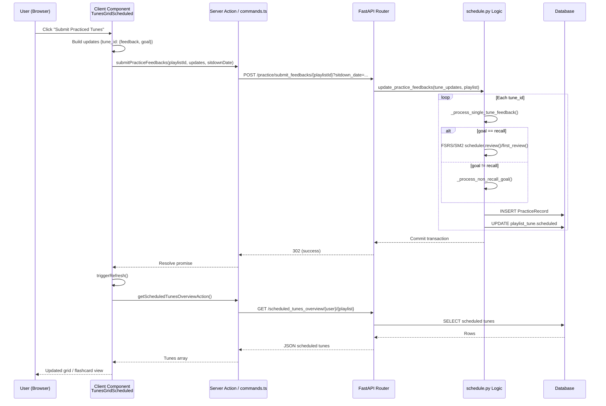

## Practice Feedback -> Scheduling Flow

This document describes the end-to-end flow from the user submitting practice feedback in the frontend to the scheduling data being persisted and re-fetched for display. It covers both recall (FSRS/SM2 spaced repetition) and non-recall goal-specific paths.

### 1. Frontend Submission (Client Component)

File: `frontend/app/(main)/pages/practice/components/TunesGridScheduled.tsx`

Key function: `submitPracticeFeedbacksHandler()`

Steps:
1. Iterate over current `tunes` array (from `useScheduledTunes()` context).
2. For each tune, read the row from the TanStack table and extract `recall_eval` (feedback) and `goal`.
3. Build `updates: { [tuneId]: { feedback, goal } }` (only include tunes with a feedback value).
4. Clear current tune selection (and persist that cleared state) if the currently focused tune is being submitted.
5. Read `sitdownDate` from `getSitdownDateFromBrowser()` (must be client supplied for correct temporal anchoring).
6. Call server function `submitPracticeFeedbacks({ playlistId, updates, sitdownDate })` (in `commands.ts`).
7. On success: trigger global refresh via `triggerRefresh()` so the latest scheduled tunes are re-fetched; show toast.
8. Fire-and-forget deletion of transient table state (`deleteTableTransientData`).

### 2. Server Action / Network Request

File: `frontend/app/(main)/pages/practice/commands.ts`

Function: `submitPracticeFeedbacks()`

Steps:
1. Validate presence and validity of `sitdownDate` (must be a Date object, non-NaN).
2. POST JSON body `updates` to: `POST {TT_API_BASE_URL}/tunetrees/practice/submit_feedbacks/{playlistId}?sitdown_date=<UTC_ISO>`.
3. `sitdown_date` is converted to Python-compatible UTC string (`convertToPythonUTCString`).
4. Returns HTTP 302 (FastAPI status code constant) or propagates an error message.

Payload Shape (per tune):
```json
{
  "<tune_id>": { "feedback": "good|again|easy|...", "goal": "recall|fluency|initial_learn|..." }
}
```

### 3. FastAPI Endpoint

File: `tunetrees/api/tunetrees.py`

Endpoint:
```python
@router.post("/practice/submit_feedbacks/{playlist_id}")
async def submit_feedbacks(playlist_id: str, tune_updates: Dict[str, TuneFeedbackUpdate], sitdown_date: datetime = Query(...))
```

Steps:
1. Ensure `sitdown_date` is timezone-aware; if naive, patch UTC tzinfo.
2. Call `update_practice_feedbacks(tune_updates, playlist_id, review_sitdown_date=sitdown_date)`.
3. Return 302 on success or raise HTTP 500 with detail on failure.

### 4. Core Scheduling Orchestration

File: `tunetrees/app/schedule.py`

Function: `update_practice_feedbacks()`

Steps:
1. Resolve `user_ref` from `playlist_ref` (playlist ownership) via DB.
2. Determine algorithm type preference (`fetch_algorithm_type`).
3. Loop each `(tune_id, tune_update)`:
   - Invoke `_process_single_tune_feedback()`.
4. Commit transaction; rollback + re-raise on exception.

### 5. Processing Single Tune Feedback (Recall Path)

Function: `_process_single_tune_feedback()` (same file)

Steps (recall goal):
1. Validate UTC timezone of `sitdown_date`.
2. Load latest practice record for reference (historical continuity) but always create a NEW record.
3. Extract `quality_int` via `validate_and_get_quality()`; skip if quality is placeholder.
4. Extract `goal` (defaults to `recall`) and fetch user default technique (`get_default_technique_for_user`).
5. If goal != `recall`, delegate to `_process_non_recall_goal()` (see §6).
6. Fetch spaced repetition prefs (`get_prefs_spaced_repetition`) for the algorithm (FSRS or SM2 config); includes weights, desired retention, intervals, fuzzing flags, steps.
7. Instantiate scheduler via `SpacedRepetitionScheduler.factory(...)`.
8. Compute review outcome:
   - `first_review()` if NEW / RESCHEDULED quality marker.
   - Otherwise `review()` with previous easiness, interval, repetitions, etc.
9. Derive `review_date_str` from scheduler output (next review datetime) and `practiced_str` from `sitdown_date` (current session timestamp).
10. Create new `PracticeRecord` (ALWAYS appending; never updating previous) with:
    - `review_date` set to the ACTUAL practice date (current design decision: track when practiced; next review date is stored separately in playlist_tune.scheduled).
11. Add record to session.
12. If a valid next review date was produced, call `update_playlist_tune_scheduled()` to mirror it into `playlist_tune.scheduled` (migration Step 2 toward playlist-based scheduling).

### 6. Processing Non-Recall Goals

Function: `_process_non_recall_goal()`

Differences:
1. Goal-specific intervals chosen from preset arrays (e.g., `initial_learn`, `fluency`, `session_ready`, `performance_polish`).
2. Adjust step based on prior repetitions and current quality.
3. Derive next review date via `_calculate_goal_specific_review_date()` (technique modifiers: `daily_practice`, `motor_skills`, `metronome`).
4. Create new `PracticeRecord` (includes interval estimation and repetition increment) with `review_date` still set to practice time (consistency) and update `playlist_tune.scheduled` with computed next review date.

### 7. Data Persistence & Uniqueness

`PracticeRecord` uniqueness relies on distinct `(tune_ref, playlist_ref, practiced)` timestamps. Each submission uses the exact `sitdown_date` down to minute precision (seconds zeroed earlier in pipeline when parsed); multiple updates in the same minute for the same tune would violate uniqueness—frontend avoids rapid duplicate submissions per tune in a single session scope.

### 8. Refresh Cycle Back to UI

1. After successful POST, frontend triggers `triggerRefresh()`.
2. `TunesGridScheduled` `useEffect` detects `refreshId` change and calls `getScheduledTunesOverviewAction()`.
3. Server action wraps `getScheduledTunesOverview()` (in `practice/queries.ts`).
4. Query executes `GET /scheduled_tunes_overview/{userId}/{playlistId}` passing `sitdown_date` (converted to UTC string) and `acceptable_delinquency_window`.
5. API responds with updated schedule including any newly scheduled tunes or changed intervals.
6. State updated → table re-renders with cleared `recall_eval` and updated scheduling info.

### 9. Sequence Diagram



### 10. Key Data Structures

Practice Feedback Update (frontend to backend):
```ts
interface ITuneUpdate { feedback: string; goal?: string | null }
type UpdatesPayload = { [tuneId: string]: ITuneUpdate }
```

PracticeRecord (subset of fields relevant here):
```python
PracticeRecord(
  tune_ref: int,
  playlist_ref: int,
  quality: int,
  practiced: str,         # UTC timestamp of review session
  review_date: str,       # (Design) also set to practiced timestamp
  interval: int,
  easiness: float | None,
  repetitions: int,
  step: int | None,
  goal: str,
  technique: str | None,
)
```

### 11. Edge Cases & Validation

1. Missing or invalid `sitdownDate` → client throws before POST.
2. Naive (timezone-less) `sitdown_date` query param → server upgrades to UTC.
3. Unknown goal string → warning + fallback to recall path.
4. Quality not provided or unexpected → raises ValueError (tune skipped or aborts if unhandled).
5. Non-recall scheduling uses heuristic arrays; may revisit for adaptive intervals.
6. Race condition (duplicate submissions) could attempt identical `(tune_ref, playlist_ref, practiced)`; mitigated by single-click + client state clear.

### 12. Future Improvements (Optional)

* Store next review date directly in PracticeRecord (separate column) to reduce dual-source complexity during migration.
* Add explicit server response payload (e.g., list of updated tune IDs + next review dates) to allow optimistic UI without full refetch.
* Batch fetch of prefs/technique outside per-tune loop (already done for algorithm/prefs; good practice maintained).
* Add idempotency key or server-side de-duplication for rapid double submissions.
* Consolidate NEW/RESCHEDULED markers into a typed enum returned from frontend UI rather than raw strings.

---

Document version: 1.0
Maintainer: (auto-generated)
