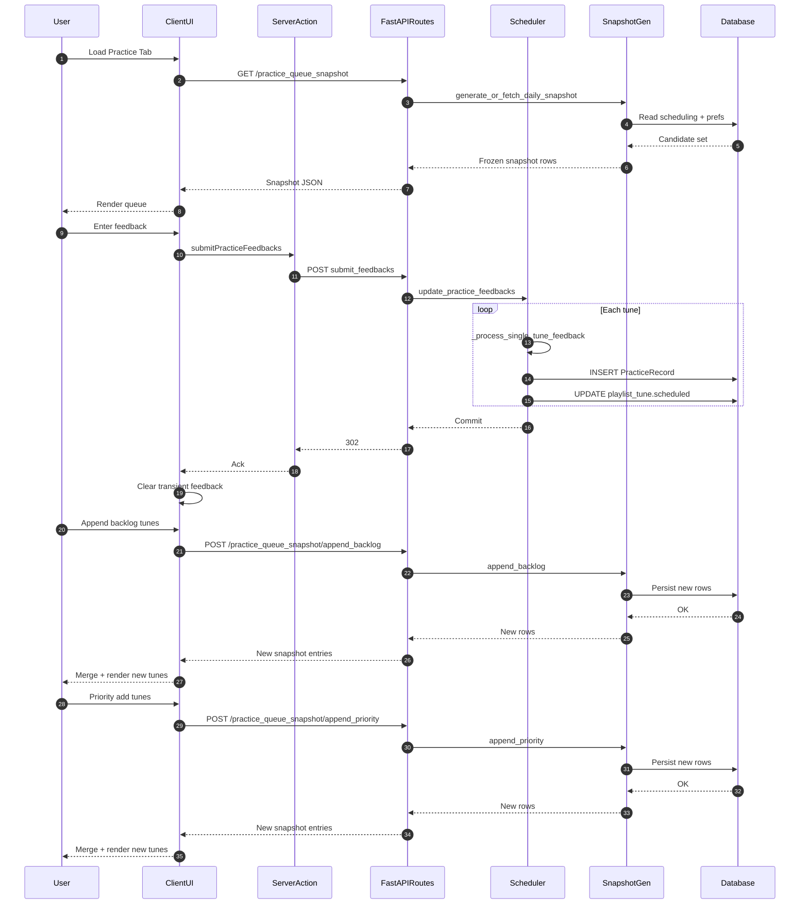

# Daily Practice Queue Snapshot Flow (Updated)

This document describes the current (snapshot-based) practice scheduling and display flow. The legacy `scheduled_tunes_overview` + direct windowed SELECT has been replaced by a **daily immutable practice queue snapshot** that freezes the set & ordering of today's tunes while allowing controlled additions (priority / backlog) during the day. Single‑tune feedback processing (FSRS / SM2 / goal heuristics) is unchanged at its core; what changed is how the UI obtains and styles the "due today" population.

## High-Level Overview

1. At first access each day (per user+playlist) the backend generates (or fetches if already generated) a frozen snapshot of the practice queue.
2. Snapshot rows include bucket classification (1=Due Today, 2=Recently Lapsed, 3=Backfill) plus captured scheduling fields for consistency the entire day.
3. User submits practice feedback in `TunesGridScheduled`; backend appends a new `PracticeRecord` and updates `playlist_tune.scheduled` (authoritative next review date for future snapshots, not mutating the current snapshot).
4. UI continues to show the frozen snapshot ordering; newly scheduled future dates won't reshuffle today's list.
5. User may explicitly append backlog or priority tunes into the snapshot via dedicated actions (these return only the new snapshot entries to merge client-side).
6. A gap counter reflects tunes that became newly due (bucket 1) after snapshot creation (e.g., manual schedule adjustments); optional force regeneration can create a fresh snapshot (rare path).

### Updated Sequence Diagram



## Core Entities & Fields

Captured once per day per (user_ref, playlist_ref):

| Field                                     | Purpose                                                                                   |
| ----------------------------------------- | ----------------------------------------------------------------------------------------- |
| `snapshot_coalesced_ts`                   | Canonical date/time basis for ordering (string).                                          |
| `scheduled_snapshot`                      | The scheduled (next review) timestamp captured at snapshot time (may be null for lapsed). |
| `latest_review_date_snapshot`             | Last actual practice time at snapshot creation (null if none).                            |
| `acceptable_delinquency_window_snapshot`  | Window (days) used to include recently lapsed items.                                      |
| `tz_offset_minutes_snapshot`              | Client tz offset captured for stable local-day semantics.                                 |
| `bucket` (frontend derived / transmitted) | 1=Due Today, 2=Recently Lapsed, 3=Backfill (older backlog pulled in).                     |

The snapshot rows deliberately **do not mutate** when subsequent feedback updates underlying `playlist_tune.scheduled`; those changes influence _future_ snapshots only.

## Bucket Classification Logic (Conceptual)

1. Bucket 1 (Due Today): Tunes whose scheduled date (or derived coalesced timestamp) is within the current local day or overdue but inside the delinquency window and prioritized as today's core work.
2. Bucket 2 (Recently Lapsed): Slightly overdue beyond today's principal slice but still inside acceptable delinquency window; surfaced after bucket 1 items or visually distinct.
3. Bucket 3 (Backfill): Older material intentionally appended (user/backlog action) to fill excess capacity.

Tunes absent from the snapshot but later detected as newly due (e.g., manual schedule adjustments) increment the "new tunes due since snapshot" counter; user can choose to force regenerate or manually append.

## Feedback Submission & Scheduling (Unchanged Core)

The core processing of a practice event remains as previously documented; only the refetch model changed. Summary below (for recall + non-recall):

1. Client builds `updates` (tune_id -> { feedback, goal }).
2. POST `/practice/submit_feedbacks/{playlist_id}?sitdown_date=...`.
3. `update_practice_feedbacks()` loops tunes, resolves algorithm prefs, calls `_process_single_tune_feedback()`.
4. Recall goal: FSRS/SM2 scheduler yields next review date; non-recall: heuristic `_process_non_recall_goal()` computes interval.
5. Append new `PracticeRecord`; update `playlist_tune.scheduled` with computed next review.
6. Transaction commit; client clears transient per-row state (no need to refetch entire snapshot just for local feedback clearing).

Snapshot ordering is stable: we _do not_ remove items practiced earlier in the same day; they remain visible (optionally styled as completed) to support session review context.

## Snapshot Lifecycle

Generation triggers:

- First GET of the day for `/practice_queue_snapshot/{user}/{playlist}` (endpoint naming abstracted here) generates if absent.
- Manual force regeneration (developer or advanced control) can explicitly rebuild (invalidating prior snapshot) – rare, because it discards user mental model of day's plan.
- Next calendar day (local tz) automatically leads to a new snapshot on first access.

Appending:

- Backlog append: Adds a batch of older unscheduled / low-priority tunes as bucket 3.
- Priority add: Injects selected tunes immediately (idempotent) respecting max daily size.
- These calls return only the new rows; client merges into existing in-memory snapshot array.

Gap Detection:

- After feedback updates, some tunes may now qualify as bucket 1 but were absent when snapshot froze.
- The frontend displays a counter (from snapshot API response) for "new tunes due since snapshot" enabling user decision: append vs force regenerate tomorrow.

## Edge Cases & Consistency

| Scenario                                             | Handling                                                                                                                       |
| ---------------------------------------------------- | ------------------------------------------------------------------------------------------------------------------------------ |
| Duplicate submission same tune + same sitdown minute | Uniqueness on `(tune_ref, playlist_ref, practiced)` prevents; client debounces.                                                |
| Timezone change mid-day                              | Snapshot retains original `tz_offset_minutes_snapshot`; visual local-day drift possible; recommend force regen if significant. |
| Large backlog append exceeding cap                   | Backend truncates to max allowed; returns only accepted rows.                                                                  |
| Tune deleted after snapshot                          | UI may gray or hide; backend can soft filter on subsequent append responses.                                                   |
| Prefs change (e.g., delinquency window) midday       | Does not retroactively re-bucket; affects next snapshot.                                                                       |

## Data Structures (Key)

Submission payload (unchanged):

```ts
interface ITuneUpdate {
  feedback: string;
  goal?: string | null;
}
type UpdatesPayload = { [tuneId: string]: ITuneUpdate };
```

Snapshot entry (frontend `QueueEntry` subset):

```ts
interface IQueueEntry {
  tune_ref: number;
  bucket: 1 | 2 | 3;
  snapshot_coalesced_ts: string;
  scheduled_snapshot?: string | null;
  latest_review_date_snapshot?: string | null;
  acceptable_delinquency_window_snapshot?: number | null;
  tz_offset_minutes_snapshot?: number | null;
  // ...additional tune metadata fields
}
```

PracticeRecord (unchanged core subset):

```python
PracticeRecord(
  tune_ref: int,
  playlist_ref: int,
  quality: int,
  practiced: str,      # UTC practice timestamp
  review_date: str,    # (currently same as practiced; next review stored on playlist_tune)
  interval: int,
  easiness: float | None,
  repetitions: int,
  step: int | None,
  goal: str,
  technique: str | None,
)
```

### Practice Record Schema Reference

Full field reference for the `practice_record` table:

| Type    | Name             | Description                                                                                                 |
| ------- | ---------------- | ----------------------------------------------------------------------------------------------------------- |
| INTEGER | id               | Primary key, autoincrement                                                                                  |
| INTEGER | playlist_ref     | References the playlist (`playlist.playlist_id`)                                                            |
| INTEGER | tune_ref         | References the tune (`tune.id`)                                                                             |
| TEXT    | practiced        | UTC timestamp when the practice occurred                                                                    |
| INTEGER | quality          | Quality rating of the practice event (0–5 mapped per algorithm)                                             |
| REAL    | easiness         | Easiness factor (SM2 path)                                                                                  |
| INTEGER | interval         | Interval (days) until next review (output of scheduler/heuristic)                                           |
| INTEGER | repetitions      | Number of successful reviews (algorithm-specific increment semantics)                                       |
| TEXT    | review_date      | Historical field; currently set equal to `practiced` (next review now tracked on `playlist_tune.scheduled`) |
| TEXT    | backup_practiced | Deprecated legacy field (retained for migration safety)                                                     |
| REAL    | stability        | FSRS stability metric                                                                                       |
| INTEGER | elapsed_days     | Days elapsed since last review (algorithm input)                                                            |
| INTEGER | lapses           | Count of lapses/forget events                                                                               |
| INTEGER | state            | Learning state enum (Learning=1, Review=2, Relearning=3, NEW/0/null)                                        |
| REAL    | difficulty       | FSRS difficulty metric                                                                                      |
| INTEGER | step             | Current step in learning/relearning sequence (or null in Review state)                                      |

Notes:

1. The authoritative NEXT review date is **not** this table's `review_date`; instead it is stored on `playlist_tune.scheduled` and captured into snapshots (`scheduled_snapshot`).
2. Future migration could repurpose `review_date` or introduce a dedicated `next_review` column once legacy semantics fully retired.
3. Uniqueness of a practice event is enforced by timestamp precision on `(tune_ref, playlist_ref, practiced)`.

### Daily Practice Queue Schema Reference

Full field reference for the `daily_practice_queue` table. Represents the frozen (and appendable) daily snapshot rows for a user + playlist + day window. Each row captures bucket classification and snapshot-time scheduling attributes. New practice events do **not** mutate existing rows; appends add new rows preserving order.

| Type    | Name                                   | Description                                                                               |
| ------- | -------------------------------------- | ----------------------------------------------------------------------------------------- |
| INTEGER | id                                     | Primary key, autoincrement                                                                |
| INTEGER | user_ref                               | Owning user id                                                                            |
| INTEGER | playlist_ref                           | Playlist identifier                                                                       |
| TEXT    | window_start_utc                       | Inclusive UTC start of snapshot window (anchored local day)                               |
| TEXT    | window_end_utc                         | Exclusive UTC end of snapshot window                                                      |
| INTEGER | tune_ref                               | Tune id included in the snapshot                                                          |
| INTEGER | bucket                                 | Classification (1=Due Today, 2=Recently Lapsed, 3=Backfill)                               |
| INTEGER | order_index                            | Stable ordering within bucket/day (dense, 0-based or 1-based per generator)               |
| TEXT    | snapshot_coalesced_ts                  | Canonical ordering timestamp (coalesced scheduled / latest review) captured at generation |
| TEXT    | generated_at                           | Timestamp when this row (or batch) was generated/appended                                 |
| TEXT    | mode                                   | Tune mode cached for display/styling                                                      |
| TEXT    | queue_date                             | Local date string (for resilience when tz shifts)                                         |
| TEXT    | scheduled_snapshot                     | Next review date captured at snapshot time (nullable)                                     |
| TEXT    | latest_review_date_snapshot            | Latest practice time captured at snapshot time (nullable)                                 |
| INTEGER | acceptable_delinquency_window_snapshot | Window (days) value used during classification                                            |
| INTEGER | tz_offset_minutes_snapshot             | Client timezone offset minutes captured for local-day logic                               |
| TEXT    | completed_at                           | When user completed this tune today (set once; row retained)                              |
| INTEGER | exposures_required                     | Target exposures within session/day (future readiness; may be null)                       |
| INTEGER | exposures_completed                    | Count of completed exposures (default 0)                                                  |
| TEXT    | outcome                                | Optional outcome summary / qualitative label                                              |
| BOOLEAN | active                                 | Row still active for today's display (false if logically retired / superseded)            |

Notes:

1. Uniqueness prevents duplicate tune insertion for same `(user_ref, playlist_ref, window_start_utc, tune_ref)`.
2. `active` allows future soft-retirement (e.g., after force regen) without deleting history for analytics.
3. `order_index` remains stable; appended rows get indexes after existing max preserving earlier mental model.
4. `exposures_*` fields anticipate multi-exposure learning strategies (e.g., multiple passes in one day); currently optional.
5. Snapshot generation indexes facilitate efficient queries by user/playlist/day and filtering by `active` & `bucket`.

### Rationale: Why Both `practice_record` and `daily_practice_queue`?

Although both tables contain per‑tune rows, they serve **orthogonal concerns** and intentionally avoid consolidation.

| Aspect                 | `practice_record`                                                                                      | `daily_practice_queue`                                                                    |
| ---------------------- | ------------------------------------------------------------------------------------------------------ | ----------------------------------------------------------------------------------------- |
| Core Purpose           | Immutable historical log of every practice event (inputs for algorithms, analytics, FSRS optimization) | Frozen daily snapshot + UX scaffold (stable ordering, buckets, completion & append flows) |
| Lifecycle              | Append-only; never mutated after insert                                                                | Regenerated each day; rows appended during day; may be soft-retired (`active=false`)      |
| Temporal Semantics     | One row per discrete feedback action (practice event)                                                  | One row per tune selected for the day's plan within a window                              |
| Scheduling Authority   | Source of truth for past performance metrics (interval, ease, stability, reps, lapses)                 | Derived view capturing next-review snapshot fields for _display_, not algorithm evolution |
| Mutation on Practice   | New row appended (no in-place updates)                                                                 | Existing row left intact; optional `completed_at` set; no reordering                      |
| Ordering               | Not ordered beyond timestamp queries                                                                   | Explicit `order_index` for deterministic UX across refreshes                              |
| Bucket Classification  | Not stored; can be recomputed if needed                                                                | Stored (1/2/3) to provide inexpensive styling & filtering                                 |
| Timezone Handling      | Raw UTC timestamps, interpretation deferred                                                            | Captures `tz_offset_minutes_snapshot` to freeze local-day boundaries                      |
| Derived / Regenerable  | Canonical dataset (cannot be recomputed if lost)                                                       | Fully regenerable from `practice_record`, `playlist_tune.scheduled`, prefs                |
| Multi-Exposure Support | Each exposure = separate record (future)                                                               | `exposures_required/completed` allow intra-day tracking without inflating historical rows |
| Performance Motivation | Optimized for write simplicity and analytical reads                                                    | Avoids recomputing due list + buckets on every refresh; enables cheap delta appends       |
| UX Stability           | Not directly rendered as the live queue                                                                | Ensures user’s plan does not “jump” after each submission or new due arrival              |

#### Key Design Drivers

1. **Stable Daily Plan**: Users retain a consistent visual queue even while underlying next-review dates shift; historical table alone would cause re-sorting jitter.
2. **Cheap Delta Operations**: Appending backlog or priority tunes only touches snapshot rows; historical log remains pure and focused.
3. **Algorithm Integrity**: Scheduling logic consumes _practice history_ metrics that require a complete chronological series; mixing transient ordering data would add noise.
4. **Snapshot Regeneration Safety**: Because queue rows are derivable, we can discard/regenerate without risking loss of essential spaced repetition signals.
5. **Extensibility**: Future features (multi-exposure tracking, partial completions, per-day outcome notes) land in the snapshot without schema churn in `practice_record`.

#### Why Not a Single Table + Flags?

Combining concerns would either (a) bloat historical rows with ephemeral per-day fields or (b) require complex partial indexes and cascading updates that erode the immutability guarantees the algorithms rely on. Separation maintains clean invariants: historical rows are never rewritten; snapshot rows are cheap, discardable, and optimized for UI semantics.

#### Potential Future Convergence

If future performance profiling shows regeneration is trivial and daily UX demands more real-time adaptability, a _materialized view_ or _on-demand generated cache_ could replace the physical snapshot table—retaining `practice_record` as the only persisted source. Current choice balances development velocity with UX stability.

## Future Improvements

1. Include per-row completion state in snapshot to eliminate client transient flag after practicing.
2. Server-delivered deltas (updated rows + counters) instead of reusing full snapshot for append responses.
3. Optional mid-day mini-snapshot for large gap counts (configurable threshold).
4. Persist practice completion markers to hide or collapse finished tunes without losing ordering context.
5. Evaluate storing next review date directly on PracticeRecord for simplified provenance.

---

Document version: 2.0 (snapshot model)
Maintainer: (auto-generated)

## Practice Feedback -> Scheduling Flow

This document describes the end-to-end flow from the user submitting practice feedback in the frontend to the scheduling data being persisted and re-fetched for display. It covers both recall (FSRS/SM2 spaced repetition) and non-recall goal-specific paths.

### 1. Frontend Submission (Client Component)

File: `frontend/app/(main)/pages/practice/components/TunesGridScheduled.tsx`

Key function: `submitPracticeFeedbacksHandler()`

Steps:

1. Iterate over current `tunes` array (from `useScheduledTunes()` context).
2. For each tune, read the row from the TanStack table and extract `recall_eval` (feedback) and `goal`.
3. Build `updates: { [tuneId: { feedback, goal } }` (only include tunes with a feedback value).
4. Clear current tune selection (and persist that cleared state) if the currently focused tune is being submitted.
5. Read `sitdownDate` from `getSitdownDateFromBrowser()` (must be client supplied for correct temporal anchoring).
6. Call server function `submitPracticeFeedbacks({ playlistId, updates, sitdownDate })` (in `commands.ts`).
7. On success: trigger global refresh via `triggerRefresh()` so the latest scheduled tunes are re-fetched; show toast.
8. Fire-and-forget deletion of transient table state (`deleteTableTransientData`).

### 2. Server Action / Network Request

File: `frontend/app/(main)/pages/practice/commands.ts`

Function: `submitPracticeFeedbacks()`

Steps:

1. Validate presence and validity of `sitdownDate` (must be a Date object, non-NaN).
2. POST JSON body `updates` to: `POST {TT_API_BASE_URL}/tunetrees/practice/submit_feedbacks/{playlistId}?sitdown_date=<UTC_ISO>`.
3. `sitdown_date` is converted to Python-compatible UTC string (`convertToPythonUTCString`).
4. Returns HTTP 302 (FastAPI status code constant) or propagates an error message.

Payload Shape (per tune):

```json
{
  "<tune_id>": {
    "feedback": "good|again|easy|...",
    "goal": "recall|fluency|initial_learn|..."
  }
}
```

### 3. FastAPI Endpoint

File: `tunetrees/api/tunetrees.py`

Endpoint:

```python
@router.post("/practice/submit_feedbacks/{playlist_id}")
async def submit_feedbacks(playlist_id: str, tune_updates: Dict[str, TuneFeedbackUpdate], sitdown_date: datetime = Query(...))
```

Steps:

1. Ensure `sitdown_date` is timezone-aware; if naive, patch UTC tzinfo.
2. Call `update_practice_feedbacks(tune_updates, playlist_id, review_sitdown_date=sitdown_date)`.
3. Return 302 on success or raise HTTP 500 with detail on failure.

### 4. Core Scheduling Orchestration

File: `tunetrees/app/schedule.py`

Function: `update_practice_feedbacks()`

Steps:

1. Resolve `user_ref` from `playlist_ref` (playlist ownership) via DB.
2. Determine algorithm type preference (`fetch_algorithm_type`).
3. Loop each `(tune_id, tune_update)`:
   - Invoke `_process_single_tune_feedback()`.
4. Commit transaction; rollback + re-raise on exception.

### 5. Processing Single Tune Feedback (Recall Path)

Function: `_process_single_tune_feedback()` (same file)

Steps (recall goal):

1. Validate UTC timezone of `sitdown_date`.
2. Load latest practice record for reference (historical continuity) but always create a NEW record.
3. Extract `quality_int` via `validate_and_get_quality()`; skip if quality is placeholder.
4. Extract `goal` (defaults to `recall`) and fetch user default technique (`get_default_technique_for_user`).
5. If goal != `recall`, delegate to `_process_non_recall_goal()` (see §6).
6. Fetch spaced repetition prefs (`get_prefs_spaced_repetition`) for the algorithm (FSRS or SM2 config); includes weights, desired retention, intervals, fuzzing flags, steps.
7. Instantiate scheduler via `SpacedRepetitionScheduler.factory(...)`.
8. Compute review outcome:
   - `first_review()` if NEW / RESCHEDULED quality marker.
   - Otherwise `review()` with previous easiness, interval, repetitions, etc.
9. Derive `review_date_str` from scheduler output (next review datetime) and `practiced_str` from `sitdown_date` (current session timestamp).
10. Create new `PracticeRecord` (ALWAYS appending; never updating previous) with:
    - `review_date` set to the ACTUAL practice date (current design decision: track when practiced; next review date is stored separately in playlist_tune.scheduled).
11. Add record to session.
12. If a valid next review date was produced, call `update_playlist_tune_scheduled()` to mirror it into `playlist_tune.scheduled` (migration Step 2 toward playlist-based scheduling).

### 6. Processing Non-Recall Goals

Function: `_process_non_recall_goal()`

Differences:

1. Goal-specific intervals chosen from preset arrays (e.g., `initial_learn`, `fluency`, `session_ready`, `performance_polish`).
2. Adjust step based on prior repetitions and current quality.
3. Derive next review date via `_calculate_goal_specific_review_date()` (technique modifiers: `daily_practice`, `motor_skills`, `metronome`).
4. Create new `PracticeRecord` (includes interval estimation and repetition increment) with `review_date` still set to practice time (consistency) and update `playlist_tune.scheduled` with computed next review date.

### 7. Data Persistence & Uniqueness

`PracticeRecord` uniqueness relies on distinct `(tune_ref, playlist_ref, practiced)` timestamps. Each submission uses the exact `sitdown_date` down to minute precision (seconds zeroed earlier in pipeline when parsed); multiple updates in the same minute for the same tune would violate uniqueness—frontend avoids rapid duplicate submissions per tune in a single session scope.

### 7b. Scheduled Tunes Query (Backend Selection Logic)

Core selector: `query_practice_list_scheduled(db, ...)` in `tunetrees/app/queries.py`.

Responsibilities:

- Accepts `review_sitdown_date` (UTC) + `acceptable_delinquency_window` to define a sliding window: `(sitdown_date - window_days, sitdown_date]`.
- Filters rows from `t_practice_list_staged` for the current user + playlist.
- Uses `COALESCE(playlist_tune.scheduled, latest_review_date)` so new playlist-based scheduling supersedes legacy practice record scheduling but still works during migration.
- Excludes deleted tunes / deleted playlists unless flags set.
- Orders by (coalesced) scheduled/review date descending, then performs a secondary in-memory sort by tune type for stable UI grouping.
- Returns rows consumed by `/scheduled_tunes_overview/{user}/{playlist}` endpoint which the frontend calls via `getScheduledTunesOverviewAction()`.

Why it matters:

- Central place where the migration from historical `PracticeRecord.review_date` to `playlist_tune.scheduled` is abstracted away.
- Ensures users see both slightly delinquent (within window) and due-today tunes in one list.
- Prevents N+1 queries by operating entirely in a single SELECT over the staged view.

Data Fallback Behavior:

- If `playlist_tune.scheduled` is NULL (older entries), the previous `latest_review_date` (from practice history) still governs visibility.
- Once a tune receives new feedback under the new system, `playlist_tune.scheduled` is populated, taking precedence.

### 8. Refresh Cycle Back to UI

1. After successful POST, frontend triggers `triggerRefresh()`.
2. `TunesGridScheduled` `useEffect` detects `refreshId` change and calls `getScheduledTunesOverviewAction()`.
3. Server action wraps `getScheduledTunesOverview()` (in `practice/queries.ts`).
4. Query executes `GET /scheduled_tunes_overview/{userId}/{playlistId}` passing `sitdown_date` (converted to UTC string) and `acceptable_delinquency_window`.
5. API responds with updated schedule including any newly scheduled tunes or changed intervals.
6. State updated → table re-renders with cleared `recall_eval` and updated scheduling info.

### 9. Key Data Structures

Practice Feedback Update (frontend to backend):

```ts
interface ITuneUpdate {
  feedback: string;
  goal?: string | null;
}
type UpdatesPayload = { [tuneId: string]: ITuneUpdate };
```

PracticeRecord (subset of fields relevant here):

```python
PracticeRecord(
  tune_ref: int,
  playlist_ref: int,
  quality: int,
  practiced: str,         # UTC timestamp of review session
  review_date: str,       # (Design) also set to practiced timestamp
  interval: int,
  easiness: float | None,
  repetitions: int,
  step: int | None,
  goal: str,
  technique: str | None,
)
```

### 10. Edge Cases & Validation

1. Missing or invalid `sitdownDate` → client throws before POST.
2. Naive (timezone-less) `sitdown_date` query param → server upgrades to UTC.
3. Unknown goal string → warning + fallback to recall path.
4. Quality not provided or unexpected → raises ValueError (tune skipped or aborts if unhandled).
5. Non-recall scheduling uses heuristic arrays; may revisit for adaptive intervals.
6. Race condition (duplicate submissions) could attempt identical `(tune_ref, playlist_ref, practiced)`; mitigated by single-click + client state clear.

### 11. Future Improvements (Optional)

- Store next review date directly in PracticeRecord (separate column) to reduce dual-source complexity during migration.
- Add explicit server response payload (e.g., list of updated tune IDs + next review dates) to allow optimistic UI without full refetch.
- Batch fetch of prefs/technique outside per-tune loop (already done for algorithm/prefs; good practice maintained).
- Add idempotency key or server-side de-duplication for rapid double submissions.
- Consolidate NEW/RESCHEDULED markers into a typed enum returned from frontend UI rather than raw strings.

---

Document version: 1.0
Maintainer: (auto-generated)
