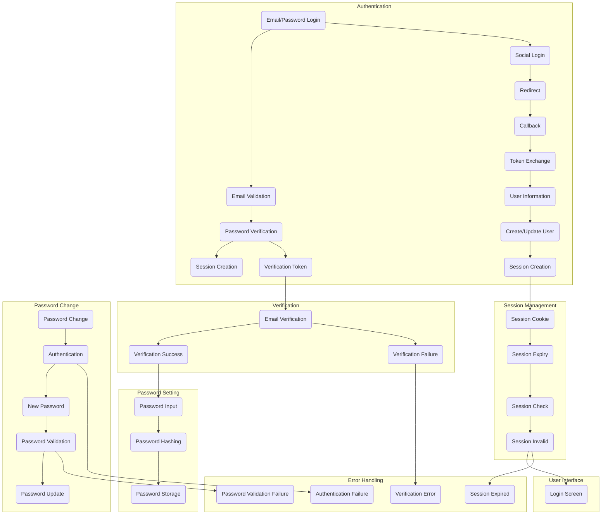

```mermaid
flowchart TB
    subgraph User Interface
        A(Login Screen)
    end
    subgraph Authentication
        B(Email/Password Login) --> C(Email Validation)
        C --> D(Password Verification)
        D --> E(Session Creation)
        D --> F(Verification Token)
        B --> G(Social Login)
        G --> H(Redirect)
        H --> I(Callback)
        I --> J(Token Exchange)
        J --> K(User Information)
        K --> L(Create/Update User)
        L --> M(Session Creation)
    end
    subgraph Verification
        F --> N(Email Verification)
        N --> O(Verification Success)
        N --> P(Verification Failure)
    end
    subgraph Password Setting
        O --> Q(Password Input)
        Q --> R(Password Hashing)
        R --> S(Password Storage)
    end
    subgraph Session Management
        M --> T(Session Cookie)
        T --> U(Session Expiry)
        U --> V(Session Check)
        V --> W(Session Invalid)
        W --> A
    end
    subgraph Password Change
        X(Password Change) --> Y(Authentication)
        Y --> Z(New Password)
        Z --> AA(Password Validation)
        AA --> BB(Password Update)
    end
    subgraph Error Handling
        P --> CC(Verification Error)
        W --> DD(Session Expired)
        Y --> EE(Authentication Failure)
        AA --> FF(Password Validation Failure)
    end
```
