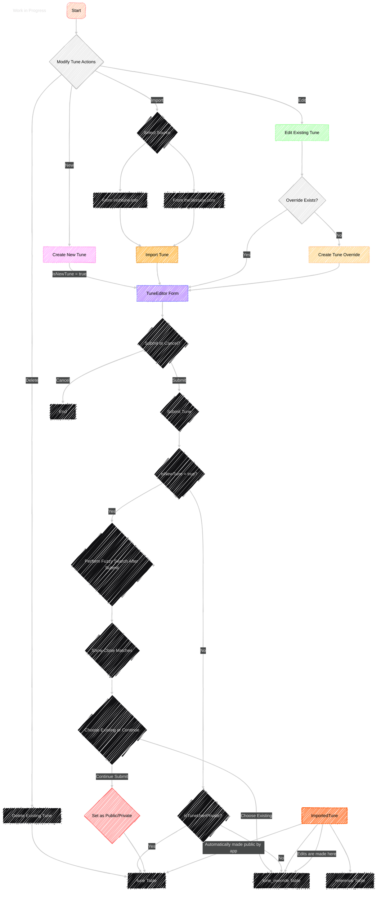

```mermaid
---
config:
  theme: redux-dark
  look: handDrawn
  layout: dagre
---
flowchart TD
    %% Overall notation for the diagram
    subgraph clusterNote [Work in Progress]
    style clusterNote fill:transparent,stroke:none
    end
    
    Start("Start") --> Decision{"Modify Tune Actions"}
    Decision -- New --> NewTune["Create New Tune"]
    Decision -- Import --> SourceOptions{"Select Source"}
    Decision -- Edit --> EditTune["Edit Existing Tune"]
    Decision -- Delete --> DeleteTune["Delete Existing Tune"]
    
    %% Conditions for tune states along branches
    NewTune -->|isNewTune = true| TuneEditor["TuneEditor Form"]
    SourceOptions --> IrishTune["From irishtune.info"] & Session["From theSession.com"]
    IrishTune --> ImportTune["Import Tune"]
    Session --> ImportTune
    ImportTune --> TuneEditor
    
    %% New decision point for tune_override
    EditTune --> CheckOverride{"Override Exists?"}
    CheckOverride -- Yes --> TuneEditor
    CheckOverride -- No --> CreateOverride["Create Tune Override"] --> TuneEditor
    
    DeleteTune --> tune_table["tune Table"]
    
    %% Editing process via TuneEditor Form
    TuneEditor --> SubmitChoice{"Submit or Cancel?"}
    SubmitChoice -- Submit --> SubmitTune{"Submit Tune"}
    SubmitChoice -- Cancel --> End
    SubmitTune --> FuzzyDecision{isNewTune = true?}
    FuzzyDecision -- Yes --> FuzzySearch{"Perform Fuzzy Search After Submit"}
    FuzzySearch --> ShowMatches{"Show Close Matches"}
    ShowMatches --> ChooseOption{"Choose Existing or Continue"}
    ChooseOption -- Choose Existing --> tune_override["tune_override Table"]
    ChooseOption -- Continue Submit --> PublicPrivate{"Set as Public/Private"}
    FuzzyDecision -- No --> TunePrivacy{"isTuneUserPrivate?"}
    TunePrivacy -- Yes --> tune_table["tune Table"]
    TunePrivacy -- No --> tune_override["tune_override Table"]
    PublicPrivate --> tune_table["tune Table"]
    ImportedTune --> tune_override & reference_table["reference Table"]
    ImportedTune -- Automatically made public by app --> tune_table
    ImportedTune -- Edits are made here --> tune_override
    
    %% Styles
    style Start fill:#ffddcc,stroke:#ffaaaa,color:#000000
    style Decision fill:#f0f0f0,stroke:#bbb,color:#000000
    style NewTune fill:#ffccff,stroke:#ffaaee,color:#000000
    style ImportTune fill:#ffcc77,stroke:#eeaa55,color:#000000
    style EditTune fill:#ccffcc,stroke:#aaffaa,color:#000000
    style CheckOverride fill:#f0f0f0,stroke:#bbb,color:#000000
    style CreateOverride fill:#ffe5b4,stroke:#ffcc99,color:#000000
    style TuneEditor fill:#ccaaff,stroke:#8888ff,color:#000000
    style ImportedTune fill:#ff9966,stroke:#ff5500,color:#000000
    style PublicPrivate fill:#ffbbbb,stroke:#ff6666,color:#000000
```
